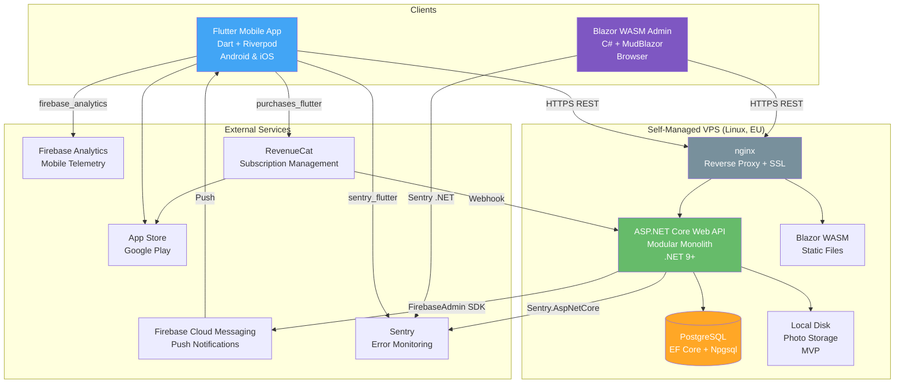
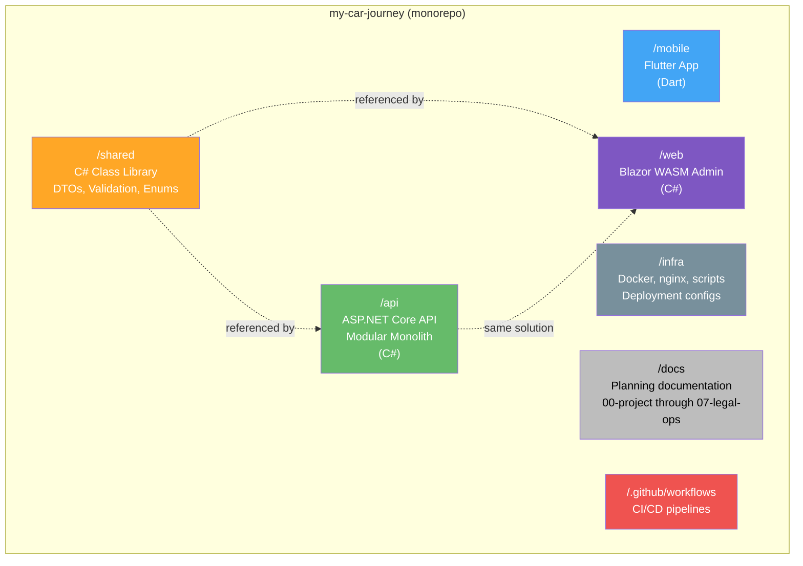
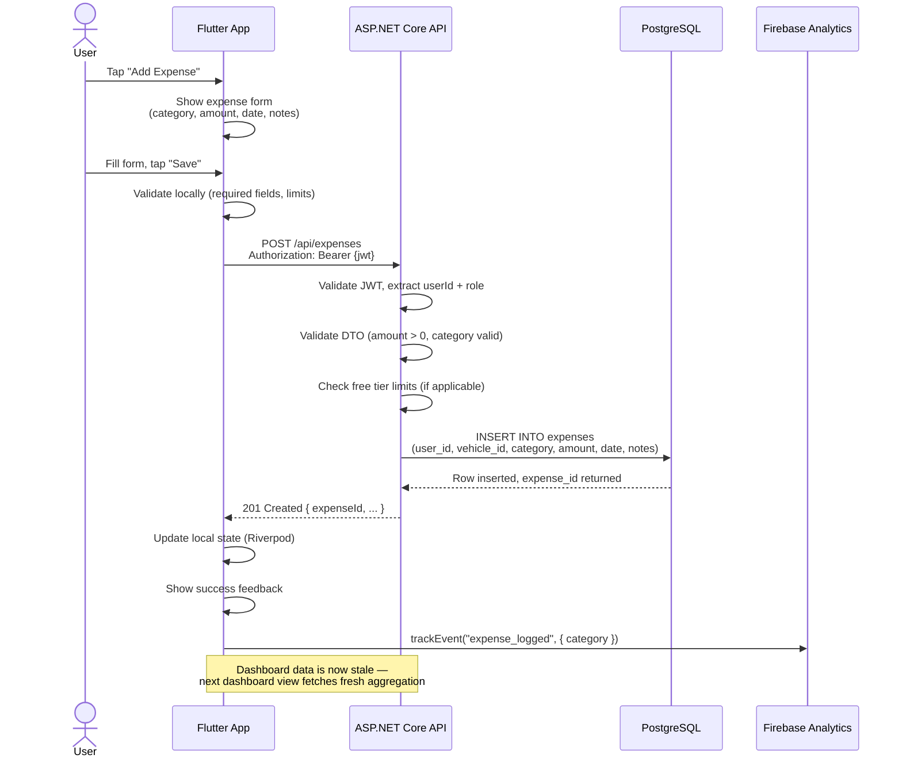
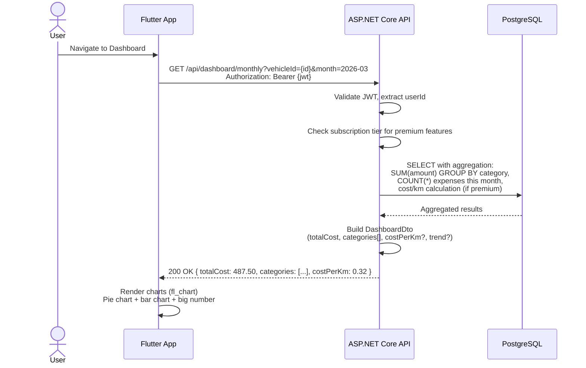
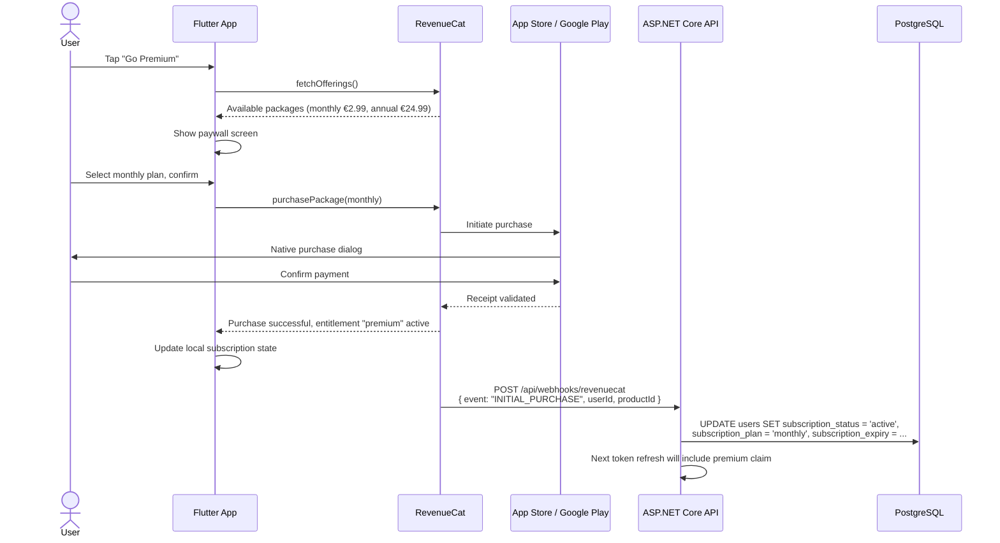
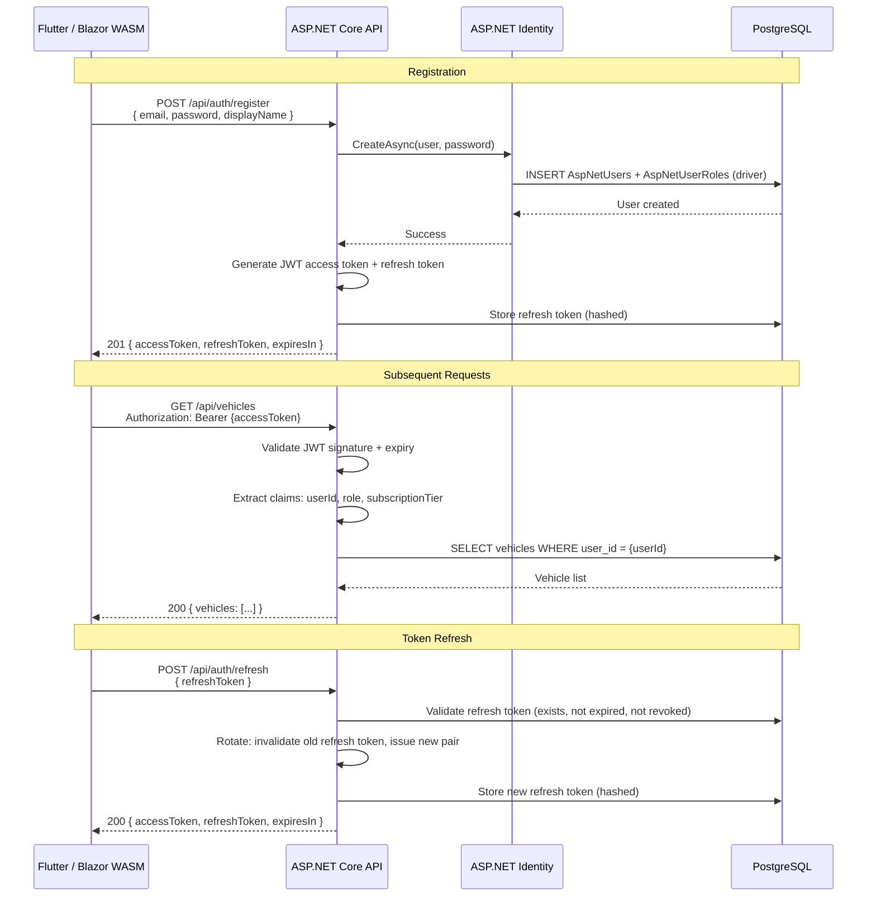

# Technical Architecture — Car Ownership Intelligence Platform

**File:** `/03-product/technical/architecture.md`
**Produced by:** @product-architect
**Date:** 2026-03-22
**Version:** 1.0
**Status:** Draft

---

## References

### Tech Stack Decisions (DEC-007 through DEC-018)

| # | Decision | Choice | File |
|---|---|---|---|
| DEC-007 | Mobile framework | Flutter (Dart) + Riverpod | `/00-project/decisions/DEC-007-mobile-framework.md` |
| DEC-008 | Web framework | Blazor WebAssembly + MudBlazor | `/00-project/decisions/DEC-008-web-framework.md` |
| DEC-009 | Backend approach | ASP.NET Core Web API — Modular Monolith, Controllers | `/00-project/decisions/DEC-009-backend-approach.md` |
| DEC-010 | Database | PostgreSQL — self-hosted on VPS, EF Core + Npgsql | `/00-project/decisions/DEC-010-database.md` |
| DEC-011 | Authentication | ASP.NET Identity + JWT (email+password MVP) | `/00-project/decisions/DEC-011-authentication.md` |
| DEC-012 | Hosting & deployment | Self-managed VPS, EU datacenter | `/00-project/decisions/DEC-012-hosting-deployment.md` |
| DEC-013 | Image storage | Local VPS disk (MVP) → Cloudflare R2 (future) | `/00-project/decisions/DEC-013-image-storage.md` |
| DEC-014 | Push notifications | Firebase Cloud Messaging (FCM) | `/00-project/decisions/DEC-014-push-notifications.md` |
| DEC-015 | Analytics & telemetry | Firebase Analytics (mobile), behind `IAnalyticsService` | `/00-project/decisions/DEC-015-analytics-telemetry.md` |
| DEC-016 | Subscriptions / IAP | RevenueCat (free tier) | `/00-project/decisions/DEC-016-subscriptions-iap.md` |
| DEC-017 | CI/CD pipeline | GitHub Actions + Fastlane | `/00-project/decisions/DEC-017-ci-cd.md` |
| DEC-018 | Error monitoring | Sentry (free tier), all platforms | `/00-project/decisions/DEC-018-error-monitoring.md` |

### Other Inputs

- PRD: `/03-product/product-requirements-document.md`
- MVP Feature List: `/03-product/mvp-feature-list.md`
- Functional Specs: `/03-product/functional-specs/`
- User Journeys: `/03-product/user-journeys/flows-index.md`
- Monetization Plan: `/02-strategy/monetization-plan.md`

---

## 1. System Architecture Overview

### 1.1 High-Level System Diagram



### 1.2 Technology Summary

| Layer | Technology | Language | Key Libraries |
|---|---|---|---|
| Mobile app | Flutter 3.x | Dart | Riverpod, fl_chart, flutter_secure_storage, firebase_messaging, firebase_analytics, purchases_flutter, sentry_flutter |
| Admin web app | Blazor WebAssembly | C# | MudBlazor, Sentry .NET SDK |
| Backend API | ASP.NET Core 9+ | C# | EF Core + Npgsql, ASP.NET Identity, FirebaseAdmin, Sentry.AspNetCore |
| Shared library | .NET Class Library | C# | System.ComponentModel.DataAnnotations |
| Database | PostgreSQL 16+ | SQL | pg_stat_statements, pg_trgm |
| Reverse proxy | nginx | — | Let's Encrypt (Certbot) |
| CI/CD | GitHub Actions | YAML | Fastlane (mobile signing/deployment) |

---

## 2. Monorepo Structure

### 2.1 Repository Layout



### 2.2 Detailed Directory Structure

```
my-car-journey/
├── .github/
│   └── workflows/
│       ├── api-ci.yml              # Build + test + deploy API on push to main
│       ├── web-ci.yml              # Build + deploy Blazor WASM on push to main
│       ├── mobile-ci.yml           # Build + test Flutter on PR
│       └── mobile-release.yml      # Build + sign + upload to stores on tag
│
├── mobile/                         # Flutter app (Dart)
│   ├── android/
│   ├── ios/
│   ├── lib/
│   │   ├── core/                   # App-wide config, constants, theme
│   │   │   ├── config/
│   │   │   ├── constants/
│   │   │   ├── theme/
│   │   │   └── router/             # GoRouter navigation
│   │   ├── features/               # Feature-first organization
│   │   │   ├── auth/
│   │   │   │   ├── data/           # Repositories, data sources, DTOs
│   │   │   │   ├── domain/         # Models, repository interfaces
│   │   │   │   └── presentation/   # Screens, widgets, providers
│   │   │   ├── vehicles/
│   │   │   ├── expenses/
│   │   │   ├── fuel/
│   │   │   ├── dashboard/
│   │   │   ├── timeline/
│   │   │   ├── reminders/
│   │   │   ├── profile/
│   │   │   ├── onboarding/
│   │   │   └── subscription/
│   │   ├── shared/                 # Shared widgets, utils, extensions
│   │   │   ├── widgets/
│   │   │   ├── services/           # IAnalyticsService, INotificationService abstractions
│   │   │   └── utils/
│   │   └── main.dart
│   ├── test/
│   ├── pubspec.yaml
│   └── fastlane/
│       ├── Fastfile
│       └── Appfile
│
├── api/                            # ASP.NET Core solution
│   ├── CarPlatform.sln
│   ├── src/
│   │   ├── CarPlatform.API/        # API host — startup, middleware, DI config
│   │   │   ├── Controllers/        # Top-level controllers (health, webhooks)
│   │   │   ├── Middleware/
│   │   │   ├── Extensions/
│   │   │   └── Program.cs
│   │   ├── CarPlatform.Core/       # Domain models, interfaces, shared business logic
│   │   │   ├── Entities/
│   │   │   ├── Interfaces/
│   │   │   ├── Enums/
│   │   │   └── Exceptions/
│   │   └── Modules/
│   │       ├── CarPlatform.Auth/           # Registration, login, tokens, roles
│   │       │   ├── Controllers/
│   │       │   ├── Services/
│   │       │   └── Data/
│   │       ├── CarPlatform.Vehicles/       # Vehicle profiles, makes/models
│   │       ├── CarPlatform.Expenses/       # Expense tracking, fuel entries, categories
│   │       ├── CarPlatform.Dashboard/      # Aggregation, cost calculations, trends
│   │       ├── CarPlatform.Timeline/       # Timeline entries, photos
│   │       ├── CarPlatform.Reminders/      # Maintenance reminders, push triggers
│   │       ├── CarPlatform.Subscriptions/  # RevenueCat webhooks, feature gating
│   │       └── CarPlatform.Admin/          # Admin-only operations and endpoints
│   └── tests/
│       ├── CarPlatform.UnitTests/
│       └── CarPlatform.IntegrationTests/
│
├── web/                            # Blazor WASM admin dashboard
│   ├── CarPlatform.Web/
│   │   ├── Pages/
│   │   │   ├── Dashboard/          # Analytics overview
│   │   │   ├── Users/              # User management
│   │   │   ├── Subscriptions/      # Subscriber management
│   │   │   └── Settings/
│   │   ├── Components/
│   │   ├── Services/               # API client services
│   │   └── Program.cs
│   └── CarPlatform.Web.csproj
│
├── shared/                         # Shared C# class library
│   ├── CarPlatform.Shared/
│   │   ├── DTOs/                   # Request/response DTOs
│   │   │   ├── Auth/
│   │   │   ├── Vehicles/
│   │   │   ├── Expenses/
│   │   │   ├── Dashboard/
│   │   │   ├── Timeline/
│   │   │   ├── Reminders/
│   │   │   └── Admin/
│   │   ├── Validation/             # Shared validation attributes
│   │   ├── Enums/                  # ExpenseCategory, FuelType, VehicleType, UserRole, etc.
│   │   └── Constants/              # Free tier limits, business rules
│   └── CarPlatform.Shared.csproj
│
├── infra/
│   ├── nginx/
│   │   └── carplatform.conf        # nginx reverse proxy config
│   ├── scripts/
│   │   ├── deploy-api.sh           # API deployment script
│   │   ├── deploy-web.sh           # Blazor WASM deployment script
│   │   └── backup-db.sh            # PostgreSQL backup script
│   └── docker/
│       └── docker-compose.yml      # Local development environment (optional)
│
├── docs/                           # Planning documentation (this repo's content)
│   ├── 00-project/
│   ├── 01-discovery/
│   ├── 02-strategy/
│   ├── 03-product/
│   ├── 04-brand/
│   ├── 05-development/
│   ├── 06-growth/
│   ├── 07-legal-ops/
│   └── CLAUDE.md
│
├── .gitignore
├── README.md
└── LICENSE
```

### 2.3 C# Solution Structure

The `api/CarPlatform.sln` solution contains the API, shared library, web project, and all module projects. This allows:
- Single `dotnet build` to compile everything
- Shared library referenced by both API and web via project reference
- Module projects referenced by API host via project reference
- IDE (Rider/VS) opens one solution, sees all C# code

```
CarPlatform.sln
├── src/
│   ├── CarPlatform.API              → references Core, all Modules
│   ├── CarPlatform.Core             → references Shared
│   ├── CarPlatform.Shared           → no project references (leaf node)
│   └── Modules/
│       ├── CarPlatform.Auth         → references Core
│       ├── CarPlatform.Vehicles     → references Core
│       ├── CarPlatform.Expenses     → references Core
│       ├── CarPlatform.Dashboard    → references Core
│       ├── CarPlatform.Timeline     → references Core
│       ├── CarPlatform.Reminders    → references Core
│       ├── CarPlatform.Subscriptions → references Core
│       └── CarPlatform.Admin        → references Core
├── web/
│   └── CarPlatform.Web              → references Shared
└── tests/
    ├── CarPlatform.UnitTests        → references modules under test
    └── CarPlatform.IntegrationTests → references API
```

**Module dependency rule:** Modules reference `CarPlatform.Core` only. They NEVER reference each other directly. Cross-module communication goes through interfaces defined in Core.

---

## 3. Deployment Topology

### 3.1 Deployment Diagram

```mermaid
graph TB
    subgraph Internet
        USER_MOBILE[Mobile Users<br/>Flutter App]
        USER_WEB[Admin<br/>Blazor WASM]
        DNS[DNS / Domain<br/>e.g., api.carplatform.bg]
    end

    subgraph External
        LE[Let's Encrypt<br/>SSL Certificates]
        GH[GitHub Actions<br/>CI/CD]
        FCM_EXT[Firebase Cloud Messaging]
        RC_EXT[RevenueCat]
        SENTRY_EXT[Sentry]
        GPLAY[Google Play Store]
        APPSTORE[Apple App Store]
    end

    subgraph VPS ["Linux VPS — EU Datacenter"]
        NGINX_D[nginx<br/>:443 HTTPS<br/>SSL termination]
        API_D[ASP.NET Core API<br/>Kestrel :5000<br/>systemd service]
        DB_D[(PostgreSQL<br/>:5432<br/>localhost only)]
        DISK_D[/data/photos/<br/>Local disk storage]
        WASM_D[/var/www/web/<br/>Blazor WASM static]
        CERTBOT_D[Certbot<br/>Auto-renewal]
        CRON_D[cron<br/>DB backups]
    end

    USER_MOBILE -->|HTTPS| DNS
    USER_WEB -->|HTTPS| DNS
    DNS --> NGINX_D
    NGINX_D -->|proxy_pass| API_D
    NGINX_D -->|static files| WASM_D
    API_D --> DB_D
    API_D --> DISK_D
    API_D --> FCM_EXT
    RC_EXT -->|webhook| NGINX_D
    GH -->|SSH deploy| VPS
    LE --> CERTBOT_D
    CRON_D -->|pg_dump| DB_D
    GH -->|Fastlane| GPLAY
    GH -->|Fastlane| APPSTORE

    style VPS fill:#E3F2FD,color:#000
    style NGINX_D fill:#78909C,color:#fff
    style API_D fill:#66BB6A,color:#fff
    style DB_D fill:#FFA726,color:#fff
```

### 3.2 VPS Configuration

| Component | Configuration |
|---|---|
| **OS** | Ubuntu 22.04+ LTS |
| **nginx** | Reverse proxy, SSL termination, serves Blazor WASM static files |
| **ASP.NET Core API** | Runs as systemd service via Kestrel on localhost:5000 |
| **PostgreSQL 16+** | Listens on localhost:5432 only (not exposed to internet) |
| **Photo storage** | `/data/photos/{userId}/{entryId}/{guid}.{ext}` |
| **Blazor WASM** | Static files in `/var/www/web/` served by nginx |
| **SSL** | Let's Encrypt via Certbot, auto-renewal cron |
| **Backups** | `pg_dump` via cron (daily), compressed, retained 30 days |
| **Firewall** | UFW: allow 22 (SSH), 80 (HTTP→redirect), 443 (HTTPS). Everything else blocked. |

### 3.3 nginx Configuration Overview

```
server {
    listen 443 ssl;
    server_name api.carplatform.bg;

    # SSL via Let's Encrypt
    ssl_certificate /etc/letsencrypt/live/api.carplatform.bg/fullchain.pem;
    ssl_certificate_key /etc/letsencrypt/live/api.carplatform.bg/privkey.pem;

    # API proxy
    location /api/ {
        proxy_pass http://localhost:5000;
        proxy_set_header Host $host;
        proxy_set_header X-Real-IP $remote_addr;
        proxy_set_header X-Forwarded-For $proxy_add_x_forwarded_for;
        proxy_set_header X-Forwarded-Proto $scheme;
    }

    # Blazor WASM admin
    location / {
        root /var/www/web;
        try_files $uri $uri/ /index.html;
    }
}
```

---

## 4. Data Flow

### 4.1 Expense Logging Flow (Core User Action)



### 4.2 Dashboard Aggregation Flow



### 4.3 Subscription Purchase Flow



---

## 5. Authentication Flow

### 5.1 Auth Architecture (Mobile + Web)



### 5.2 JWT Claims Structure

```json
{
  "sub": "user-uuid",
  "email": "user@example.com",
  "role": "driver",
  "subscription_tier": "premium",
  "subscription_expiry": "2026-04-22T00:00:00Z",
  "iat": 1711100000,
  "exp": 1711101800
}
```

| Claim | Purpose | Updated When |
|---|---|---|
| `sub` | User ID | Never changes |
| `role` | User role (`driver`, `garage_owner`, `dealer`, `fleet_manager`) | Role assigned/changed |
| `subscription_tier` | `free` or `premium` | RevenueCat webhook received |
| `subscription_expiry` | When premium expires | RevenueCat webhook received |

### 5.3 Token Storage

| Client | Access Token | Refresh Token |
|---|---|---|
| Flutter | In-memory (Riverpod state) | `flutter_secure_storage` (Keychain/Keystore) |
| Blazor WASM | In-memory | `localStorage` (acceptable for admin dashboard) |

### 5.4 Multi-Role Architecture

MVP launches with `driver` role only. The role system is built from day one to support future B2B expansion:

| Role | Phase | Access Scope |
|---|---|---|
| `driver` | MVP | Own vehicles, own expenses, own dashboard |
| `admin` | MVP | Admin dashboard, all users, system management |
| `garage_owner` | Phase 2 | Own garage profile, customer vehicles (with consent), work orders |
| `dealer` | Phase 3 | Inventory, customer vehicles, profitability tracking |
| `fleet_manager` | Phase 3 | Fleet vehicles, driver assignments, fleet-wide dashboard |

**Data isolation rule:** Every database query includes a `WHERE user_id = {currentUserId}` filter (or equivalent role-scoped filter). No endpoint returns data outside the user's role scope. This is enforced at the repository/query level, not just the controller level.

---

## 6. API Architecture

### 6.1 API Design Principles

- **RESTful** — resource-oriented URLs, standard HTTP methods and status codes
- **Versioned** — `/api/v1/` prefix from day one. Breaking changes get a new version.
- **JSON** — all request/response bodies are JSON (`application/json`)
- **JWT-authenticated** — all endpoints except `/api/v1/auth/*` require a valid JWT
- **Role-gated** — endpoints enforce `[Authorize(Roles = "...")]` as appropriate
- **Subscription-gated** — premium endpoints check `subscription_tier` claim
- **Consistent error format** — all errors return a standard `ProblemDetails` response

### 6.2 Endpoint Organization

```mermaid
graph LR
    subgraph "API v1 Endpoints"
        AUTH["/api/v1/auth/*<br/>Register, Login,<br/>Refresh, Reset"]
        VEHICLES["/api/v1/vehicles/*<br/>CRUD Vehicle Profiles"]
        EXPENSES["/api/v1/expenses/*<br/>CRUD Expenses"]
        FUEL["/api/v1/fuel-entries/*<br/>CRUD Fuel Entries"]
        DASHBOARD["/api/v1/dashboard/*<br/>Aggregations,<br/>Trends, Cost/km"]
        TIMELINE["/api/v1/timeline/*<br/>Entries, Photos"]
        REMINDERS["/api/v1/reminders/*<br/>CRUD Reminders"]
        PROFILE["/api/v1/profile/*<br/>User Profile,<br/>Settings"]
        SUBSCRIPTION["/api/v1/subscription/*<br/>Status, Plans"]
        ADMIN["/api/v1/admin/*<br/>Users, Analytics,<br/>Subscriptions"]
        WEBHOOKS["/api/v1/webhooks/*<br/>RevenueCat"]
        DEVICES["/api/v1/devices/*<br/>FCM Token Reg"]
    end

    style AUTH fill:#EF5350,color:#fff
    style ADMIN fill:#7E57C2,color:#fff
    style DASHBOARD fill:#42A5F5,color:#fff
    style WEBHOOKS fill:#FF9800,color:#fff
```



### 6.3 API Versioning Strategy

- **URL-based versioning:** `/api/v1/expenses`, `/api/v2/expenses`
- **Why URL-based:** Most explicit, easiest to route, simplest for solo developer. Header-based versioning adds complexity with no benefit at this scale.
- **When to increment:** Only for breaking changes (removed fields, changed semantics). Additive changes (new optional fields, new endpoints) stay on current version.
- **Parallel support:** When v2 is introduced, v1 stays active for a deprecation period (minimum 3 months). Mobile app updates can't be forced — old versions must keep working.

### 6.4 Request/Response Contract

All requests and responses use shared DTOs from `CarPlatform.Shared`. This is the contract between API and Blazor WASM (compiled), and the specification that Flutter must mirror in Dart.

**Standard response envelope:**

```json
// Success
{
  "data": { ... },
  "meta": { "page": 1, "pageSize": 20, "totalCount": 142 }
}

// Error (ProblemDetails RFC 7807)
{
  "type": "https://carplatform.bg/errors/validation",
  "title": "Validation Error",
  "status": 400,
  "detail": "Amount must be greater than zero.",
  "errors": {
    "amount": ["Must be greater than 0"]
  }
}
```

**Pagination:** Cursor-based for timeline (infinite scroll), offset-based for admin tables.

### 6.5 Mobile ↔ API DTO Synchronization

The Flutter app (Dart) cannot reference the shared C# class library directly. DTOs must be maintained in both languages.

**Synchronization strategy:**
1. **C# DTOs are the source of truth.** All changes start in `CarPlatform.Shared`.
2. **Dart models mirror C# DTOs.** Each DTO has a corresponding Dart class with `fromJson`/`toJson`.
3. **API integration tests validate the contract.** Tests serialize C# DTOs to JSON and verify the shape matches what Flutter expects.
4. **Code generation (future optimization):** If DTO count grows large (50+), consider generating Dart models from C# DTOs using a custom script or OpenAPI spec generation from ASP.NET Core.

### 6.6 Rate Limiting

| Endpoint Group | Limit | Window |
|---|---|---|
| `/api/v1/auth/login` | 10 requests | 15 minutes (per IP) |
| `/api/v1/auth/register` | 5 requests | 1 hour (per IP) |
| `/api/v1/auth/reset-password` | 3 requests | 1 hour (per email) |
| All authenticated endpoints | 100 requests | 1 minute (per user) |
| Photo upload | 10 uploads | 1 hour (per user) |

Implemented via ASP.NET Core rate limiting middleware.

---

## 7. Admin Web App — MVP Scope

### 7.1 MVP Admin Features

The Blazor WASM admin dashboard is a functional, internal tool — not a polished product. MudBlazor data tables and basic charts are the primary UI components.

#### Essential (MVP Launch)

**User Management**
- View all users (MudBlazor data table: paginated, sortable, searchable)
- Per-user detail view: vehicles count, expenses count, last active date, subscription status, registration date
- Disable/enable user accounts
- View user's vehicles and expense summary (not individual expense amounts — privacy)
- GDPR: trigger data export and account deletion for a user

**Analytics Dashboard**
- See Section 7.2 for full metrics specification

**Subscription Management**
- View all premium subscribers (table: user, plan, start date, expiry, status)
- Revenue summary: total MRR, subscriber count, monthly vs annual split
- Manual entitlement override (grant/revoke premium for specific users — useful for beta testers, support cases)
- Subscription status breakdown: active, cancelled (still in period), expired, grace period

#### Post-Launch Additions

| Feature | Add When |
|---|---|
| Challenge management (create/edit/end, view leaderboards) | When challenges feature (S4) ships |
| Content moderation (photo review queue) | When photo volume warrants it |
| Push notification management (send manual notifications) | When engagement campaigns begin |
| System health dashboard (API response times, error rates) | Sentry covers most of this; build custom only if gaps emerge |

### 7.2 Analytics Dashboard — Investor-Ready Metrics

All metrics tracked from day one. Data sources: PostgreSQL (primary), Firebase Analytics (supplementary), RevenueCat (revenue).

#### Core Metrics (PostgreSQL — queried by Admin API)

| Metric | Definition | Visualization |
|---|---|---|
| **DAU** | Users who opened app and performed any action today | Line chart (30-day trend) |
| **WAU** | Users who logged at least 1 expense in last 7 days | Line chart (12-week trend) |
| **MAU** | Users who logged at least 1 expense in last 30 days — **PRIMARY METRIC** | Big number + line chart |
| **New users** | Registrations per day/week/month | Bar chart |
| **Day 1 retention** | % of users who return and perform an action the day after signup | Line chart by cohort |
| **Day 7 retention** | % of users who log an expense within 7 days of signup | Line chart by cohort |
| **Day 30 retention** | % of users who log an expense within 30 days of signup | Line chart by cohort |
| **Day 60 retention** | % of users active 60 days after signup | Line chart by cohort |
| **Day 90 retention** | % of users active 90 days after signup | Line chart by cohort |
| **Retention cohort chart** | Users grouped by signup month, showing % still active over time | Heatmap / cohort table |

#### User Activity States (PostgreSQL)

| State | Definition | Query Logic |
|---|---|---|
| **Daily Active** | Opened app and performed any action today | `last_activity_at >= today` |
| **Weekly Active** | Logged at least 1 expense in last 7 days | `last_expense_at >= now - 7 days` |
| **Monthly Active** | Logged at least 1 expense in last 30 days | `last_expense_at >= now - 30 days` |
| **At-risk** | No expense logged in 45-60 days | `last_expense_at BETWEEN now - 60 days AND now - 45 days` |
| **Churned** | No expense logged in 90+ days | `last_expense_at < now - 90 days` |

**Implementation:** The `users` table includes `last_activity_at` (updated on any API call via middleware) and `last_expense_at` (updated when an expense is created). These denormalized fields enable efficient activity state queries without scanning the expenses table.

#### Engagement Metrics (PostgreSQL)

| Metric | Definition |
|---|---|
| Expenses per user per week (avg) | `COUNT(expenses) / COUNT(DISTINCT active_users)` per week |
| Avg expenses per active user | Rolling 30-day average |
| Most used expense categories | `GROUP BY category ORDER BY COUNT(*) DESC` |
| % users with 2+ vehicles | Users with multiple vehicles / total users |
| % users with timeline photos | Users with at least 1 photo / total users |
| Feature adoption rates | % of users who have used each feature at least once |

#### Revenue Metrics (RevenueCat + PostgreSQL)

| Metric | Source | Visualization |
|---|---|---|
| Total premium subscribers | RevenueCat API or local DB | Big number |
| Premium conversion rate | Subscribers / MAU | Percentage + trend |
| Conversion funnel | Firebase Analytics (paywall_viewed → upgrade_completed) | Funnel chart |
| MRR (Monthly Recurring Revenue) | RevenueCat dashboard + webhook data | Big number + trend |
| ARPU (Average Revenue Per User) | MRR / MAU | Number |
| Subscriber churn rate | Cancelled or expired / total subscribers per month | Percentage |
| Revenue by plan | Monthly vs annual subscriber split | Pie chart |

#### Growth Metrics (Firebase Analytics + App Store Connect / Google Play Console)

| Metric | Source |
|---|---|
| App store downloads per day/week | App Store Connect API, Google Play Console API (or manual check) |
| Organic vs paid acquisition | Firebase Analytics UTM/campaign tracking |
| Referral rate | % of users who used share feature / total users |

#### Implementation Approach

1. **Core metrics + engagement + activity states** are computed from PostgreSQL via dedicated admin API endpoints in `CarPlatform.Admin` module
2. **Revenue metrics** are fetched from RevenueCat's REST API (or cached from webhook data in PostgreSQL)
3. **Growth metrics** from Firebase Analytics are viewed directly in the Firebase console for MVP; integrate via BigQuery API only if needed
4. **Retention cohort chart** requires a dedicated SQL query grouping users by `created_at` month and checking `last_expense_at` against each subsequent month — this is a single complex query, not a reporting engine
5. **Caching:** Dashboard queries are expensive. Cache results for 5-15 minutes (per metric) to avoid hammering PostgreSQL on every admin page load

---

## 8. Coding Conventions & Patterns

### 8.1 Flutter (Dart) — Mobile App

| Convention | Standard |
|---|---|
| **Architecture** | Feature-first folder structure with clean architecture layers (data/domain/presentation) |
| **State management** | Riverpod (providers, notifiers, async notifiers) |
| **Navigation** | GoRouter (declarative routing) |
| **Naming** | `camelCase` for variables/functions, `PascalCase` for classes/types, `snake_case` for file names |
| **File organization** | One widget/class per file. Feature folders: `data/`, `domain/`, `presentation/` |
| **HTTP client** | `dio` or `http` package with a centralized API client class |
| **Error handling** | Result type pattern (sealed classes for Success/Failure) — no raw try/catch in UI |
| **Testing** | Widget tests for key screens, unit tests for providers/services |
| **Linting** | `flutter_lints` or `very_good_analysis` — strict, enforced in CI |
| **i18n** | `flutter_localizations` + ARB files. Bulgarian primary, English secondary. |
| **Dependency injection** | Riverpod providers (no external DI container needed) |

### 8.2 ASP.NET Core (C#) — Backend API

| Convention | Standard |
|---|---|
| **Architecture** | Modular monolith. Each module owns controllers, services, data access. |
| **Pattern** | Repository pattern for data access, service layer for business logic |
| **Naming** | `PascalCase` for public members, `camelCase` for parameters, `_camelCase` for private fields |
| **File organization** | One class per file. `Controllers/`, `Services/`, `Data/`, `Models/` per module |
| **API style** | Controllers with `[ApiController]` attribute. Explicit routing via `[Route]` |
| **DTOs** | In `CarPlatform.Shared`. Never expose EF Core entities directly. |
| **Validation** | Data annotations on DTOs + FluentValidation for complex rules |
| **Error handling** | Global exception handler middleware → `ProblemDetails` responses |
| **Async** | All I/O operations use `async/await`. No `.Result` or `.Wait()` |
| **DI** | Built-in ASP.NET Core DI. Each module registers its services via an `IServiceCollection` extension method |
| **Testing** | xUnit + Moq for unit tests. `WebApplicationFactory` for integration tests |
| **Logging** | `ILogger<T>` (built-in), structured logging via Serilog to console + file |
| **EF Core** | Code-first migrations. Explicit configuration via `IEntityTypeConfiguration<T>`. No conventions-only mapping. |

### 8.3 Blazor WASM (C#) — Admin Web App

| Convention | Standard |
|---|---|
| **Component library** | MudBlazor for all UI components |
| **Architecture** | Page components call API client services. No direct HTTP calls in pages. |
| **State management** | Scoped services + cascading parameters. No complex state management needed for admin. |
| **HTTP client** | `HttpClient` with `BaseAddress` pointing to API. Auth token attached via `DelegatingHandler`. |
| **Naming** | Same C# conventions as backend |
| **File organization** | `Pages/` by feature area, `Components/` for reusable, `Services/` for API clients |
| **Error handling** | Global error boundary component. Toast notifications for user-facing errors. |

### 8.4 Shared Library (C#)

| Convention | Standard |
|---|---|
| **Purpose** | DTOs, validation attributes, enums, constants shared between API and Blazor WASM |
| **Rule** | No business logic. No EF Core references. No external package dependencies. |
| **DTOs** | Separate request/response DTOs. Named `CreateExpenseRequest`, `ExpenseResponse`, etc. |
| **Enums** | Shared across all projects: `ExpenseCategory`, `FuelType`, `VehicleType`, `UserRole`, `SubscriptionTier` |
| **Constants** | Free tier limits: `MaxFreeVehicles = 2`, `MaxFreeReminders = 3`, `MaxFreePhotos = 5` |

---

## 9. Multi-Role Data Architecture

### 9.1 Role System Design

The database supports multi-role from day one. MVP activates only `driver` and `admin`. B2B roles are added without schema changes.

```
AspNetRoles table:
├── driver          (MVP — default for all registrations)
├── admin           (MVP — assigned manually to founder)
├── garage_owner    (Phase 2 — activated when garage module ships)
├── dealer          (Phase 3)
└── fleet_manager   (Phase 3)
```

### 9.2 Future B2B Entity Model

MVP entities are user-scoped (every record has `user_id`). B2B entities introduce organization-scoped data:

```
Phase 2-3 additions:
├── organizations (id, name, type [garage/dealer/fleet], owner_user_id)
├── organization_members (org_id, user_id, role_in_org)
├── work_orders (org_id, customer_vehicle_id, status, ...)
├── fleet_vehicles (org_id, vehicle_id, assigned_driver_id)
└── organization_invites (org_id, email, role, token, expires_at)
```

### 9.3 Data Access Pattern

| Role | Sees | Scope Filter |
|---|---|---|
| `driver` | Own vehicles, own expenses, own dashboard, own timeline | `WHERE user_id = @currentUserId` |
| `admin` | All users (summary level), system metrics, subscriptions | No user filter (full access) |
| `garage_owner` | Own garage, customer vehicles (with consent), work orders | `WHERE organization_id = @orgId` |
| `dealer` | Inventory vehicles, customer records | `WHERE organization_id = @orgId` |
| `fleet_manager` | Fleet vehicles, driver assignments, fleet dashboard | `WHERE organization_id = @orgId` |

**Source tracking:** Timeline entries and expenses include a `source` enum (`user_entered`, `garage_synced`, `fleet_system`) and `created_by_user_id` to distinguish who created the record — critical when garage/fleet systems create entries on behalf of a driver.

---

## 10. Infrastructure Cost Estimates

### 10.1 Monthly Costs by Scale

| Component | 100 Users | 1,000 Users | 10,000 Users |
|---|---|---|---|
| **VPS** (2 vCPU, 4GB → 4 vCPU, 8GB) | €5-7 | €5-7 | €15-25 |
| **PostgreSQL** (on VPS) | €0 | €0 | €0 (consider managed at 20K+) |
| **Photo storage** (local disk → R2) | €0 | €0 (~5GB) | €1-2 (~50GB on R2) |
| **Domain + DNS** | €1 | €1 | €1 |
| **SSL** (Let's Encrypt) | €0 | €0 | €0 |
| **Email** (password reset — SendGrid free) | €0 | €0 | €0 (100/day free) |
| **Firebase** (FCM + Analytics) | €0 | €0 | €0 |
| **RevenueCat** | €0 | €0 | €0 (under $2.5K MRR) |
| **Sentry** (free tier 5K events) | €0 | €0 | €0-26 (may need Team plan) |
| **GitHub Actions** (free tier) | €0 | €0 | €0 |
| **Apple Developer** | €8/mo (€99/yr) | €8/mo | €8/mo |
| **Google Play** | €0 (one-time $25) | €0 | €0 |
| **Total** | **~€14-16/mo** | **~€14-16/mo** | **~€25-62/mo** |

### 10.2 Cost Notes

- Costs remain extremely low through 10K users because the stack is self-hosted with free-tier external services
- The first significant cost increase comes when: (a) VPS needs upgrading for CPU/RAM (likely around 20K+ MAU) or (b) photo storage migrates to R2
- At 10K users with 5% premium conversion (500 subscribers × €2.99 = ~€1,500 MRR), revenue exceeds infrastructure costs by ~25-60x
- RevenueCat becomes paid at ~830 monthly subscribers ($2.5K MRR) — at that point, the 1% fee (~€15/mo) is negligible relative to revenue

---

## 11. Technical Risks & Mitigations

| # | Risk | Likelihood | Impact | Mitigation |
|---|---|---|---|---|
| 1 | **Dart learning curve exceeds estimate** (>4 weeks) | Medium | MVP delayed by 2-3 weeks | Start with Flutter tutorials during planning phase. Build a throwaway prototype first. Dart is similar to Java/C# — the learning curve is Flutter's widget system, not the language. |
| 2 | **iOS build/signing complexity** | High | Delays first TestFlight release | Set up Fastlane + certificates early (Sprint 1). Don't wait until feature-complete to attempt iOS build. |
| 3 | **DTO drift between Dart and C#** | Medium | Serialization bugs, runtime crashes | Integration tests that validate JSON contract. Consider OpenAPI spec generation as contract documentation. |
| 4 | **VPS management overhead** | Low | Developer time spent on ops instead of features | Automate deployment via GitHub Actions from day one. Automate backups. Keep the server config minimal. |
| 5 | **PostgreSQL on VPS — no managed failover** | Low | Data loss if VPS fails without backup | Daily automated `pg_dump` backups. Test restore procedure quarterly. VPS providers offer snapshots. |
| 6 | **RevenueCat dependency** — service outage | Low | Users can't purchase premium | RevenueCat caches entitlements on-device. Purchases work offline temporarily. Backend caches last-known subscription status. |
| 7 | **Firebase dependency** — FCM/Analytics outage | Low | Push notifications and analytics disrupted | FCM outages are rare and brief. Analytics data gaps are acceptable. Core product functionality does not depend on Firebase. |
| 8 | **Free tier limits exceeded** (Sentry, GitHub Actions) | Low | Unexpected cost or degraded monitoring | Monitor usage monthly. Sentry: configure sampling at 80% threshold. GitHub Actions: self-host Linux runner on VPS if needed. |
| 9 | **Single VPS = single point of failure** | Medium | All users affected during downtime | Acceptable for MVP. At 10K+ users, add health monitoring and consider a hot standby or managed platform migration. |
| 10 | **GDPR compliance gaps** | Medium | Legal risk, user trust | Build data export and deletion from Sprint 1. Use EU datacenter. Sentry EU region. Firebase DPA in place. |
| 11 | **App store rejection** (Apple) | Medium | Launch delayed | Follow Apple HIG from start. Submit early for review (even with limited features). Common rejection reasons: incomplete features, crash on launch, payment outside IAP. |
| 12 | **Subscription edge cases** (refunds, family sharing, cross-platform) | Medium | Revenue leakage or angry users | RevenueCat handles most edge cases. Test every subscription state transition before launch. |

---

## 12. Assumptions

| # | Assumption | If Wrong |
|---|---|---|
| 1 | A single VPS (2-4 vCPU, 4-8GB RAM) handles 10K MAU without performance issues | Upgrade VPS or split DB to managed PostgreSQL |
| 2 | 5,000 Sentry events/month is sufficient for MVP | Upgrade to Team plan ($26/mo) or increase sampling |
| 3 | RevenueCat's free tier covers the first 1-2 years | Switch to direct StoreKit/Billing if pricing changes unfavorably |
| 4 | GitHub Actions free tier (2,000 min/month) is sufficient | Self-host Linux runner on VPS (free) for non-macOS builds |
| 5 | Local disk photo storage works through 5K users | Migrate to Cloudflare R2 earlier than planned |
| 6 | The modular monolith provides sufficient separation for B2B expansion | Modules are already isolated — worst case is extracting to separate services (unlikely before 500K+ MAU) |
| 7 | DTO drift between Dart and C# is manageable manually | Invest in OpenAPI spec generation + Dart code generation |

---

## Next Steps

1. **Database schema design** — @product-architect → `/03-product/technical/database-schema.md`
2. **API specification** — @product-architect → `/03-product/technical/api-specification.md` (requires database schema)
3. **Sprint plan** — @product-architect → `/03-product/sprint-plan.md`
4. **Development environment setup** — @developer → Initialize monorepo, solution files, project scaffolding

---

## Hands Off To

- **@developer** — This document defines how to build. Use it alongside functional specs and (upcoming) database schema and API specification.
- **@qa** — Architecture informs test scope: mobile + API + admin web. Error monitoring (Sentry) supplements manual testing.
- **@strategist** — Cost estimates validate monetization plan viability. Revenue exceeds infrastructure costs from early stage.

---

## Document History

| Version | Date | Changes |
|---|---|---|
| 1.0 | 2026-03-22 | Initial architecture document — all 12 tech decisions incorporated |