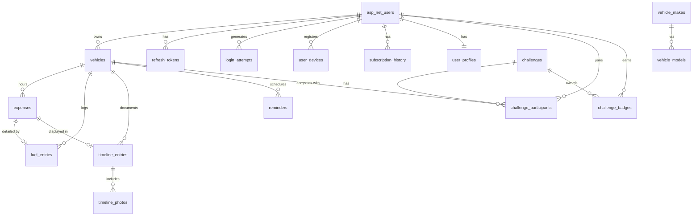

# Database Schema Design — Car Ownership Intelligence Platform

**File:** `/03-product/technical/database-schema.md`
**Produced by:** @product-architect
**Date:** 2026-03-22
**Version:** 1.0
**Status:** Draft

---

## References

### Input Documents

| Document | Path | Used For |
|---|---|---|
| Technical Architecture | `/03-product/technical/architecture.md` | Stack decisions, module structure, data flow |
| Onboarding & Auth Spec | `/03-product/functional-specs/onboarding-auth.md` | User, AuthToken, LoginAttempt entities |
| Vehicle Management Spec | `/03-product/functional-specs/vehicle-management.md` | Vehicle entity |
| Expense Tracking Spec | `/03-product/functional-specs/expense-tracking.md` | Expense entity, categories |
| Fuel Entry Spec | `/03-product/functional-specs/fuel-entry.md` | FuelEntry entity |
| Cost Dashboard Spec | `/03-product/functional-specs/cost-dashboard.md` | Aggregation queries, premium gating |
| Vehicle Timeline Spec | `/03-product/functional-specs/vehicle-timeline.md` | TimelineEntry, TimelinePhoto entities |
| Maintenance Reminders Spec | `/03-product/functional-specs/maintenance-reminders.md` | Reminder entity |
| Challenges & Gamification Spec | `/03-product/functional-specs/challenges-gamification.md` | Challenge, ChallengeParticipant, ChallengeBadge entities |
| Share & Export Spec | `/03-product/functional-specs/share-export.md` | No new entities (reads existing) |
| DEC-010 Database Decision | `/00-project/decisions/DEC-010-database.md` | PostgreSQL, EF Core + Npgsql |
| DEC-011 Authentication Decision | `/00-project/decisions/DEC-011-authentication.md` | ASP.NET Identity tables |
| DEC-016 Subscriptions Decision | `/00-project/decisions/DEC-016-subscriptions-iap.md` | RevenueCat, subscription tracking |
| Monetization Plan | `/02-strategy/monetization-plan.md` | Tier limits, pricing |

### Tech Stack

- **Database:** PostgreSQL 16+ (self-hosted on VPS)
- **ORM:** Entity Framework Core + Npgsql
- **Auth:** ASP.NET Identity (provides AspNetUsers, AspNetRoles, AspNetUserRoles, etc.)
- **Primary keys:** UUID (`uuid_generate_v4()`)
- **Naming:** snake_case for all tables and columns (PostgreSQL convention)

---

## 1. Design Principles

### 1.1 Core Conventions

| Principle | Implementation |
|---|---|
| **UUID primary keys** | All tables use `id UUID PRIMARY KEY DEFAULT uuid_generate_v4()`. Required for future offline sync (client-generated IDs won't collide with server IDs). |
| **Multi-tenant from day one** | Every user-owned table has `user_id UUID NOT NULL` FK to `asp_net_users`. Future `org_id` column is documented as extension point but NOT created yet. |
| **Soft deletes everywhere** | All domain tables include `deleted_at TIMESTAMPTZ NULL`. Queries filter `WHERE deleted_at IS NULL` by default. Hard deletes only for auth tokens and login attempts. |
| **Audit timestamps** | All tables include `created_at TIMESTAMPTZ NOT NULL DEFAULT now()` and `updated_at TIMESTAMPTZ NOT NULL DEFAULT now()`. Updated via EF Core `SaveChanges` interceptor. |
| **Money as integer cents** | All monetary amounts stored as `INTEGER` (cents). Example: 127.50 лв = 12750. No floating point. Currency stored separately as ISO 4217 code. |
| **GDPR PII flagging** | Columns containing personally identifiable information are marked with `-- PII` comments. Enables automated data export and deletion for GDPR compliance. |
| **No cascading deletes in FK** | All FKs use `ON DELETE RESTRICT`. Cascading logic is handled in application code (EF Core) for explicit control and auditability. Exception: ASP.NET Identity tables follow their own conventions. |

### 1.2 Naming Conventions

- **Tables:** plural, snake_case (e.g., `vehicles`, `expenses`, `fuel_entries`)
- **Columns:** snake_case (e.g., `user_id`, `created_at`, `price_per_liter_thousandths`)
- **Foreign keys:** `{referenced_table_singular}_id` (e.g., `vehicle_id`, `expense_id`)
- **Indexes:** `ix_{table}_{columns}` (e.g., `ix_expenses_vehicle_id_date`)
- **Unique constraints:** `uq_{table}_{columns}` (e.g., `uq_users_email`)
- **Check constraints:** `ck_{table}_{description}` (e.g., `ck_expenses_amount_positive`)
- **Enums:** stored as `VARCHAR` lookup values (not PostgreSQL `CREATE TYPE` — see Section 5 for rationale)

---

## 2. Schema Overview

### 2.1 Entity-Relationship Diagram



### 2.2 Table Groups by Module

| Module | Tables | Spec Source |
|---|---|---|
| **Auth** | `asp_net_users` (Identity), `asp_net_roles`, `asp_net_user_roles`, `user_profiles`, `refresh_tokens`, `password_reset_tokens`, `login_attempts`, `user_devices` | onboarding-auth.md |
| **Vehicles** | `vehicles`, `vehicle_makes`, `vehicle_models` | vehicle-management.md |
| **Expenses** | `expenses`, `expense_categories` (seed) | expense-tracking.md |
| **Fuel** | `fuel_entries` | fuel-entry.md |
| **Timeline** | `timeline_entries`, `timeline_photos` | vehicle-timeline.md |
| **Reminders** | `reminders`, `reminder_completions` | maintenance-reminders.md |
| **Subscriptions** | `subscription_history` | DEC-016, monetization-plan.md |
| **Challenges** | `challenges`, `challenge_participants`, `challenge_badges` | challenges-gamification.md |
| **Analytics/Admin** | `analytics_events` | architecture.md Section 7.2, PRD |

---

## 3. Table Definitions

### 3.1 Auth Module

#### Table: `asp_net_users` (ASP.NET Identity — Extended)

ASP.NET Identity creates this table automatically. We extend it with custom columns via a custom `ApplicationUser : IdentityUser<Guid>` class.

| Column | Type | Nullable | Default | Constraints | PII |
|---|---|---|---|---|---|
| `id` | `UUID` | NO | `uuid_generate_v4()` | PK | |
| `user_name` | `VARCHAR(256)` | YES | | Identity managed | YES |
| `normalized_user_name` | `VARCHAR(256)` | YES | | Identity managed, UNIQUE | |
| `email` | `VARCHAR(256)` | YES | | Identity managed | YES |
| `normalized_email` | `VARCHAR(256)` | YES | | Identity managed, UNIQUE | YES |
| `email_confirmed` | `BOOLEAN` | NO | `false` | | |
| `password_hash` | `TEXT` | YES | | NULL for OAuth-only accounts | |
| `security_stamp` | `TEXT` | YES | | Identity managed | |
| `concurrency_stamp` | `TEXT` | YES | | Identity managed | |
| `phone_number` | `VARCHAR(20)` | YES | | | YES |
| `phone_number_confirmed` | `BOOLEAN` | NO | `false` | | |
| `two_factor_enabled` | `BOOLEAN` | NO | `false` | | |
| `lockout_end` | `TIMESTAMPTZ` | YES | | | |
| `lockout_enabled` | `BOOLEAN` | NO | `true` | | |
| `access_failed_count` | `INTEGER` | NO | `0` | | |
| `display_name` | `VARCHAR(50)` | YES | | | YES |
| `avatar_url` | `VARCHAR(500)` | YES | | Photo storage URL | |
| `auth_provider` | `VARCHAR(20)` | NO | `'email'` | `CHECK (auth_provider IN ('email', 'google', 'apple', 'facebook'))` | |
| `locale` | `VARCHAR(5)` | NO | `'bg'` | `CHECK (locale IN ('bg', 'en'))` | |
| `currency_preference` | `VARCHAR(3)` | NO | `'BGN'` | `CHECK (currency_preference IN ('BGN', 'EUR'))` | |
| `distance_unit` | `VARCHAR(5)` | NO | `'km'` | `CHECK (distance_unit IN ('km', 'mi'))` | |
| `onboarding_completed` | `BOOLEAN` | NO | `false` | | |
| `onboarding_skipped_at_step` | `VARCHAR(30)` | YES | | NULL if not skipped | |
| `last_activity_at` | `TIMESTAMPTZ` | YES | | Updated by middleware on each API call | |
| `last_expense_at` | `TIMESTAMPTZ` | YES | | Denormalized — updated on expense create | |
| `created_at` | `TIMESTAMPTZ` | NO | `now()` | | |
| `updated_at` | `TIMESTAMPTZ` | NO | `now()` | | |
| `deleted_at` | `TIMESTAMPTZ` | YES | | Soft delete | |

**Notes:**
- ASP.NET Identity columns (`user_name` through `access_failed_count`) are managed by the Identity framework. Custom columns start at `display_name`.
- `last_activity_at` and `last_expense_at` are denormalized fields for efficient admin analytics queries (architecture.md Section 7.2). They avoid scanning the expenses table for DAU/WAU/MAU calculations.
- Lockout is handled by Identity's built-in `lockout_end` + `access_failed_count` (maps to BR-4 in onboarding-auth.md: 5 failed attempts = 15 min lockout).

---

#### Table: `user_profiles`

Extended profile data that doesn't belong on the Identity user table. One-to-one with `asp_net_users`.

| Column | Type | Nullable | Default | Constraints | PII |
|---|---|---|---|---|---|
| `id` | `UUID` | NO | `uuid_generate_v4()` | PK | |
| `user_id` | `UUID` | NO | | FK → `asp_net_users(id)`, UNIQUE | |
| `notification_quiet_start` | `TIME` | YES | `'22:00'` | Reminders BR-10: quiet hours | |
| `notification_quiet_end` | `TIME` | YES | `'08:00'` | | |
| `milestone_10_shown` | `BOOLEAN` | NO | `false` | Dashboard milestone tracking | |
| `milestone_25_shown` | `BOOLEAN` | NO | `false` | | |
| `milestone_50_shown` | `BOOLEAN` | NO | `false` | | |
| `milestone_100_shown` | `BOOLEAN` | NO | `false` | | |
| `created_at` | `TIMESTAMPTZ` | NO | `now()` | | |
| `updated_at` | `TIMESTAMPTZ` | NO | `now()` | | |

**FK:** `user_id` → `asp_net_users(id)` ON DELETE RESTRICT

---

#### Table: `refresh_tokens`

| Column | Type | Nullable | Default | Constraints | PII |
|---|---|---|---|---|---|
| `id` | `UUID` | NO | `uuid_generate_v4()` | PK | |
| `user_id` | `UUID` | NO | | FK → `asp_net_users(id)` | |
| `token_hash` | `VARCHAR(256)` | NO | | Hashed, never plain text | |
| `expires_at` | `TIMESTAMPTZ` | NO | | 30-day expiry (BR-6) | |
| `revoked_at` | `TIMESTAMPTZ` | YES | | NULL = active | |
| `replaced_by_token_id` | `UUID` | YES | | FK → self, for rotation chain | |
| `created_at` | `TIMESTAMPTZ` | NO | `now()` | | |

**FK:** `user_id` → `asp_net_users(id)` ON DELETE RESTRICT
**FK:** `replaced_by_token_id` → `refresh_tokens(id)` ON DELETE SET NULL
**Note:** No soft delete — expired/revoked tokens are hard-deleted by a background cleanup job.

---

#### Table: `password_reset_tokens`

| Column | Type | Nullable | Default | Constraints | PII |
|---|---|---|---|---|---|
| `id` | `UUID` | NO | `uuid_generate_v4()` | PK | |
| `user_id` | `UUID` | NO | | FK → `asp_net_users(id)` | |
| `token_hash` | `VARCHAR(256)` | NO | | Hashed | |
| `expires_at` | `TIMESTAMPTZ` | NO | | 1-hour expiry (BR-5) | |
| `used_at` | `TIMESTAMPTZ` | YES | | NULL = unused | |
| `created_at` | `TIMESTAMPTZ` | NO | `now()` | | |

**FK:** `user_id` → `asp_net_users(id)` ON DELETE RESTRICT
**Note:** No soft delete — consumed/expired tokens are hard-deleted by cleanup job.

---

#### Table: `login_attempts`

| Column | Type | Nullable | Default | Constraints | PII |
|---|---|---|---|---|---|
| `id` | `UUID` | NO | `uuid_generate_v4()` | PK | |
| `user_id` | `UUID` | YES | | FK → `asp_net_users(id)`, NULL for non-existent emails | |
| `ip_address` | `VARCHAR(45)` | NO | | IPv4 or IPv6 | YES |
| `success` | `BOOLEAN` | NO | | | |
| `created_at` | `TIMESTAMPTZ` | NO | `now()` | | |

**FK:** `user_id` → `asp_net_users(id)` ON DELETE RESTRICT
**Note:** No soft delete — old attempts are hard-deleted by cleanup job (retain 90 days). IP addresses are PII under GDPR.

---

#### Table: `user_devices`

FCM token registration for push notifications (DEC-014).

| Column | Type | Nullable | Default | Constraints | PII |
|---|---|---|---|---|---|
| `id` | `UUID` | NO | `uuid_generate_v4()` | PK | |
| `user_id` | `UUID` | NO | | FK → `asp_net_users(id)` | |
| `fcm_token` | `VARCHAR(500)` | NO | | Firebase Cloud Messaging token | |
| `device_platform` | `VARCHAR(10)` | NO | | `CHECK (device_platform IN ('android', 'ios'))` | |
| `device_name` | `VARCHAR(100)` | YES | | User's device model | |
| `is_active` | `BOOLEAN` | NO | `true` | Deactivated when token is invalidated | |
| `created_at` | `TIMESTAMPTZ` | NO | `now()` | | |
| `updated_at` | `TIMESTAMPTZ` | NO | `now()` | | |

**FK:** `user_id` → `asp_net_users(id)` ON DELETE RESTRICT
**UNIQUE:** `uq_user_devices_fcm_token` on `(fcm_token)` — one token per device

---

### 3.2 Vehicles Module

#### Table: `vehicles`

| Column | Type | Nullable | Default | Constraints | PII |
|---|---|---|---|---|---|
| `id` | `UUID` | NO | `uuid_generate_v4()` | PK | |
| `user_id` | `UUID` | NO | | FK → `asp_net_users(id)` | |
| `make` | `VARCHAR(50)` | NO | | Vehicle make (e.g., "BMW") | |
| `model` | `VARCHAR(50)` | NO | | Vehicle model (e.g., "E46 320i") | |
| `year` | `SMALLINT` | NO | | `CHECK (year BETWEEN 1970 AND 2100)` | |
| `fuel_type` | `VARCHAR(10)` | YES | | `CHECK (fuel_type IN ('petrol', 'diesel', 'lpg', 'hybrid', 'electric', 'other'))` | |
| `license_plate` | `VARCHAR(15)` | YES | | | YES |
| `current_odometer_km` | `INTEGER` | YES | | `CHECK (current_odometer_km >= 0)` | |
| `photo_url` | `VARCHAR(500)` | YES | | Path to compressed image | |
| `nickname` | `VARCHAR(30)` | YES | | User-defined display name | |
| `is_active` | `BOOLEAN` | NO | `false` | Active vehicle for UI context | |
| `created_at` | `TIMESTAMPTZ` | NO | `now()` | | |
| `updated_at` | `TIMESTAMPTZ` | NO | `now()` | | |
| `deleted_at` | `TIMESTAMPTZ` | YES | | Soft delete | |

**FK:** `user_id` → `asp_net_users(id)` ON DELETE RESTRICT

**Business rules enforced:**
- BR-1 (vehicle-management): Free tier max 2 vehicles — enforced in application layer, not DB constraint (tier may change)
- BR-7 (vehicle-management): Odometer non-decreasing — enforced in application layer (allows override)
- BR-8 (vehicle-management): Photo compressed to 1920x1080, max 500KB — enforced client-side

---

#### Table: `vehicle_makes` (Seed Data)

Static lookup table for the make picker. Top 50+ makes in the Bulgarian market.

| Column | Type | Nullable | Default | Constraints |
|---|---|---|---|---|
| `id` | `UUID` | NO | `uuid_generate_v4()` | PK |
| `name` | `VARCHAR(50)` | NO | | UNIQUE |
| `display_order` | `INTEGER` | NO | `999` | Lower = higher in picker. Popular BG makes get 1-10. |
| `is_popular_bg` | `BOOLEAN` | NO | `false` | BMW, VW, Audi, Mercedes, Opel, Toyota = true |

---

#### Table: `vehicle_models` (Seed Data)

| Column | Type | Nullable | Default | Constraints |
|---|---|---|---|---|
| `id` | `UUID` | NO | `uuid_generate_v4()` | PK |
| `make_id` | `UUID` | NO | | FK → `vehicle_makes(id)` |
| `name` | `VARCHAR(50)` | NO | | |
| `display_order` | `INTEGER` | NO | `999` | |

**FK:** `make_id` → `vehicle_makes(id)` ON DELETE RESTRICT
**UNIQUE:** `uq_vehicle_models_make_name` on `(make_id, name)`

---

### 3.3 Expenses Module

#### Table: `expenses`

The core data table. Every car-related cost is an expense.

| Column | Type | Nullable | Default | Constraints | PII |
|---|---|---|---|---|---|
| `id` | `UUID` | NO | `uuid_generate_v4()` | PK | |
| `user_id` | `UUID` | NO | | FK → `asp_net_users(id)` | |
| `vehicle_id` | `UUID` | NO | | FK → `vehicles(id)` | |
| `amount_cents` | `INTEGER` | NO | | `CHECK (amount_cents > 0 AND amount_cents <= 99999999)` — max 999,999.99 | |
| `currency` | `VARCHAR(3)` | NO | `'BGN'` | `CHECK (currency IN ('BGN', 'EUR'))` — ISO 4217 | |
| `category` | `VARCHAR(20)` | NO | | `CHECK (category IN ('fuel', 'maintenance', 'modifications', 'insurance', 'tax', 'tires', 'parking', 'fines', 'car_wash', 'other'))` | |
| `subcategory` | `VARCHAR(50)` | YES | | Free text or from suggested list | |
| `date` | `DATE` | NO | | `CHECK (date <= CURRENT_DATE)` — no future dates | |
| `odometer_km` | `INTEGER` | YES | | `CHECK (odometer_km >= 0 AND odometer_km <= 9999999)` | |
| `notes` | `VARCHAR(500)` | YES | | | |
| `source` | `VARCHAR(20)` | NO | `'manual'` | `CHECK (source IN ('manual', 'reminder_completion', 'garage_sync'))` | |
| `created_at` | `TIMESTAMPTZ` | NO | `now()` | | |
| `updated_at` | `TIMESTAMPTZ` | NO | `now()` | | |
| `deleted_at` | `TIMESTAMPTZ` | YES | | Soft delete | |

**FK:** `user_id` → `asp_net_users(id)` ON DELETE RESTRICT
**FK:** `vehicle_id` → `vehicles(id)` ON DELETE RESTRICT

**Business rules enforced:**
- BR-1 (expense-tracking): Unlimited in both free and premium — no DB constraint
- BR-5 (expense-tracking): Amounts in user's primary currency (лв default) — `currency` column
- BR-6 (expense-tracking): Amount > 0 and <= 999,999.99 — CHECK on `amount_cents`
- BR-14 (expense-tracking): Date can be backdated up to 5 years — enforced in application layer (more flexible than a CHECK)

---

#### Table: `expense_categories` (Seed Data)

Reference table for category metadata (icons, localized names). The 10 fixed MVP categories.

| Column | Type | Nullable | Default | Constraints |
|---|---|---|---|---|
| `id` | `UUID` | NO | `uuid_generate_v4()` | PK |
| `slug` | `VARCHAR(20)` | NO | | UNIQUE — matches `expenses.category` values |
| `name_bg` | `VARCHAR(30)` | NO | | Bulgarian display name |
| `name_en` | `VARCHAR(30)` | NO | | English display name |
| `icon_name` | `VARCHAR(30)` | NO | | Icon identifier for the mobile app |
| `display_order` | `INTEGER` | NO | | Sort order in UI |

---

### 3.4 Fuel Module

#### Table: `fuel_entries`

Detailed fuel logging — linked 1:1 with an expense record (category = 'fuel').

| Column | Type | Nullable | Default | Constraints | PII |
|---|---|---|---|---|---|
| `id` | `UUID` | NO | `uuid_generate_v4()` | PK | |
| `expense_id` | `UUID` | NO | | FK → `expenses(id)`, UNIQUE | |
| `vehicle_id` | `UUID` | NO | | FK → `vehicles(id)` — denormalized for query efficiency | |
| `liters_ml` | `INTEGER` | YES | | Milliliters (42.5L = 42500). `CHECK (liters_ml > 0)` | |
| `price_per_liter_thousandths` | `INTEGER` | YES | | Thousandths of currency unit (2.850 лв = 2850). `CHECK (price_per_liter_thousandths > 0)` | |
| `total_cost_cents` | `INTEGER` | NO | | Cents — mirrors `expenses.amount_cents`. `CHECK (total_cost_cents > 0)` | |
| `odometer_km` | `INTEGER` | YES | | `CHECK (odometer_km >= 0 AND odometer_km <= 9999999)` | |
| `fill_type` | `VARCHAR(10)` | NO | `'full'` | `CHECK (fill_type IN ('full', 'partial'))` | |
| `station_name` | `VARCHAR(50)` | YES | | Free text | |
| `consumption_l_per_100km` | `DECIMAL(5,2)` | YES | | Calculated server-side. NULL if not calculable. | |
| `created_at` | `TIMESTAMPTZ` | NO | `now()` | | |
| `updated_at` | `TIMESTAMPTZ` | NO | `now()` | | |
| `deleted_at` | `TIMESTAMPTZ` | YES | | Soft delete | |

**FK:** `expense_id` → `expenses(id)` ON DELETE RESTRICT
**FK:** `vehicle_id` → `vehicles(id)` ON DELETE RESTRICT
**UNIQUE:** `uq_fuel_entries_expense_id` on `(expense_id)` — one fuel entry per expense

**Design decisions:**
- `liters_ml` stores milliliters as integer to avoid floating point (42.5L = 42500 ml). One decimal place precision in UI.
- `price_per_liter_thousandths` stores thousandths to preserve 3 decimal places (BR-7 in fuel-entry.md: Bulgarian fuel prices sometimes have 3 decimals).
- `consumption_l_per_100km` uses `DECIMAL(5,2)` because it's a calculated display value, not a financial amount. Precision to 0.01 L/100km is sufficient.
- `vehicle_id` is denormalized (also on the linked expense) to enable efficient fuel history queries per vehicle without joining through expenses.

---

### 3.5 Timeline Module

#### Table: `timeline_entries`

Chronological feed entries — some auto-created from expenses, some standalone.

| Column | Type | Nullable | Default | Constraints | PII |
|---|---|---|---|---|---|
| `id` | `UUID` | NO | `uuid_generate_v4()` | PK | |
| `user_id` | `UUID` | NO | | FK → `asp_net_users(id)` | |
| `vehicle_id` | `UUID` | NO | | FK → `vehicles(id)` | |
| `expense_id` | `UUID` | YES | | FK → `expenses(id)`, NULL for standalone entries | |
| `category` | `VARCHAR(20)` | NO | | Same categories as expense + `'event'` for non-cost entries. `CHECK (category IN ('fuel', 'maintenance', 'modifications', 'insurance', 'tax', 'tires', 'parking', 'fines', 'car_wash', 'other', 'event'))` | |
| `description` | `VARCHAR(200)` | YES | | Title/summary | |
| `amount_cents` | `INTEGER` | YES | | `CHECK (amount_cents IS NULL OR amount_cents >= 0)` — NULL for no-cost entries | |
| `currency` | `VARCHAR(3)` | YES | `'BGN'` | | |
| `date` | `DATE` | NO | | | |
| `odometer_km` | `INTEGER` | YES | | `CHECK (odometer_km >= 0 AND odometer_km <= 9999999)` | |
| `notes` | `VARCHAR(1000)` | YES | | Longer than expense notes — timeline is the "journal" | |
| `created_by` | `VARCHAR(10)` | NO | `'owner'` | `CHECK (created_by IN ('owner', 'garage', 'dealer', 'system'))` — MVP only uses `'owner'` | |
| `created_at` | `TIMESTAMPTZ` | NO | `now()` | | |
| `updated_at` | `TIMESTAMPTZ` | NO | `now()` | | |
| `deleted_at` | `TIMESTAMPTZ` | YES | | Soft delete | |

**FK:** `user_id` → `asp_net_users(id)` ON DELETE RESTRICT
**FK:** `vehicle_id` → `vehicles(id)` ON DELETE RESTRICT
**FK:** `expense_id` → `expenses(id)` ON DELETE RESTRICT

**Business rules:**
- BR-1 (vehicle-timeline): Every expense auto-creates a timeline entry — `expense_id` links them
- BR-2 (vehicle-timeline): Standalone entries have `expense_id = NULL` and optionally `amount_cents = NULL`
- BR-3 (vehicle-timeline): Deleting either side cascades to the other — enforced in application layer

---

#### Table: `timeline_photos`

| Column | Type | Nullable | Default | Constraints | PII |
|---|---|---|---|---|---|
| `id` | `UUID` | NO | `uuid_generate_v4()` | PK | |
| `timeline_entry_id` | `UUID` | NO | | FK → `timeline_entries(id)` | |
| `photo_url` | `VARCHAR(500)` | NO | | Path to compressed image on storage | |
| `sort_order` | `SMALLINT` | NO | `0` | Display order within entry | |
| `created_at` | `TIMESTAMPTZ` | NO | `now()` | | |

**FK:** `timeline_entry_id` → `timeline_entries(id)` ON DELETE RESTRICT

**Business rules:**
- BR-4 (vehicle-timeline): Free tier 5 photos total — enforced in application layer
- BR-5 (vehicle-timeline): Max 3 photos per entry — enforced in application layer
- BR-6 (vehicle-timeline): Photos compressed to 1920x1080, max 500KB JPEG — client-side

---

### 3.6 Reminders Module

#### Table: `reminders`

| Column | Type | Nullable | Default | Constraints | PII |
|---|---|---|---|---|---|
| `id` | `UUID` | NO | `uuid_generate_v4()` | PK | |
| `user_id` | `UUID` | NO | | FK → `asp_net_users(id)` | |
| `vehicle_id` | `UUID` | NO | | FK → `vehicles(id)` | |
| `name` | `VARCHAR(100)` | NO | | e.g., "Oil Change", "Insurance Renewal" | |
| `trigger_type` | `VARCHAR(10)` | NO | | `CHECK (trigger_type IN ('date', 'mileage', 'combined'))` | |
| `next_due_date` | `DATE` | YES | | Required if trigger_type = 'date' or 'combined' | |
| `repeat_interval_days` | `INTEGER` | YES | | NULL = one-time. E.g., 365 for annual. `CHECK (repeat_interval_days > 0)` | |
| `mileage_interval_km` | `INTEGER` | YES | | E.g., 10000 for every 10K km. `CHECK (mileage_interval_km > 0)` | |
| `next_due_mileage_km` | `INTEGER` | YES | | Absolute target. `CHECK (next_due_mileage_km > 0)` | |
| `notification_days_before` | `VARCHAR(30)` | NO | `'30,7,1'` | Comma-separated days (BR-3) | |
| `notification_km_before` | `VARCHAR(20)` | NO | `'1000,500'` | Comma-separated km thresholds (BR-4) | |
| `last_completed_date` | `DATE` | YES | | | |
| `last_completed_odometer_km` | `INTEGER` | YES | | | |
| `snooze_count` | `SMALLINT` | NO | `0` | Tracks snoozes for the current cycle (BR-8: limit 3) | |
| `status` | `VARCHAR(10)` | NO | `'active'` | `CHECK (status IN ('active', 'snoozed', 'overdue', 'completed'))` | |
| `source` | `VARCHAR(20)` | NO | `'user_created'` | `CHECK (source IN ('user_created', 'system_suggested', 'garage_created', 'fleet_policy'))` — MVP: user_created only | |
| `notes` | `VARCHAR(500)` | YES | | | |
| `created_at` | `TIMESTAMPTZ` | NO | `now()` | | |
| `updated_at` | `TIMESTAMPTZ` | NO | `now()` | | |
| `deleted_at` | `TIMESTAMPTZ` | YES | | Soft delete | |

**FK:** `user_id` → `asp_net_users(id)` ON DELETE RESTRICT
**FK:** `vehicle_id` → `vehicles(id)` ON DELETE RESTRICT

**Business rules:**
- BR-1 (maintenance-reminders): Free tier max 3 active reminders — enforced in application layer
- BR-6: After completion, next cycle auto-scheduled — application logic updates `next_due_date`/`next_due_mileage_km`
- Notification thresholds stored as comma-separated strings (simple, no need for a separate table at this scale)

---

#### Table: `reminder_completions`

Historical record of when reminders were completed. Enables "last 3 completions" display and average cost calculation.

| Column | Type | Nullable | Default | Constraints | PII |
|---|---|---|---|---|---|
| `id` | `UUID` | NO | `uuid_generate_v4()` | PK | |
| `reminder_id` | `UUID` | NO | | FK → `reminders(id)` | |
| `expense_id` | `UUID` | YES | | FK → `expenses(id)`, NULL if completed without logging expense | |
| `completed_date` | `DATE` | NO | | | |
| `odometer_km` | `INTEGER` | YES | | | |
| `created_at` | `TIMESTAMPTZ` | NO | `now()` | | |

**FK:** `reminder_id` → `reminders(id)` ON DELETE RESTRICT
**FK:** `expense_id` → `expenses(id)` ON DELETE SET NULL

---

### 3.7 Subscriptions Module

#### Table: `subscription_history`

Tracks subscription state changes over time. Each row is a state transition event, not the current state. The latest row per user is the current state.

| Column | Type | Nullable | Default | Constraints | PII |
|---|---|---|---|---|---|
| `id` | `UUID` | NO | `uuid_generate_v4()` | PK | |
| `user_id` | `UUID` | NO | | FK → `asp_net_users(id)` | |
| `event_type` | `VARCHAR(30)` | NO | | `CHECK (event_type IN ('initial_purchase', 'renewal', 'cancellation', 'expiration', 'reactivation', 'upgrade', 'downgrade', 'refund', 'manual_grant', 'manual_revoke'))` | |
| `plan` | `VARCHAR(10)` | NO | | `CHECK (plan IN ('free', 'monthly', 'annual'))` | |
| `status` | `VARCHAR(15)` | NO | | `CHECK (status IN ('active', 'cancelled', 'expired', 'grace_period', 'free'))` | |
| `started_at` | `TIMESTAMPTZ` | YES | | Subscription period start | |
| `expires_at` | `TIMESTAMPTZ` | YES | | Subscription period end | |
| `revenuecat_event_id` | `VARCHAR(100)` | YES | | RevenueCat webhook event ID for dedup | |
| `revenuecat_product_id` | `VARCHAR(100)` | YES | | Store product identifier | |
| `price_cents` | `INTEGER` | YES | | Price paid in cents | |
| `currency` | `VARCHAR(3)` | YES | | | |
| `created_at` | `TIMESTAMPTZ` | NO | `now()` | | |

**FK:** `user_id` → `asp_net_users(id)` ON DELETE RESTRICT
**UNIQUE:** `uq_subscription_history_rc_event` on `(revenuecat_event_id)` WHERE `revenuecat_event_id IS NOT NULL` — prevents duplicate webhook processing

**Design decision:** Subscription history is append-only (no updates, no deletes). Current subscription status is derived from the latest row per user. This provides a full audit trail for support, debugging, and revenue analytics. The JWT claim `subscription_tier` (architecture.md Section 5.2) is the runtime source of truth; this table is the persistence layer.

---

### 3.8 Challenges Module

#### Table: `challenges`

Admin-created monthly challenges.

| Column | Type | Nullable | Default | Constraints | PII |
|---|---|---|---|---|---|
| `id` | `UUID` | NO | `uuid_generate_v4()` | PK | |
| `name` | `VARCHAR(100)` | NO | | e.g., "Lowest Cost per km" | |
| `description` | `VARCHAR(500)` | NO | | | |
| `metric_type` | `VARCHAR(20)` | NO | | `CHECK (metric_type IN ('cost_per_km', 'fuel_efficiency', 'expense_count'))` | |
| `month` | `SMALLINT` | NO | | 1-12 | |
| `year` | `SMALLINT` | NO | | | |
| `status` | `VARCHAR(10)` | NO | `'upcoming'` | `CHECK (status IN ('upcoming', 'active', 'completed'))` | |
| `min_participants` | `INTEGER` | NO | `50` | BR-5: challenges need minimum users | |
| `participant_count` | `INTEGER` | NO | `0` | Denormalized counter | |
| `sponsor_id` | `UUID` | YES | | Future: brand sponsor FK | |
| `scope` | `VARCHAR(15)` | NO | `'global'` | `CHECK (scope IN ('global', 'vehicle_class', 'team', 'fleet'))` — MVP: global only | |
| `created_at` | `TIMESTAMPTZ` | NO | `now()` | | |

**UNIQUE:** `uq_challenges_metric_month_year` on `(metric_type, month, year)` — one challenge per metric per month

---

#### Table: `challenge_participants`

| Column | Type | Nullable | Default | Constraints | PII |
|---|---|---|---|---|---|
| `id` | `UUID` | NO | `uuid_generate_v4()` | PK | |
| `challenge_id` | `UUID` | NO | | FK → `challenges(id)` | |
| `user_id` | `UUID` | NO | | FK → `asp_net_users(id)` | |
| `vehicle_id` | `UUID` | NO | | FK → `vehicles(id)` — locked for the month | |
| `current_rank` | `INTEGER` | YES | | Recalculated periodically | |
| `current_metric_value` | `DECIMAL(10,4)` | YES | | Depends on metric_type | |
| `joined_at` | `TIMESTAMPTZ` | NO | `now()` | | |
| `updated_at` | `TIMESTAMPTZ` | NO | `now()` | | |

**FK:** `challenge_id` → `challenges(id)` ON DELETE RESTRICT
**FK:** `user_id` → `asp_net_users(id)` ON DELETE RESTRICT
**FK:** `vehicle_id` → `vehicles(id)` ON DELETE RESTRICT
**UNIQUE:** `uq_challenge_participants_challenge_user` on `(challenge_id, user_id)` — one entry per user per challenge

---

#### Table: `challenge_badges`

| Column | Type | Nullable | Default | Constraints | PII |
|---|---|---|---|---|---|
| `id` | `UUID` | NO | `uuid_generate_v4()` | PK | |
| `user_id` | `UUID` | NO | | FK → `asp_net_users(id)` | |
| `challenge_id` | `UUID` | NO | | FK → `challenges(id)` | |
| `badge_type` | `VARCHAR(20)` | NO | | `CHECK (badge_type IN ('top_1', 'top_3', 'top_10'))` | |
| `final_rank` | `INTEGER` | NO | | User's rank when badge was awarded | |
| `final_metric_value` | `DECIMAL(10,4)` | NO | | | |
| `earned_at` | `TIMESTAMPTZ` | NO | `now()` | | |

**FK:** `user_id` → `asp_net_users(id)` ON DELETE RESTRICT
**FK:** `challenge_id` → `challenges(id)` ON DELETE RESTRICT
**UNIQUE:** `uq_challenge_badges_challenge_user` on `(challenge_id, user_id)` — one badge per user per challenge

---

### 3.9 Analytics Module

#### Table: `analytics_events`

Server-side analytics event store. Complements Firebase Analytics (mobile client-side). Used for admin dashboard metrics and events that don't originate from the mobile client.

| Column | Type | Nullable | Default | Constraints | PII |
|---|---|---|---|---|---|
| `id` | `UUID` | NO | `uuid_generate_v4()` | PK | |
| `user_id` | `UUID` | YES | | FK → `asp_net_users(id)`, NULL for anonymous events | |
| `event_name` | `VARCHAR(50)` | NO | | e.g., `'premium_tease_tapped'`, `'reminder_notification_sent'` | |
| `event_data` | `JSONB` | YES | | Flexible key-value payload | |
| `created_at` | `TIMESTAMPTZ` | NO | `now()` | | |

**FK:** `user_id` → `asp_net_users(id)` ON DELETE SET NULL

**Design decision:** JSONB for `event_data` provides flexibility for diverse event payloads without schema migrations for every new event type. This table is append-only; old events are archived or hard-deleted by a retention policy (e.g., 12 months).

**Key events tracked server-side:**
- `reminder_notification_sent` — when push notification fires
- `subscription_changed` — RevenueCat webhook processed
- `challenge_rank_changed` — rank recalculation result
- `monthly_summary_sent` — end-of-month push notification
- `account_locked` — lockout triggered

---

## 4. Indexes

### 4.1 Auth Module Indexes

| Table | Index | Columns | Type | Justification |
|---|---|---|---|---|
| `asp_net_users` | `ix_users_last_activity_at` | `(last_activity_at)` WHERE `deleted_at IS NULL` | Partial | Admin DAU/WAU/MAU queries (architecture.md 7.2) |
| `asp_net_users` | `ix_users_last_expense_at` | `(last_expense_at)` WHERE `deleted_at IS NULL` | Partial | Admin retention cohort queries |
| `asp_net_users` | `ix_users_created_at` | `(created_at)` WHERE `deleted_at IS NULL` | Partial | Admin new user trends |
| `refresh_tokens` | `ix_refresh_tokens_user_id` | `(user_id)` WHERE `revoked_at IS NULL` | Partial | Token lookup during refresh |
| `refresh_tokens` | `ix_refresh_tokens_expires_at` | `(expires_at)` | B-tree | Cleanup job finds expired tokens |
| `login_attempts` | `ix_login_attempts_user_created` | `(user_id, created_at DESC)` | Composite | Lockout check: last 5 attempts |
| `user_devices` | `ix_user_devices_user_id` | `(user_id)` WHERE `is_active = true` | Partial | Push notification delivery |

### 4.2 Vehicles Module Indexes

| Table | Index | Columns | Type | Justification |
|---|---|---|---|---|
| `vehicles` | `ix_vehicles_user_id` | `(user_id)` WHERE `deleted_at IS NULL` | Partial | Vehicle list per user — most common query |
| `vehicles` | `ix_vehicles_user_active` | `(user_id, is_active)` WHERE `deleted_at IS NULL` | Partial composite | Find active vehicle for a user |

### 4.3 Expenses Module Indexes

| Table | Index | Columns | Type | Justification |
|---|---|---|---|---|
| `expenses` | `ix_expenses_vehicle_date` | `(vehicle_id, date DESC)` WHERE `deleted_at IS NULL` | Partial composite | Expense list per vehicle by month — primary query pattern. Column order: vehicle first (equality), date second (range/sort). |
| `expenses` | `ix_expenses_vehicle_category_date` | `(vehicle_id, category, date DESC)` WHERE `deleted_at IS NULL` | Partial composite | Dashboard category breakdown per vehicle per month. Also supports category filter on timeline. |
| `expenses` | `ix_expenses_user_id` | `(user_id)` WHERE `deleted_at IS NULL` | Partial | Admin: expenses per user |
| `expenses` | `ix_expenses_vehicle_date_amount` | `(vehicle_id, date)` INCLUDE `(amount_cents, category)` WHERE `deleted_at IS NULL` | Covering | Dashboard monthly total aggregation — avoids heap lookup for SUM(amount_cents) GROUP BY category |

### 4.4 Fuel Module Indexes

| Table | Index | Columns | Type | Justification |
|---|---|---|---|---|
| `fuel_entries` | `ix_fuel_entries_vehicle_created` | `(vehicle_id, created_at DESC)` WHERE `deleted_at IS NULL` | Partial composite | Fuel history list, consumption trend |
| `fuel_entries` | `ix_fuel_entries_vehicle_odometer` | `(vehicle_id, odometer_km DESC)` WHERE `deleted_at IS NULL AND odometer_km IS NOT NULL` | Partial composite | Find previous odometer for consumption calculation |

### 4.5 Timeline Module Indexes

| Table | Index | Columns | Type | Justification |
|---|---|---|---|---|
| `timeline_entries` | `ix_timeline_vehicle_date` | `(vehicle_id, date DESC)` WHERE `deleted_at IS NULL` | Partial composite | Timeline feed per vehicle — paginated, newest first |
| `timeline_entries` | `ix_timeline_vehicle_category` | `(vehicle_id, category)` WHERE `deleted_at IS NULL` | Partial composite | Filtered timeline view |
| `timeline_entries` | `ix_timeline_expense_id` | `(expense_id)` WHERE `expense_id IS NOT NULL AND deleted_at IS NULL` | Partial | Lookup timeline entry for an expense (bidirectional link) |
| `timeline_photos` | `ix_timeline_photos_entry_id` | `(timeline_entry_id)` | B-tree | Photos for an entry |

### 4.6 Reminders Module Indexes

| Table | Index | Columns | Type | Justification |
|---|---|---|---|---|
| `reminders` | `ix_reminders_vehicle_id` | `(vehicle_id)` WHERE `deleted_at IS NULL` | Partial | Reminders list per vehicle |
| `reminders` | `ix_reminders_status` | `(status, next_due_date)` WHERE `deleted_at IS NULL` | Partial composite | Background job finds due/overdue reminders for notification |
| `reminders` | `ix_reminders_user_status` | `(user_id, status)` WHERE `deleted_at IS NULL` | Partial composite | Count active reminders per user (free tier limit check) |
| `reminder_completions` | `ix_reminder_completions_reminder` | `(reminder_id, completed_date DESC)` | Composite | Last 3 completions per reminder |

### 4.7 Challenges Module Indexes

| Table | Index | Columns | Type | Justification |
|---|---|---|---|---|
| `challenges` | `ix_challenges_status` | `(status, year, month)` | Composite | List active challenges |
| `challenge_participants` | `ix_cp_challenge_rank` | `(challenge_id, current_rank ASC)` | Composite | Leaderboard query — sorted by rank |
| `challenge_participants` | `ix_cp_user_id` | `(user_id)` | B-tree | User's active challenges |
| `challenge_badges` | `ix_badges_user_id` | `(user_id)` | B-tree | User's badge collection |

### 4.8 Analytics Module Indexes

| Table | Index | Columns | Type | Justification |
|---|---|---|---|---|
| `analytics_events` | `ix_analytics_name_created` | `(event_name, created_at DESC)` | Composite | Query events by type over time |
| `analytics_events` | `ix_analytics_user_created` | `(user_id, created_at DESC)` WHERE `user_id IS NOT NULL` | Partial composite | Events per user |

### 4.9 Subscriptions Module Indexes

| Table | Index | Columns | Type | Justification |
|---|---|---|---|---|
| `subscription_history` | `ix_sub_history_user_created` | `(user_id, created_at DESC)` | Composite | Latest subscription state per user |
| `subscription_history` | `ix_sub_history_status` | `(status)` WHERE `status IN ('active', 'grace_period')` | Partial | Admin: count active subscribers |

---

## 5. Enums

### Approach: VARCHAR with CHECK Constraints

**Decision:** Store enum values as `VARCHAR` columns with `CHECK` constraints, NOT PostgreSQL `CREATE TYPE` enums.

**Rationale:**
1. **Migration simplicity:** Adding a new value to a `CHECK` constraint is a single `ALTER TABLE` statement. Adding a value to a PostgreSQL enum type requires `ALTER TYPE ... ADD VALUE` which cannot run inside a transaction (PostgreSQL limitation).
2. **EF Core compatibility:** EF Core maps string columns naturally. PostgreSQL enum types require extra Npgsql configuration and can cause migration headaches.
3. **Solo developer speed:** Less infrastructure to maintain. CHECK constraints are visible in the table definition.
4. **Trade-off accepted:** Slightly more storage (VARCHAR vs. integer enum). At our scale (< 100K users), this is negligible.

### Enum Value Definitions

| Enum Name | Values | Used In |
|---|---|---|
| **auth_provider** | `email`, `google`, `apple`, `facebook` | `asp_net_users.auth_provider` |
| **locale** | `bg`, `en` | `asp_net_users.locale` |
| **currency** | `BGN`, `EUR` | `asp_net_users.currency_preference`, `expenses.currency` |
| **distance_unit** | `km`, `mi` | `asp_net_users.distance_unit` |
| **fuel_type** | `petrol`, `diesel`, `lpg`, `hybrid`, `electric`, `other` | `vehicles.fuel_type` |
| **expense_category** | `fuel`, `maintenance`, `modifications`, `insurance`, `tax`, `tires`, `parking`, `fines`, `car_wash`, `other` | `expenses.category` |
| **timeline_category** | All expense categories + `event` | `timeline_entries.category` |
| **expense_source** | `manual`, `reminder_completion`, `garage_sync` | `expenses.source` |
| **fill_type** | `full`, `partial` | `fuel_entries.fill_type` |
| **reminder_trigger** | `date`, `mileage`, `combined` | `reminders.trigger_type` |
| **reminder_status** | `active`, `snoozed`, `overdue`, `completed` | `reminders.status` |
| **reminder_source** | `user_created`, `system_suggested`, `garage_created`, `fleet_policy` | `reminders.source` |
| **subscription_event** | `initial_purchase`, `renewal`, `cancellation`, `expiration`, `reactivation`, `upgrade`, `downgrade`, `refund`, `manual_grant`, `manual_revoke` | `subscription_history.event_type` |
| **subscription_plan** | `free`, `monthly`, `annual` | `subscription_history.plan` |
| **subscription_status** | `active`, `cancelled`, `expired`, `grace_period`, `free` | `subscription_history.status` |
| **challenge_metric** | `cost_per_km`, `fuel_efficiency`, `expense_count` | `challenges.metric_type` |
| **challenge_status** | `upcoming`, `active`, `completed` | `challenges.status` |
| **challenge_scope** | `global`, `vehicle_class`, `team`, `fleet` | `challenges.scope` |
| **badge_type** | `top_1`, `top_3`, `top_10` | `challenge_badges.badge_type` |
| **device_platform** | `android`, `ios` | `user_devices.device_platform` |
| **timeline_created_by** | `owner`, `garage`, `dealer`, `system` | `timeline_entries.created_by` |
| **user_role** | `driver`, `admin`, `garage_owner`, `dealer`, `fleet_manager` | ASP.NET Identity roles (`asp_net_roles` table) |

---

## 6. Key Relationships

### 6.1 User → Vehicle Ownership

```
asp_net_users (1) ──── (0..*) vehicles
```

- A user owns 0 or more vehicles.
- Free tier limits to 2 vehicles (application-enforced).
- `vehicles.user_id` is the ownership FK.
- **Vehicle transfer (future):** Currently, vehicles cannot transfer between users. For future resale history support, add a `vehicle_ownership_history` table with `user_id`, `vehicle_id`, `start_date`, `end_date`. The current `vehicles.user_id` always points to the current owner.

### 6.2 Vehicle → Expense → FuelEntry Chain

```
vehicles (1) ──── (0..*) expenses (1) ──── (0..1) fuel_entries
```

- Every expense belongs to exactly one vehicle.
- A fuel_entry is always linked to exactly one expense (1:1 via `expense_id` UNIQUE FK).
- Quick fuel add creates an expense only. Detailed fuel add creates both.
- Deleting a fuel_entry should also delete its linked expense. Deleting an expense with a linked fuel_entry should delete the fuel_entry. Both directions handled in application code.

### 6.3 Expense ↔ Timeline Entry Bidirectional Link

```
expenses (1) ──── (0..1) timeline_entries (via timeline_entries.expense_id)
```

- Every expense auto-creates a timeline entry. The `timeline_entries.expense_id` links back.
- Timeline entries can also exist WITHOUT an expense (`expense_id = NULL`).
- **Cascade rules (application-enforced):**
  - Delete expense → delete linked timeline entry (and its photos)
  - Delete timeline entry with expense_id → delete linked expense (and linked fuel_entry if any)
  - This bidirectional cascade is explicitly warned in UI confirmation dialogs

### 6.4 Reminder → Expense via Completion

```
reminders (1) ──── (0..*) reminder_completions (0..1) ──── expenses
```

- When a reminder is completed, a `reminder_completions` row is created.
- If the user opts to log the expense, `reminder_completions.expense_id` links to the created expense.
- The expense is tagged `source = 'reminder_completion'`.
- Completing a reminder → logging expense → creates timeline entry: the full chain (BR-12, maintenance-reminders.md).

### 6.5 Challenge Participation Model

```
challenges (1) ──── (0..*) challenge_participants ──── asp_net_users + vehicles
```

- A challenge has many participants. A user joins with exactly one vehicle per challenge (UNIQUE on `challenge_id, user_id`).
- Rank and metric are recalculated periodically (hourly batch job or on expense save).
- At month end, top performers get `challenge_badges` rows.
- Free users can view but not join (application-enforced, not DB).

### 6.6 Subscription History (Event Sourcing Pattern)

```
asp_net_users (1) ──── (0..*) subscription_history [ordered by created_at DESC]
```

- Each row is a state change event (initial purchase, renewal, cancellation, etc.).
- Current state = latest row per user_id.
- JWT contains `subscription_tier` claim for runtime checks. DB is the audit trail.
- RevenueCat webhook events are deduplicated by `revenuecat_event_id`.

---

## 7. Migration Strategy

### 7.1 Migration Approach

- **EF Core Migrations** with sequential naming: `001_InitialIdentity`, `002_UserExtensions`, etc.
- Each migration is idempotent and can be rolled back.
- Migrations are version-controlled in the `api/src/CarPlatform.API/Migrations/` directory.
- Applied via `dotnet ef database update` during deployment.

### 7.2 Migration Order

Migrations are ordered by dependency — tables that are referenced by FKs are created before the referencing tables.

| # | Migration | Tables Created | Dependencies |
|---|---|---|---|
| **001** | `InitialIdentity` | `asp_net_users`, `asp_net_roles`, `asp_net_user_roles`, `asp_net_user_claims`, `asp_net_user_logins`, `asp_net_user_tokens`, `asp_net_role_claims` | None (Identity foundation) |
| **002** | `UserExtensions` | `user_profiles`, `refresh_tokens`, `password_reset_tokens`, `login_attempts`, `user_devices` | 001 (asp_net_users) |
| **003** | `VehicleLookups` | `vehicle_makes`, `vehicle_models` | None |
| **004** | `Vehicles` | `vehicles` | 001 (asp_net_users), 003 (lookups for seed reference) |
| **005** | `Expenses` | `expenses`, `expense_categories` | 001 (asp_net_users), 004 (vehicles) |
| **006** | `FuelEntries` | `fuel_entries` | 004 (vehicles), 005 (expenses) |
| **007** | `Timeline` | `timeline_entries`, `timeline_photos` | 001 (asp_net_users), 004 (vehicles), 005 (expenses) |
| **008** | `Reminders` | `reminders`, `reminder_completions` | 001 (asp_net_users), 004 (vehicles), 005 (expenses) |
| **009** | `Subscriptions` | `subscription_history` | 001 (asp_net_users) |
| **010** | `Challenges` | `challenges`, `challenge_participants`, `challenge_badges` | 001 (asp_net_users), 004 (vehicles) |
| **011** | `Analytics` | `analytics_events` | 001 (asp_net_users) |
| **012** | `SeedData` | (seeds into existing tables) | 003, 005 |
| **013** | `Indexes` | (all non-PK indexes) | All tables |

### 7.3 Seed Data Requirements

| Table | Seed Data | Count |
|---|---|---|
| `asp_net_roles` | `driver`, `admin` (MVP roles). Future: `garage_owner`, `dealer`, `fleet_manager` | 2 |
| `vehicle_makes` | Top 50+ makes for Bulgarian market. Popular: BMW, VW, Audi, Mercedes-Benz, Opel, Toyota, Peugeot, Renault, Ford, Hyundai, Kia, Skoda, Seat, Fiat, Honda, Mazda, Nissan, Volvo, Citroen, Dacia | 50+ |
| `vehicle_models` | Top 20 models per popular make (BMW: E36, E46, E90, F30, X3, X5, etc.) | ~500+ |
| `expense_categories` | 10 fixed categories with Bulgarian and English names, icons, display order | 10 |

### 7.4 Admin User Setup

The first deployment seeds an admin user account (configurable via environment variables) with the `admin` role. This user can access the Blazor WASM admin dashboard.

---

## 8. Extension Points

These are documented architectural hooks for post-MVP features. No tables or columns are created for these — only comments and design notes.

### 8.1 B2B Multi-Tenant (org_id)

**When:** After 5,000-10,000 active B2C users (Lean Canvas decision).

**Where `org_id` gets added:**

| Table | Column | Behavior |
|---|---|---|
| `asp_net_users` | `org_id UUID NULL FK → organizations(id)` | NULL for B2C users. Set for garage/dealer/fleet employees. |
| `vehicles` | `org_id UUID NULL FK → organizations(id)` | NULL for personal. Set for fleet/dealer inventory. |
| `expenses` | `org_id UUID NULL FK → organizations(id)` | NULL for personal. Set for business expenses. |
| `reminders` | `org_id UUID NULL FK → organizations(id)` | NULL for personal. Set for fleet maintenance policies. |

**New tables needed:**
- `organizations` — id, name, type (garage/dealer/fleet), created_at
- `organization_members` — id, org_id, user_id, role_in_org, joined_at

**Query impact:** All existing queries that filter by `user_id` continue to work. B2B queries add `org_id` filter. The `WHERE user_id = X` pattern ensures B2C users never see B2B data.

### 8.2 Challenge Expansion

**Sponsored challenges:** `challenges.sponsor_id` FK to a future `sponsors` table (brands, parts companies).

**Vehicle class sub-leaderboards:** `challenges.scope` already supports `'vehicle_class'`. New table: `vehicle_classes` (sedan, SUV, hatchback, etc.). Participants filtered by class.

**Team challenges:** `challenges.scope` = `'team'`. New table: `teams` (car clubs). `challenge_participants` gets `team_id` FK.

### 8.3 Fleet Management

Builds on the B2B org_id extension:

- `fleet_vehicles` — extends vehicles with fleet-specific fields (assigned_driver_id, department, cost_center)
- `fleet_policies` — org-level maintenance policies that auto-create reminders
- `fleet_reports` — aggregated cost reports per fleet

### 8.4 Offline Sync

UUID primary keys are already in place for client-generated IDs. Future additions:

- `sync_log` table — tracks last sync timestamp per user per device
- `version` column on all domain tables — optimistic concurrency for conflict detection
- Conflict resolution: last-write-wins for MVP offline, manual merge for complex cases

### 8.5 Social Features

- `user_follows` — follower/following relationships (if social profiles are added)
- `vehicle_visibility` — public/private/friends-only per vehicle (for shared profiles)

---

## 9. Performance Considerations

### 9.1 Expected Row Volumes

| Table | 1K Users | 10K Users | 100K Users |
|---|---|---|---|
| `asp_net_users` | 1K | 10K | 100K |
| `vehicles` | 1.5K | 15K | 150K |
| `expenses` | 15K/mo | 150K/mo | 1.5M/mo |
| `fuel_entries` | 4K/mo | 40K/mo | 400K/mo |
| `timeline_entries` | 18K/mo | 180K/mo | 1.8M/mo |
| `timeline_photos` | 5K/mo | 50K/mo | 500K/mo |
| `reminders` | 3K | 30K | 300K |
| `subscription_history` | 500 | 5K | 50K |
| `analytics_events` | 50K/mo | 500K/mo | 5M/mo |

**Assumptions:** Average user logs ~15 expenses/month, 4 fuel entries/month, ~3 timeline-only entries. 1.5 vehicles per user.

### 9.2 Heaviest Queries

| Query | Source Spec | Pattern | Mitigation |
|---|---|---|---|
| **Dashboard monthly total** | cost-dashboard.md | `SUM(amount_cents) WHERE vehicle_id = X AND date BETWEEN Y AND Z AND deleted_at IS NULL` | Covering index `ix_expenses_vehicle_date_amount`. At 100K users: partition by date range. |
| **Dashboard category breakdown** | cost-dashboard.md | Same as above + `GROUP BY category` | Index `ix_expenses_vehicle_category_date` |
| **Timeline feed (paginated)** | vehicle-timeline.md | `SELECT * WHERE vehicle_id = X AND deleted_at IS NULL ORDER BY date DESC LIMIT 20 OFFSET N` | Index `ix_timeline_vehicle_date`. Cursor-based pagination at scale. |
| **Admin DAU/WAU/MAU** | architecture.md 7.2 | `COUNT(*) WHERE last_activity_at >= X AND deleted_at IS NULL` | Denormalized `last_activity_at` on users table + partial index |
| **Challenge leaderboard** | challenges-gamification.md | `SELECT * WHERE challenge_id = X ORDER BY current_rank LIMIT 50` | Index `ix_cp_challenge_rank`. Materialized at recalculation time. |
| **Reminder due check** | maintenance-reminders.md | `SELECT * WHERE status = 'active' AND (next_due_date <= X OR next_due_mileage_km <= Y) AND deleted_at IS NULL` | Index `ix_reminders_status`. Background job runs hourly. |

### 9.3 Partitioning Strategy

**Not needed at MVP scale.** At 100K users, consider:

- **`expenses`:** Range partition by `date` (monthly partitions). Queries almost always filter by date range. EF Core supports table-per-partition transparently with PostgreSQL.
- **`analytics_events`:** Range partition by `created_at` (monthly). Append-only table benefits most from partitioning. Old partitions can be detached and archived.
- **`timeline_entries`:** Range partition by `date` if expenses partition proves beneficial.

**When to partition:** When the expenses table exceeds ~10M rows (roughly 100K users × 6 months). Monitor query plan costs in `pg_stat_statements`.

### 9.4 Connection Pooling

- **PgBouncer** in transaction mode between ASP.NET Core API and PostgreSQL.
- EF Core's `NpgsqlDataSource` supports multiplexing natively — evaluate before adding PgBouncer.
- Target: 20-50 connections at 10K users. PostgreSQL default `max_connections = 100` is sufficient for MVP.
- Monitor with `pg_stat_activity` and `pg_stat_statements`.

### 9.5 Denormalization Choices

| Denormalized Field | On Table | Source | Why |
|---|---|---|---|
| `last_activity_at` | `asp_net_users` | Middleware on every API call | DAU/WAU/MAU without scanning expenses |
| `last_expense_at` | `asp_net_users` | Expense creation | Retention queries without scanning expenses |
| `vehicle_id` | `fuel_entries` | `expenses.vehicle_id` | Fuel history per vehicle without join |
| `participant_count` | `challenges` | `COUNT(challenge_participants)` | Avoid COUNT on every challenge list view |
| `total_cost_cents` | `fuel_entries` | `expenses.amount_cents` | Fuel-specific queries without joining expenses |

---

## 10. GDPR Compliance Summary

### PII Columns by Table

| Table | PII Columns | Erasure Action |
|---|---|---|
| `asp_net_users` | `email`, `normalized_email`, `user_name`, `normalized_user_name`, `phone_number`, `display_name`, `avatar_url` | Anonymize: set to `deleted_user_{uuid}`, NULL photos |
| `login_attempts` | `ip_address` | Hard delete all rows for user |
| `vehicles` | `license_plate` | Set to NULL |
| `user_devices` | `fcm_token`, `device_name` | Hard delete all rows for user |
| `user_profiles` | — | Hard delete row |

### GDPR Data Export

All user data exportable via admin endpoint: user profile, vehicles, expenses, fuel entries, timeline entries (with photo URLs), reminders, subscription history, challenge participation. Exported as JSON per GDPR Article 20 (right to data portability).

### GDPR Right to Erasure

Account deletion flow (specified separately):
1. Soft delete user record (`deleted_at` set)
2. Anonymize PII columns (email → `deleted_{uuid}@deleted.local`, etc.)
3. Hard delete: login attempts, refresh tokens, password reset tokens, user devices
4. Retain anonymized expense/vehicle data for aggregate analytics (no PII remains)
5. Photos: delete from storage, set URLs to NULL

---

## Cross-Reference: Spec → Tables

Every entity mentioned in each functional spec is accounted for in this schema.

| Functional Spec | Entities in Spec | Tables in Schema |
|---|---|---|
| onboarding-auth.md | User, AuthToken, PasswordResetToken, LoginAttempt | `asp_net_users` (extended), `refresh_tokens`, `password_reset_tokens`, `login_attempts`, `user_profiles`, `user_devices` |
| vehicle-management.md | Vehicle | `vehicles`, `vehicle_makes`, `vehicle_models` |
| expense-tracking.md | Expense | `expenses`, `expense_categories` |
| fuel-entry.md | FuelEntry, Expense (linked) | `fuel_entries`, `expenses` |
| cost-dashboard.md | No new entities (reads Expense, FuelEntry, Vehicle) | No new tables — aggregation queries |
| vehicle-timeline.md | TimelineEntry, TimelinePhoto | `timeline_entries`, `timeline_photos` |
| maintenance-reminders.md | Reminder | `reminders`, `reminder_completions` |
| challenges-gamification.md | Challenge, ChallengeParticipant, ChallengeBadge | `challenges`, `challenge_participants`, `challenge_badges` |
| share-export.md | No new entities (reads Vehicle, Expense, TimelineEntry, FuelEntry) | No new tables — read-only queries |
| architecture.md (Section 7.2) | Analytics events, subscription tracking | `analytics_events`, `subscription_history` |

**Total tables: 22** (7 Identity + 15 custom domain tables)

---

## Assumptions

1. **ASP.NET Identity manages its own tables.** The 7 `asp_net_*` tables follow Identity conventions. We extend `asp_net_users` with custom columns via inheritance, not by creating a separate user table.
2. **RevenueCat is the source of truth for active subscription status at runtime.** The `subscription_history` table is an audit log, not the primary subscription check. JWT claims carry the tier.
3. **Firebase Analytics handles mobile client-side events.** The `analytics_events` table captures server-side events only.
4. **Photo storage is file-based (local disk MVP, Cloudflare R2 future).** The database stores URL paths only.
5. **Make/model list is seeded statically.** No external API for vehicle data in MVP.
6. **All monetary amounts in the system use the same cents pattern.** No mixed decimal/integer storage.

---

## Next Steps / Hands Off To

- **@developer** — Implement EF Core entity classes, DbContext configuration, and migrations based on this schema
- **@product-architect** — Use this schema as input for the API specification (`/03-product/technical/api-specification.md`)
- **@qa** — Use table definitions and business rules to write database-level test scenarios

---

## Document History

| Version | Date | Changes |
|---|---|---|
| 1.0 | 2026-03-22 | Initial schema design. 22 tables across 9 modules. All functional spec entities mapped. Extension points documented for B2B, fleet, challenges, offline sync. |
