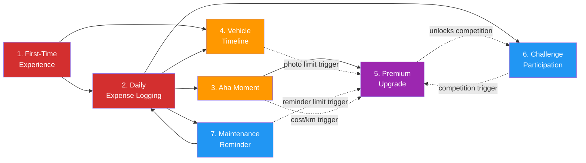

# User Journeys Index

**File:** `/03-product/user-journeys/flows-index.md`
**Produced by:** @product-architect
**Date:** 2026-03-07
**Version:** 1.0 — Pre-validation

---

## References

- PRD: `/03-product/product-requirements-document.md`
- MVP Feature List: `/03-product/mvp-feature-list.md`
- Value Proposition: `/02-strategy/value-proposition.md`
- Positioning Strategy: `/02-strategy/positioning-strategy.md`
- Monetization Plan: `/02-strategy/monetization-plan.md`
- All Functional Specs: `/03-product/functional-specs/`

---

## Journey Map

| # | Journey | File | Phase | User Role | Priority | Frequency | Key Features | Functional Specs |
|---|---------|------|-------|-----------|----------|-----------|-------------|-----------------|
| 1 | First-Time Experience | `journey-first-time-experience.md` | MVP | Driver | Critical | Once | M1 (Auth), M2 (Vehicle profiles), M3 (Expense tracking), M5 (Dashboard), M10 (Onboarding), S6 (Icons), S7 (Currency) | onboarding-auth.md, vehicle-management.md, expense-tracking.md, cost-dashboard.md |
| 2 | Daily Expense Logging | `journey-daily-expense-logging.md` | MVP | Driver | Critical | 2-5x/week | M3 (Expense tracking), M4 (Fuel entry), M5 (Dashboard), S3 (Quick-add widget), S6 (Icons), S7 (Currency) | expense-tracking.md, fuel-entry.md, cost-dashboard.md |
| 3 | The "Aha Moment" | `journey-aha-moment.md` | MVP | Driver | High | Once (reinforced monthly) | M3 (Expense tracking), M5 (Dashboard), S2 (Trends), C1 (Benchmarks) | cost-dashboard.md, expense-tracking.md |
| 4 | Vehicle Timeline | `journey-vehicle-timeline.md` | MVP | Driver | High | Weekly / monthly | M6 (Timeline), S1 (Photos), S5 (Share card), M3 (Expense tracking) | vehicle-timeline.md, share-export.md, expense-tracking.md |
| 5 | Premium Upgrade | `journey-premium-upgrade.md` | MVP | Driver | High | Once (conversion) | M5 (Dashboard), S2 (Trends), C1 (Benchmarks), M6 (Timeline), M7 (Reminders), S4 (Challenges) | cost-dashboard.md, challenges-gamification.md, vehicle-timeline.md, maintenance-reminders.md |
| 6 | Challenge Participation | `journey-challenge-participation.md` | MVP (P1) | Driver | Medium | Monthly cycles | S4 (Challenges), M5 (Dashboard), M3 (Expense tracking), M4 (Fuel entry) | challenges-gamification.md, cost-dashboard.md |
| 7 | Maintenance Reminder | `journey-maintenance-reminder.md` | MVP | Driver | Medium | Monthly triggers | M7 (Reminders), M3 (Expense tracking), M6 (Timeline), M4 (Fuel entry) | maintenance-reminders.md, expense-tracking.md, vehicle-timeline.md |

---

## Journey Dependencies Diagram



**Legend:**
- Red: Critical priority (must work flawlessly)
- Orange: High priority (strong impact on retention and conversion)
- Purple: Revenue-generating (premium conversion)
- Blue: Medium priority (engagement and utility features)
- Solid arrows: Direct dependency (Journey B requires Journey A to happen first)
- Dashed arrows: Trigger relationship (Journey A creates a trigger that can lead to Journey B)

---

## Journey Lifecycle

The journeys form a user lifecycle from acquisition to monetization:

```
ACQUISITION        ACTIVATION         ENGAGEMENT          MONETIZATION
Download     -->   Onboarding    -->  Expense Logging --> Premium Upgrade
                   (Journey 1)       (Journey 2)         (Journey 5)
                                           |
                                           v
                                     Aha Moment         Challenge
                                     (Journey 3)   <-- Participation
                                           |            (Journey 6)
                                           v
                                     Vehicle Timeline    Maintenance
                                     (Journey 4)        Reminder
                                                        (Journey 7)
```

**Critical path to retention:** Journey 1 --> Journey 2 --> Journey 3. If this path breaks at any point, the user does not retain.

**Critical path to monetization:** Journey 3 --> Journey 5. The aha moment creates the desire; the premium screen converts it.

---

## Feature Coverage Check

Every MVP feature should appear in at least one journey. This ensures no feature is orphaned.

### P0 — Must Have Features

| Feature | Journeys Where It Appears | Coverage |
|---------|--------------------------|----------|
| M1: User authentication | Journey 1 (onboarding) | Covered |
| M2: Vehicle profile management | Journey 1 (add first car) | Covered |
| M3: Expense tracking | Journey 1 (first expense), Journey 2 (daily logging), Journey 3 (dashboard data), Journey 7 (post-maintenance) | Covered |
| M4: Fuel entry (specialized) | Journey 2 (fuel logging path), Journey 6 (fuel efficiency challenge), Journey 7 (odometer updates) | Covered |
| M5: Cost dashboard | Journey 1 (first reveal), Journey 2 (post-log feedback), Journey 3 (aha moment), Journey 5 (premium tease), Journey 6 (challenge metrics) | Covered |
| M6: Vehicle timeline | Journey 4 (primary), Journey 7 (maintenance entries) | Covered |
| M7: Maintenance reminders | Journey 7 (primary), Journey 5 (limit trigger) | Covered |
| M8: Multi-vehicle support | Journey 1 (vehicle setup), Journey 2 (vehicle switching) | Covered |
| M9: User profile & settings | Journey 1 (account creation) | Covered |
| M10: Onboarding flow | Journey 1 (primary) | Covered |

### P1 — Should Have Features

| Feature | Journeys Where It Appears | Coverage |
|---------|--------------------------|----------|
| S1: Photo attachments | Journey 4 (timeline photos) | Covered |
| S2: Spending trends | Journey 3 (aha moment depth), Journey 5 (premium feature) | Covered |
| S3: Quick-add widget | Journey 2 (fastest logging path) | Covered |
| S4: Basic challenges | Journey 6 (primary), Journey 5 (premium trigger) | Covered |
| S5: Shareable vehicle card | Journey 4 (sharing) | Covered |
| S6: Expense category icons | Journey 1 (first expense), Journey 2 (category selection) | Covered |
| S7: Currency formatting | Journey 1 (first expense), Journey 2 (amount entry) | Covered |

### P2 — Could Have Features (deferred but referenced)

| Feature | Referenced In Journey | Status |
|---------|---------------------|--------|
| C1: Model benchmarks | Journey 3, Journey 5 | Referenced as premium tease; not yet available at launch |
| C2: PDF service history export | Journey 4 (future connection) | Deferred — noted as future enhancement |
| C3: Document storage | — | Not covered by any journey. Consider if it needs its own micro-journey in v1.1. |
| C4: Spending forecast | Journey 3, Journey 5 | Referenced as premium feature tease |
| C5: Keep vs. sell insights | Journey 5 | Referenced as premium benefit |
| C6: Achievement badges | Journey 6 | Referenced as challenge reward |
| C7: Dark mode | — | Not covered (UX preference, not a journey). No journey needed. |

**Gap analysis:** C3 (Document storage) is not covered by any journey. This is acceptable for MVP — document storage is a utility feature that doesn't require a dedicated journey. When built in v1.1, it can be added to Journey 7 (store insurance documents when setting up an insurance renewal reminder).

---

## Future Journeys (Phase 2-3)

| # | Journey | Phase | User Role | Trigger | Description |
|---|---------|-------|-----------|---------|-------------|
| 8 | Garage creates work order | Phase 2 | Garage Owner | Garage module built | Garage receives vehicle, creates work order, assigns mechanic, records parts and labor, completes job. |
| 9 | Driver receives service record | Phase 2 | Driver | Garage integration active | Driver receives push notification that garage completed service. Service record appears in timeline automatically. Expense auto-logged. |
| 10 | Garage-driver connection | Phase 2 | Both | Garage + driver both on platform | Driver selects their garage in-app. Garage sees driver's vehicle. Two-way data flow for service history. |
| 11 | Dealer tracks vehicle profitability | Phase 3 | Dealer | Dealer module built | Dealer adds vehicle to inventory, tracks all costs (purchase, transport, repair, detail), calculates true profitability on sale. |
| 12 | Fleet manager reviews dashboard | Phase 3 | Fleet Manager | Fleet module built | Fleet manager views cost dashboard across all fleet vehicles. Sees per-vehicle and aggregate costs. Sets reminders at fleet level. |
| 13 | Driver sells car with documented history | Phase 2+ | Driver | PDF export + sufficient history | Driver generates comprehensive PDF service history from timeline. Uses it as proof of maintenance when selling. |
| 14 | Model benchmark comparison | Phase 1.1+ | Driver | 500+ users per model | Driver opens dashboard and sees how their costs compare to other owners of the same car model. Powered by real community data. |

**Note:** These journeys will be fully mapped when their respective phases begin. Listed here for planning and to ensure MVP architecture supports them.

---

## Multi-Role Architecture Note

The MVP serves only the "driver" role. However, the technical architecture must support multiple roles from day one to avoid costly refactoring later. Journey files document future role considerations individually, but the key architectural requirements are:

1. **Users should have a role/type field** — `driver`, `garage_owner`, `dealer`, `fleet_manager`. MVP only implements `driver`.
2. **Data access should be role-scoped** — queries and API responses filtered by role and ownership. A driver sees only their vehicles; a garage owner sees their customer vehicles; a fleet manager sees fleet vehicles.
3. **Organizations/companies should be a first-class entity** — even if only used in Phase 2+. A garage is an organization. A dealership is an organization. A fleet is an organization. The `organization` table should exist from day one (empty in MVP).
4. **Vehicle ownership can transfer between users** — when a driver sells their car through the platform (future), the vehicle record and history should be transferable.
5. **Expenses, reminders, and timeline entries should support `source` and `created_by` fields** — allowing entries to be created by the owner, a garage, a fleet manager, or the system.

**This note should be referenced in `/03-product/technical/architecture.md` when the technical architecture is designed.**

---

## Journey Quality Checklist

Each journey file follows a consistent structure. Verify:

| Section | J1 | J2 | J3 | J4 | J5 | J6 | J7 |
|---------|----|----|----|----|----|----|----|
| Goal | Yes | Yes | Yes | Yes | Yes | Yes | Yes |
| User Context | Yes | Yes | Yes | Yes | Yes | Yes | Yes |
| Prerequisites | Yes | Yes | Yes | Yes | Yes | Yes | Yes |
| Flow Diagram (Mermaid) | Yes | Yes | Yes | Yes | Yes | Yes | Yes |
| Step-by-Step Flow | Yes | Yes | Yes | Yes | Yes | Yes | Yes |
| Key Moments | Yes | Yes | Yes | Yes | Yes | Yes | Yes |
| Empty States | Yes | Yes | Yes | Yes | Yes | Yes | Yes |
| Drop-Off Risks | Yes | Yes | Yes | Yes | Yes | Yes | Yes |
| Design Implications | Yes | Yes | Yes | Yes | Yes | Yes | Yes |
| Success Criteria | Yes | Yes | Yes | Yes | Yes | Yes | Yes |
| Connections to Other Journeys | Yes | Yes | Yes | Yes | Yes | Yes | Yes |
| Future Role Considerations | Yes | Yes | Yes | Yes | Yes | Yes | Yes |

---

## Hands Off To

- **@developer** — Use journey flows and design implications to inform UI/UX implementation priorities. Journey 1 and Journey 2 are the most critical to get right.
- **@brand-architect** — Journey emotional states inform brand voice and copywriting for each screen. The emotional arc (curious -> surprised -> in control -> proud) should guide all messaging.
- **@qa** — Use step-by-step flows, empty states, and drop-off risks to create test scenarios. Each journey is a testable end-to-end flow. Run `/write-tests` for structured test generation.
- **@growth-lead** — Journey 1 (activation), Journey 5 (conversion), and Journey 4's sharing step are the most growth-relevant. Optimize these for acquisition and monetization.
- **@customer-analyst** — Validate journey assumptions through interviews. Key questions: Does the aha moment happen? Is expense logging fast enough? Is the premium price acceptable?

---

## Document History

| Version | Date | Changes |
|---|---|---|
| 1.0 | 2026-03-07 | Initial 7-journey index. Pre-validation — customer interviews not yet conducted. |
