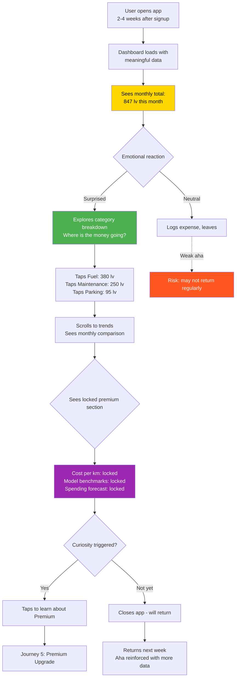

# Journey 3: The "Aha Moment"

**File:** `/03-product/user-journeys/journey-aha-moment.md`
**Produced by:** @product-architect
**Date:** 2026-03-07
**Version:** 1.0 — Pre-validation

---

journey: aha-moment
priority: High
frequency: Once (the first time), then reinforced monthly
phase: MVP
user-role: driver (MVP) — system will support multiple roles in future phases
related-features: M3 (Expense tracking), M5 (Cost dashboard), S2 (Spending trends), C1 (Model benchmarks)
related-specs: cost-dashboard.md, expense-tracking.md

---

## References

- PRD: `/03-product/product-requirements-document.md` (Section 6.2, Flow 3; Section 3: Success Metrics)
- Value Proposition: `/02-strategy/value-proposition.md` (Pain P1: don't know true cost; Gain G1: see exact monthly cost)
- Positioning: `/02-strategy/positioning-strategy.md` (Emotional shift: uncertainty to clarity)
- Monetization: `/02-strategy/monetization-plan.md` (Section 3: paywall trigger; Section 6: conversion psychology)

---

## Journey: The "Aha Moment"

### Goal

The user sees their true monthly car cost for the first time and has an emotional reaction: "I had no idea my car cost me THAT much." This moment transforms the app from a logging tool into an indispensable cost intelligence platform. It is the retention engine and the premium conversion trigger.

### User Context

**When:** 2-4 weeks after first use. The user has logged 10+ expenses across multiple categories (fuel, maintenance, parking, etc.). It's a quiet moment — maybe evening on the couch, maybe a commute break. They open the app to log something or just check in.

**Why:** Curiosity. They've been logging expenses and want to see the total. Or the app sent a notification: "You've tracked 15 expenses this month. See your monthly total." They open the dashboard and the number hits them.

**State of mind:** Casual at first — just checking the app. Then surprise/shock as the number is higher than expected. Then engagement as they explore where the money goes. Then consideration: "Can I learn more?"

**Critical truth:** This moment determines whether the user stays for months or drifts away. The emotional reaction to their cost number is the product's core retention mechanism. If the number doesn't surprise them, the aha is flat and retention weakens.

### Prerequisites

- User has logged 10+ expenses over 2+ weeks
- At least 3 different expense categories used
- At least 1 full month of data (or close to it)
- Dashboard has enough data to show a meaningful monthly total and category breakdown

### Flow Diagram (Mermaid)

### Step-by-Step Flow

| Step | User Action | System Response | Screen | Emotional State |
|------|------------|----------------|--------|-----------------|
| 1 | Opens app (routine check-in or after notification) | Dashboard loads with accumulated data. Monthly total is prominent: "847 лв this month." | Dashboard | Casual — "let me check my numbers" |
| 2 | Sees the monthly total number for the first time with real data | Large, clear number: "847 лв" with the car model below it. Feels real, not abstract. | Dashboard | Surprise — "Wait, THAT much?" |
| 3 | Processes the number mentally | App reinforces: "That's about 10,164 лв per year" (annualized projection below monthly total). | Dashboard | Shock — "Over 10,000 лв a year on my car?!" |
| 4 | Taps category breakdown (pie/donut chart) | Breakdown expands: Fuel 380 лв (45%), Maintenance 250 лв (30%), Parking 95 лв (11%), Insurance 72 лв (8%), Other 50 лв (6%) | Category Breakdown | Analytical — "Where is it all going?" |
| 5 | Explores individual categories (taps Maintenance) | Drill-down: list of maintenance expenses this month with dates and amounts | Category Detail | Understanding — "Oh right, the brake pads and the oil change..." |
| 6 | Scrolls down past breakdown | Monthly trend bar chart visible (if 2+ months of data). Or: "Track for 2 months to see your spending trends." | Dashboard (scrolled) | Engaged — wanting to see patterns |
| 7 | Encounters locked premium section | Subtle, integrated section: "Your cost per kilometer: [lock icon] Unlock with Premium" and "How does your car compare to other [model] owners? [lock icon]" | Dashboard (premium tease) | Curious — "I wonder what my cost per km is" |
| 8a | Taps the premium tease | Navigates to premium benefits screen (Journey 5) | Premium Screen | Evaluating — "is it worth it?" |
| 8b | Ignores premium tease, continues exploring | Scrolls to timeline, reviews recent entries | Timeline | Satisfied — the free dashboard is already valuable |
| 9 | Closes app | Notification scheduled: weekly summary next Monday: "Last week: 3 expenses, 212 лв. Monthly total: 847 лв." | — | Changed perspective — now thinks about car costs differently |

### Key Moments

**Moment 1: The number reveal (Step 2-3)**
The first time the monthly total becomes a real, meaningful number (not just a single expense). The design must make this number feel impactful. Large typography. Prominent placement. No clutter around it. The annualized projection ("That's ~10,164 лв per year") amplifies the shock. This single number is the core of the entire product.

**Moment 2: Category exploration (Step 4-5)**
After the shock of the total, the user wants to understand it. The category breakdown answers "where does it all go?" This exploration creates engagement and makes the data feel personal. Each tap deeper builds investment in the app.

**Moment 3: Premium tease (Step 7)**
The locked "cost per km" and "model benchmarks" sections appear naturally below the free data. They don't interrupt the experience — they extend it. The user thinks: "I can see my total, but what does that mean per kilometer? How does it compare to other owners?" This curiosity is the seed of premium conversion.

### Aha Moment Amplification Strategies

| Strategy | Implementation | Expected Impact |
|----------|---------------|-----------------|
| **Annualized projection** | Show "~X лв per year" below the monthly total | Makes the number feel bigger and more real |
| **Monthly notification** | "Your car cost you 847 лв in February. That's 12% more than January." | Drives return visits, reinforces the aha periodically |
| **Milestone celebrations** | At 10, 25, 50, 100 expenses: "You've tracked 50 expenses! You know more about your car costs than 95% of owners." | Builds engagement, validates the habit |
| **Category surprise** | Highlight the most surprising category: "Parking cost you 95 лв this month — more than you might think" | Creates micro-aha moments within the data |
| **Year-to-date running total** | Show cumulative total since tracking started | The number only grows, creating ongoing impact |
| **Social comparison (future)** | "Most [model] owners spend X лв/month. You spend Y." | Adds context that makes the number meaningful |

### Empty States

Not directly applicable — this journey requires meaningful data to exist. However, pre-aha states matter:

| Data Level | What the User Sees | Design Goal |
|-----------|-------------------|-------------|
| 1-4 expenses | Single number, 1-2 categories. "Keep tracking to see your full monthly picture." | Encourage more logging. Don't show charts with 1 data point. |
| 5-9 expenses | Growing total, 3+ categories starting to show proportions. "You're getting close to your first full monthly view." | Build anticipation. Show the breakdown is forming. |
| 10+ expenses (1 month) | **Full aha.** Monthly total, complete category breakdown, annualized projection. | Maximize impact. This is the moment. |
| 2+ months | Monthly comparison, trend arrows (up/down), trend chart. | Reinforce with patterns. The aha evolves into ongoing insight. |

### Drop-Off Risks

| Risk Point | Why They Might Leave | Severity | Mitigation |
|-----------|---------------------|----------|------------|
| **Number feels inaccurate** | User knows they forgot several expenses; total seems too low | Medium | Prompt: "Missing any expenses? Add older ones to see a more accurate total." Allow date-backfilled entries. |
| **Number isn't surprising** | Some users already have a rough idea of their costs | Low | The category breakdown and annualized projection still add value. Not every user needs "shock" — some need "confirmation." |
| **Number is depressing** | User realizes they spend more than they can afford | Medium | Frame positively: "Knowledge is power. Now you can make informed decisions." Never judge or suggest spending less — that's not our role. |
| **Premium tease too aggressive** | User feels paywalled too early | High | Premium section must be subtle, below the fold, and clearly separated from free data. Never lock the monthly total or category breakdown. |
| **No data to show** | User logged expenses but sporadically; no full month yet | Medium | Show partial-month data with context: "You've tracked 5 expenses so far this month. Keep going for your full monthly total." |

### Design Implications

1. **The monthly total is sacred.** It must always be the largest, most prominent element on the dashboard. No competing elements. No visual clutter around it. This number IS the product.

2. **Progressive data richness.** The dashboard should feel like it's "filling up" as the user logs more expenses. Early on, it's sparse but clean. After 10+ expenses, it's rich and insightful. After 2+ months, it shows trends. The dashboard grows with the user.

3. **Annualized projection is a free feature.** Do not gate this. It's an amplifier for the aha moment and drives the emotional reaction that leads to retention and eventual premium conversion.

4. **Premium teases are whispers, not shouts.** Locked features should be visible but not intrusive. A small lock icon, a soft "Unlock with Premium" link. Not a full-screen modal. Not a banner. The free experience must feel complete; premium is an expansion, not a requirement.

5. **Monthly summary notifications.** At the end of each month, send a push notification with the total: "February summary: your [car model] cost you 847 лв." This brings users back and reinforces the aha moment every month.

### Success Criteria

| Metric | Target | How Measured |
|--------|--------|-------------|
| Users reaching 10+ expenses within 30 days | 40%+ of activated users | Event analytics |
| Dashboard engagement at 10+ expense threshold | Average session duration >2 minutes | Session analytics |
| Category breakdown exploration rate | 50%+ tap into at least 1 category detail | Tap analytics |
| Premium tease impression-to-tap rate | 15%+ | Funnel analytics |
| 30-day retention (users who experienced aha) | 35%+ | Cohort comparison: users with 10+ expenses vs. those with fewer |
| Monthly summary notification open rate | 25%+ | Push notification analytics |

### Connections to Other Journeys

- **Depends on Journey 2 (Daily Expense Logging):** The aha moment is a direct consequence of the logging habit. Without 10+ expenses, this journey never occurs. Journey 2 IS the engine that powers Journey 3.
- **Leads to Journey 5 (Premium Upgrade):** The premium tease during the aha moment plants the conversion seed. Many users won't convert immediately but will after 2-3 exposures.
- **Reinforced by Journey 7 (Maintenance Reminder):** When a reminder triggers a service expense that hits the dashboard, it reinforces the accuracy and completeness of the monthly total.
- **Enhanced by Journey 4 (Vehicle Timeline):** Users who explore the timeline after the aha moment build deeper engagement with their car's story, not just the costs.

### Future Role Considerations

- **Garage integration (Phase 2):** When garages auto-log service records, the monthly total becomes more accurate without manual entry. The aha moment becomes stronger because fewer expenses are missed.
- **Fleet managers (Phase 3):** Fleet managers have their own aha moment: seeing the total cost across all fleet vehicles. The dashboard aggregation view serves a different but parallel purpose.
- **Data intelligence (Phase 4):** With aggregated data, the aha evolves: "Your car costs you 847 лв/month. The average for your model in Sofia is 720 лв. Here's why yours is higher." This transforms personal insight into comparative intelligence.

---

## Document History

| Version | Date | Changes |
|---|---|---|
| 1.0 | 2026-03-07 | Initial journey map. Pre-validation — customer interviews not yet conducted. |
