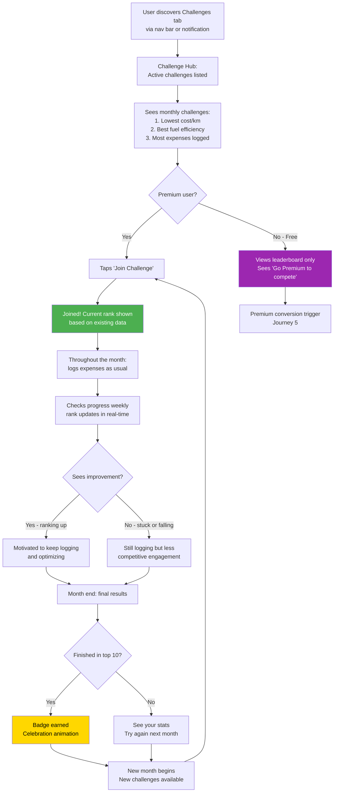

# Journey 6: Challenge Participation

**File:** `/03-product/user-journeys/journey-challenge-participation.md`
**Produced by:** @product-architect
**Date:** 2026-03-07
**Version:** 1.0 — Pre-validation

---

journey: challenge-participation
priority: Medium
frequency: Monthly (challenge cycles), weekly (progress checks)
phase: MVP (P1 — Should Have)
user-role: driver (MVP) — system will support multiple roles in future phases
related-features: S4 (Basic challenges), M5 (Cost dashboard), M3 (Expense tracking), M4 (Fuel entry)
related-specs: challenges-gamification.md, cost-dashboard.md

---

## References

- PRD: `/03-product/product-requirements-document.md` (Section 6.1, Feature S4)
- Functional Spec: `/03-product/functional-specs/challenges-gamification.md`
- Value Proposition: `/02-strategy/value-proposition.md` (Gain G9: have fun with car ownership)
- Monetization Plan: `/02-strategy/monetization-plan.md` (Section 3: challenges as premium conversion trigger)

---

> **⚠️ Deferred to v2:** This journey applies to v2. Not part of MVP launch. The journey map is retained for future implementation.

## Journey: Challenge Participation

### Goal

The user discovers challenges, joins a monthly competition (e.g., lowest cost per km), tracks their progress throughout the month, and sees results — driving regular return visits and reinforcing the expense logging habit through friendly competition.

### User Context

**When:** 1-4 weeks after signup. The user has established a basic logging habit and is exploring the app beyond the core expense tracking. They discover the Challenges tab through natural exploration or a nudge notification.

**Why:** Competitive instinct. Car enthusiasts naturally compare — "my car vs. your car." Challenges channel this instinct into structured competition that also reinforces the core logging behavior.

**State of mind:** Curious about how they compare. Mildly competitive. Looking for another reason to keep using the app.

### Prerequisites

- User has logged 5+ expenses (enough data for meaningful metrics)
- User has been active for 1+ weeks
- At least one active challenge exists (monthly cycle)
- For competition participation: Premium subscription (free users can view leaderboards only)

### Flow Diagram (Mermaid)

### Step-by-Step Flow

| Step | User Action | System Response | Screen | Emotional State |
|------|------------|----------------|--------|-----------------|
| 1 | Taps Challenges tab in navigation | Challenge Hub loads: list of active monthly challenges with icons, descriptions, and current participant count. | Challenge Hub | Curious — "what's this?" |
| 2 | Browses available challenges | Sees 2-3 challenges: "Lowest Cost/km" (fuel efficiency), "Best Fuel Efficiency" (L/100km), "Most Consistent Tracker" (most expenses logged). Each shows: description, your current metric, top 3 leaderboard preview. | Challenge Hub | Interested — "I want to see where I stand" |
| 3 | Taps a challenge to see full leaderboard | Full leaderboard: anonymous usernames, rank, metric value. Your position highlighted. Top 10 shown, your rank shown even if outside top 10. | Challenge Detail | Competitive — "I can beat some of these" |
| 4a | (Premium) Taps "Join Challenge" | Joined. Rank calculated from existing data. "You're currently #47. Keep tracking to climb!" | Challenge Detail | Determined — "let's improve" |
| 4b | (Free) Sees "Go Premium to compete" | Soft premium tease below the leaderboard. Can still see rankings. | Challenge Detail | FOMO — "I want to participate" |
| 5 | Returns to regular app use | Challenge rank indicator appears on dashboard (small badge): "Cost/km Challenge: #47" | Dashboard | Awareness — challenge is always visible |
| 6 | Logs expenses throughout the month | After each save, rank may update: "You moved up to #43!" (subtle notification) | Quick-Add / Dashboard | Micro-reward — rank improvement feels good |
| 7 | Checks progress mid-month | Visits Challenge Detail: sees updated rank, distance to next rank, days remaining. | Challenge Detail | Strategic — "I need to drive more efficiently" |
| 8 | Month ends | Push notification: "Monthly challenge results are in! Your cost/km: 0.38 лв. Rank: #12." | Notification | Anticipation — "how did I do?" |
| 9 | Opens challenge results | Final leaderboard: your rank, improvement from start, badge if top 10. "Next month's challenges start tomorrow." | Results Screen | Pride (if ranked well) or determination (if not) |
| 10 | New month starts | New challenges available. Previous results archived. "Rejoin and defend your rank?" | Challenge Hub | Ready — "let's go again" |

### Key Moments

**Moment 1: First leaderboard view (Step 3)**
Seeing your position among other users for the first time. Even a #47 ranking creates a reference point and a desire to improve. The leaderboard must feel fair, anonymous, and engaging.

**Moment 2: Rank improvement notification (Step 6)**
After logging an expense, a subtle message: "You moved up to #43 in the Cost/km Challenge!" This micro-reward connects the logging action to the competitive outcome, reinforcing the habit loop.

**Moment 3: Month-end results (Step 9)**
The culmination of a month of tracking. A satisfying summary: your rank, your metric, how you improved, and a badge if you placed well. This is the moment of social validation — "I'm a smart car owner."

### Challenge Design

| Challenge | Metric | Calculation | Who Benefits |
|-----------|--------|-------------|--------------|
| **Lowest Cost/km** | Total expenses / km driven | Sum all expenses in the month, divide by odometer delta | Efficient drivers, those who track diligently |
| **Best Fuel Efficiency** | L/100km average | Calculated from fuel entries with odometer readings | Eco-conscious drivers, enthusiasts optimizing |
| **Most Consistent Tracker** | Number of expenses logged | Count of entries in the month | Everyone — rewards the habit, not the outcome |

**Fairness considerations:**
- Challenges are anonymous (display name or username, never real name)
- Cost/km and fuel efficiency may vary by vehicle class — consider future sub-leaderboards by car category (sedan, SUV, etc.)
- "Most Consistent Tracker" is the most democratic challenge — anyone can win
- Start with 2-3 challenges. Add more based on engagement data

### Empty States

| State | What the User Sees |
|-------|-------------------|
| No challenges yet (pre-launch) | "Challenges are coming soon! Start tracking your expenses to be ready." |
| Challenge available but user hasn't joined | Challenge description + leaderboard preview + "Join" button (premium) or "View leaderboard" (free) |
| Joined but insufficient data | "Log more expenses and fuel entries this month to improve your rank." |
| No fuel entries (can't participate in fuel efficiency challenge) | "This challenge requires fuel logging with odometer readings. Log your next fill-up to participate." |
| Month ended, no participation | "You didn't participate this month. Join a challenge to compete next month!" |

### Drop-Off Risks

| Risk Point | Why They Might Leave | Severity | Mitigation |
|-----------|---------------------|----------|------------|
| **Challenges feel irrelevant** | User doesn't care about competition or metrics | Low | Challenges are optional — never forced. The core app works without them. |
| **Leaderboard feels unfair** | User with an older, less efficient car can never win fuel efficiency | Medium | Add vehicle-class sub-leaderboards in future. "Most Consistent Tracker" is skill-based, not car-based. |
| **Premium gate frustrating** | Free user wants to compete but can't | Medium | Free users CAN see leaderboards and their theoretical rank. Premium unlocks actual participation and badges. This creates desire, not resentment. |
| **Not enough participants** | Early in the product, leaderboards may be sparse | High | Seed with enough users before launching challenges. Start challenges only when 50+ active users exist. Show "X people competing" to create social proof. |
| **Badge value unclear** | Earning a badge doesn't feel meaningful | Low | Badges appear on vehicle profile. Future: badges visible on shareable vehicle card. Start small — the psychological reward of ranking matters more than the badge. |

### Design Implications

1. **Challenges are secondary, not primary.** The challenges tab is in the navigation but is NOT the first thing users see. Core value is expense tracking and dashboard. Challenges add engagement flavor.

2. **Leaderboard design must feel clean and competitive.** Think: fitness app leaderboards (Strava segments). Your rank highlighted. Top 3 have distinctive visual treatment. The list should feel alive — numbers update, positions shift.

3. **Micro-notifications after expense logging.** When a user logs an expense and it affects their challenge rank, show a brief, dismissable notification: "Cost/km Challenge: moved up to #34!" This connects the daily action to the monthly competition.

4. **Monthly cycle with clear start/end.** Challenges run from the 1st to the last day of each month. Results published on the 1st of the next month. Clear countdown visible on the challenge detail screen.

### Success Criteria

| Metric | Target | How Measured |
|--------|--------|-------------|
| Challenge discovery rate | 40%+ of users view the Challenges tab within 30 days | Screen view analytics |
| Challenge join rate (of premium users) | 50%+ join at least 1 challenge per month | Challenge participation analytics |
| Challenge-driven premium conversion | 10%+ of premium conversions attributed to challenge tease | Paywall trigger attribution |
| Weekly challenge check-in rate | 2+ visits to challenge detail per joined user per month | Screen view analytics |
| Month-over-month challenge re-join rate | 60%+ | Participation analytics |

### Connections to Other Journeys

- **Depends on Journey 2 (Daily Expense Logging):** Every expense logged affects challenge metrics. The challenge gives an additional reason to log consistently.
- **Depends on Journey 5 (Premium Upgrade):** Active participation requires premium. Challenges serve as a conversion trigger for free users.
- **Reinforces Journey 3 (Aha Moment):** Challenge metrics (cost/km, fuel efficiency) add context to the monthly total — it's not just about how much you spend, but how efficiently.
- **Independent of Journey 4 (Vehicle Timeline) and Journey 7 (Maintenance Reminder):** Challenges operate on a separate engagement axis.

### Future Role Considerations

- **Sponsored challenges (Phase 2+):** Tire brands, oil companies, or fuel stations sponsor monthly challenges: "Shell Fuel Efficiency Challenge — win fuel vouchers." Revenue stream + user engagement.
- **Vehicle-class leaderboards:** When user base grows, split leaderboards by vehicle class (sedan, hatchback, SUV, performance) for fairer competition.
- **Team challenges (Phase 2):** Car club teams compete against each other. Requires social features and club/group functionality.
- **Fleet challenges (Phase 3):** Fleet managers set internal challenges for drivers: "Lowest fuel consumption this month wins a bonus."
- **Architecture implication:** Challenge model should support `sponsor` field (null for organic, brand_id for sponsored) and `scope` field (global, vehicle_class, team, fleet) from day one, even though MVP only uses global scope.

---

## Document History

| Version | Date | Changes |
|---|---|---|
| 1.0 | 2026-03-07 | Initial journey map. Pre-validation — customer interviews not yet conducted. |
