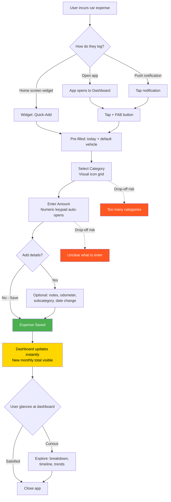

# Journey 2: Daily Expense Logging

**File:** `/03-product/user-journeys/journey-daily-expense-logging.md`
**Produced by:** @product-architect
**Date:** 2026-03-07
**Version:** 1.0 — Pre-validation

---

journey: daily-expense-logging
priority: Critical
frequency: 2-5 times per week
phase: MVP
user-role: driver (MVP) — system will support multiple roles in future phases
related-features: M3 (Expense tracking), M4 (Fuel entry), M5 (Cost dashboard), S3 (Quick-add widget), S6 (Category icons), S7 (Currency formatting)
related-specs: expense-tracking.md, fuel-entry.md, cost-dashboard.md

---

## References

- PRD: `/03-product/product-requirements-document.md` (Section 6.2, Flow 2)
- Functional Specs: `/03-product/functional-specs/expense-tracking.md`, `/03-product/functional-specs/fuel-entry.md`, `/03-product/functional-specs/cost-dashboard.md`
- Value Proposition: `/02-strategy/value-proposition.md` (Pain P8: tedious entry; Gain G8: save time)
- Monetization: `/02-strategy/monetization-plan.md` (Section 6: conversion psychology — Week 1-2 habit building)

---

## Journey: Daily Expense Logging

### Goal

Log a car expense in under 30 seconds total (open app to close app), with the core input taking under 10 seconds and 3 taps. This journey must feel effortless, fast, and mildly satisfying — building a habit loop that brings the user back 2-5 times per week.

### User Context

**When:** The user just spent money on their car. They're at the gas station, leaving the mechanic, paid for parking, or got home after a car wash. The expense is fresh in their mind.

**Why:** They want to record it before they forget. Or the app has become a habit — they feel a small itch to log it because they want their monthly total to be accurate.

**State of mind:** Busy, in transit, or multitasking. They have 10-30 seconds of attention, not minutes. If the app makes them think or wait, they'll say "I'll do it later" — and they won't.

**Critical truth:** This is the most frequent journey in the entire product. If logging feels like work, retention dies within 2 weeks regardless of how good the dashboard is.

### Prerequisites

- User has completed onboarding (Journey 1)
- At least one vehicle exists in their account
- User has recently incurred a car expense

### Flow Diagram (Mermaid)

### Step-by-Step Flow

**Path A: Standard (open app)**

| Step | User Action | System Response | Screen | Emotional State |
|------|------------|----------------|--------|-----------------|
| 1 | Opens app | Dashboard loads instantly (<1s). Shows current monthly total and recent activity. FAB (+) button prominent in bottom-right. | Dashboard | Purposeful — "let me log this" |
| 2 | Taps + (FAB) button | Quick-add sheet slides up. Pre-filled: today's date, default vehicle (last used). Category icon grid visible. Numeric keypad ready. | Quick-Add Sheet | Focused — "this should be fast" |
| 3 | Taps category icon (e.g., fuel pump, wrench, tire) | Category selected, icon highlights. If fuel is selected, option to switch to detailed fuel entry appears. | Quick-Add Sheet | Easy — "one tap" |
| 4 | Types amount on numeric keypad (e.g., "127.50") | Amount formats in лв as typed. Running total hint: "Month total: 847 лв + 127.50 = 974.50 лв" | Quick-Add Sheet | Fast — "just a number" |
| 5 | Taps "Save" | Expense saved. Success micro-animation (checkmark + subtle haptic). Sheet dismisses. Dashboard updates with new total. | Dashboard (updated) | Satisfaction — "done!" |
| 6 | Glances at updated dashboard: new monthly total | Monthly total updates in real-time. Category breakdown adjusts. | Dashboard | Mild reward — "my total is growing, I can see the pattern" |
| 7 | Closes app or continues browsing | — | — | Complete — took 10-15 seconds total |

**Path B: Quick-add widget (fastest)**

| Step | User Action | System Response | Screen | Emotional State |
|------|------------|----------------|--------|-----------------|
| 1 | Taps home screen widget | Widget expands or opens quick-add directly. Pre-filled: today, default vehicle. | Widget / Quick-Add | Efficient — "I don't even need to open the app" |
| 2 | Selects category + enters amount | Same as steps 3-4 above | Quick-Add | Fast |
| 3 | Taps "Save" | Saved. Widget shows brief confirmation. | Widget | Done — under 10 seconds |

**Path C: Fuel entry (specialized)**

| Step | User Action | System Response | Screen | Emotional State |
|------|------------|----------------|--------|-----------------|
| 1 | Opens app, taps +, selects Fuel category | Fuel-specific form opens: liters, price/liter, total cost, odometer, full/partial fill | Fuel Entry Screen | "Filling up is the most common expense" |
| 2 | Enters liters and price/liter | Total cost auto-calculates. Or: enters total cost and liters, price/liter auto-calculates. | Fuel Entry Screen | Convenient — auto-calculation |
| 3 | Enters current odometer reading | If previous reading exists: consumption auto-calculates (e.g., "8.2 L/100km"). Shows trend arrow (up/down vs. last fill). | Fuel Entry Screen | Insightful — immediate consumption feedback |
| 4 | Taps "Save" | Saved. Dashboard updates. Consumption trend updates. | Dashboard | Informed — "my consumption is improving" |

### Key Moments

**Moment 1: The + button tap (Step 2)**
The FAB (+) button must be the most prominent interactive element on the dashboard. Large enough to tap without precision. Always visible, never hidden behind scrolling. This single button is the gateway to the entire habit loop.

**Moment 2: Category selection (Step 3)**
Categories must be a visual icon grid, not a dropdown list. 10 categories with distinct icons: fuel pump, wrench, car modification icon, shield (insurance), document (tax), tire, parking sign, warning triangle (fines), water droplet (car wash), plus sign (other). User scans and taps in under 2 seconds.

**Moment 3: Dashboard update (Step 6)**
After saving, the dashboard total must update instantly and visibly. The user should SEE the number change. This tiny moment of feedback — "my total just went from 847 to 975 лв" — is the micro-reward that reinforces the habit. Consider a brief number animation (counting up to the new total).

### Smart Defaults That Reduce Input

| Default | Logic | Saves |
|---------|-------|-------|
| Date = today | 95%+ of expense logging happens same-day | 1 tap (date picker avoided) |
| Vehicle = last used | Most users have 1-2 vehicles, use the same one 80%+ of the time | 1 tap (vehicle picker avoided) |
| Category = recently used | After 5+ entries, show last 3 categories as "quick picks" above the full grid | 1 tap (faster category selection) |
| Amount = numeric keypad auto-opens | No need to tap into a text field | 1 tap (field selection avoided) |
| Currency = лв | From settings, never changes mid-entry | 0 taps |
| Subcategory = none (optional) | Only show if user taps "More details" | 0 taps unless wanted |
| Notes = empty (optional) | Only show if user taps "Add note" | 0 taps unless wanted |
| Odometer = empty (optional) | Only show if user taps "Add odometer" or if fuel category is selected | 0 taps unless fuel |

**Result: Minimum viable expense = 3 taps + type amount:**
1. Tap + (FAB)
2. Tap category icon
3. Type amount + tap Save

### Empty States

Not applicable for this journey — the user has already completed onboarding and has at least 1 expense. However:

| Scenario | System Response |
|----------|----------------|
| First expense after onboarding | Show the same guided prompt from Journey 1: "What did you last spend on your car?" |
| No expenses this month (new month started) | Dashboard shows "0 лв this month" with a cheerful prompt: "New month, fresh start. Log your first expense." |
| Returning after 7+ days of inactivity | Gentle re-engagement on dashboard: "Welcome back! You might have expenses to catch up on." |

### Drop-Off Risks

| Risk Point | Why They Might Leave | Severity | Mitigation |
|-----------|---------------------|----------|------------|
| **App load time** | App takes >2 seconds to open | High | Optimize cold start. Cache dashboard data. Show last-known state instantly while fetching updates. |
| **Too many categories** | User can't find the right category | Medium | Keep to 10 categories max. Use universally recognizable icons. Add "Other" as catch-all. |
| **Amount entry confusion** | User unsure if they should include subcategory, notes, etc. | Medium | Default to minimal (amount + category only). "More details" is expandable, not visible by default. |
| **No immediate feedback** | User saves but nothing visibly changes | High | Animate the save. Show the new monthly total. Brief haptic feedback. The user must FEEL the save happened. |
| **Widget not available** | User wants quick-add from home screen but can't find widget | Medium | Post-onboarding tip: "Add the widget for 10-second logging." Include in settings. |
| **Forgot to log, now it's been 3 days** | Backlog of expenses feels overwhelming | Medium | Allow batch entry. "Quick catch-up: add multiple expenses." Don't make them feel guilty — make it easy to backfill. |

### The Habit Loop

This journey is designed as a behavioral habit loop:

1. **Cue:** User spends money on their car (external trigger) OR receives a gentle push notification (app trigger: "Did you fill up today?")
2. **Routine:** Open app (or widget) > tap + > category > amount > save (10-30 seconds)
3. **Reward:** See updated monthly total on dashboard. Micro-animation confirms the save. Running total grows — feels like progress and control.
4. **Investment:** Each logged expense makes the dashboard more accurate and the timeline more complete. The more they invest, the more valuable the app becomes (data lock-in).

**Frequency target:** 2-5 times per week. At this frequency, the monthly total becomes accurate enough to be insightful within 2-4 weeks (Journey 3: Aha Moment).

### Design Implications

1. **The quick-add sheet must be the fastest interaction in the app.** Nothing should be faster than logging an expense. If the user discovers any other action is quicker, we've failed.

2. **Numeric keypad first.** When the quick-add opens, the keypad should already be visible or open with category selection. Never make the user tap into a text field to start typing an amount.

3. **Visual categories, not text lists.** Icons are scanned in <1 second. Text labels require reading. The category grid should be icons-first with small labels below. Color-code each category for instant recognition.

4. **Dashboard feedback loop.** After saving, the user must see their dashboard update. This is not optional polish — it's the reward mechanism that drives the habit. Removing this feedback breaks retention.

5. **Error-forgiving.** If the user enters the wrong amount or category, editing must be trivially easy: tap the recent entry on the timeline, edit, save. No confirmation dialogs, no "are you sure?" for edits.

### Success Criteria

| Metric | Target | How Measured |
|--------|--------|-------------|
| Time from app open to expense saved | Under 15 seconds (median) | Timestamp analytics |
| Time from widget tap to expense saved | Under 10 seconds (median) | Timestamp analytics |
| Taps to complete a basic expense | 3 taps + amount entry | UX audit |
| Expenses logged per active user per week | 2+ | Event analytics |
| Quick-add sheet usage (vs. other entry methods) | 80%+ of all entries | Feature usage analytics |
| Fuel-specific entry adoption | 40%+ of fuel expenses use detailed form | Feature usage analytics |
| Edit/delete rate (proxy for input errors) | Under 10% of entries | Event analytics |

### Connections to Other Journeys

- **Depends on Journey 1 (First-Time Experience):** User must have completed onboarding to reach this journey. The first expense in Journey 1 is the bridge to this habit loop.
- **Feeds Journey 3 (Aha Moment):** Every expense logged builds toward the 10+ threshold where the monthly total becomes meaningful. This journey IS the engine that powers the aha moment.
- **Triggers Journey 4 (Vehicle Timeline):** Each expense logged automatically creates a timeline entry. Users discover the timeline through their logged data.
- **Can trigger Journey 5 (Premium Upgrade):** When the user glances at the dashboard after logging and sees the locked "Cost per km" section, curiosity builds over time.
- **Intersects with Journey 7 (Maintenance Reminder):** When a maintenance expense is logged, the app can suggest resetting a reminder: "Oil changed? Update your reminder."

### Future Role Considerations

- **Garage owners (Phase 2):** When a garage completes work, the expense could be auto-logged to the driver's account via the garage integration. The driver receives a notification: "Your garage logged a service: 280 лв for brake pad replacement." The driver confirms or edits. This replaces manual entry for service-related expenses.
- **Fleet managers (Phase 3):** Fleet drivers may have a simplified expense logging flow that auto-assigns to the fleet vehicle. Fleet managers see aggregated expenses across all vehicles.
- **Architecture implication:** The expense model should support a `source` field (manual, garage_sync, fleet_import) from day one, even though MVP only uses "manual."

---

## Document History

| Version | Date | Changes |
|---|---|---|
| 1.0 | 2026-03-07 | Initial journey map. Pre-validation — customer interviews not yet conducted. |
