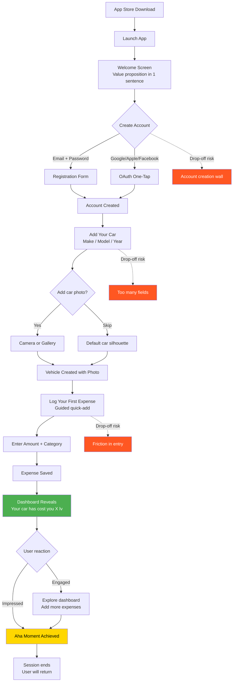

# Journey 1: First-Time Experience

**File:** `/03-product/user-journeys/journey-first-time-experience.md`
**Produced by:** @product-architect
**Date:** 2026-03-07
**Version:** 1.0 — Pre-validation

---

journey: first-time-experience
priority: Critical
frequency: Once (per user)
phase: MVP
user-role: driver (MVP) — system will support multiple roles in future phases
related-features: M1 (Auth), M2 (Vehicle profiles), M3 (Expense tracking), M5 (Cost dashboard), M10 (Onboarding), S6 (Category icons), S7 (Currency formatting)
related-specs: onboarding-auth.md, vehicle-management.md, expense-tracking.md, cost-dashboard.md

---

## References

- PRD: `/03-product/product-requirements-document.md` (Section 6.2, Flow 1)
- Functional Specs: `/03-product/functional-specs/onboarding-auth.md`, `/03-product/functional-specs/vehicle-management.md`, `/03-product/functional-specs/expense-tracking.md`, `/03-product/functional-specs/cost-dashboard.md`
- Value Proposition: `/02-strategy/value-proposition.md` (Pains P1, P8; Gains G1, G8)
- Positioning: `/02-strategy/positioning-strategy.md` (Emotional shift: uncertainty to clarity)
- Monetization: `/02-strategy/monetization-plan.md` (Section 6: conversion psychology)

---

## Journey: First-Time Experience

### Goal

Get from "just downloaded the app" to "I see what my car costs me" in a single session, under 3 minutes. The user must experience the "aha moment" — seeing their first cost entry on the dashboard — before they close the app for the first time.

### User Context

**When:** The user has just discovered the app — through a Facebook car group post, word of mouth at a car meet, or an app store search for "car expense tracker." They downloaded it 5 seconds ago.

**Why:** Curiosity. Someone in their BMW Club Bulgaria Facebook group said "this app showed me my car costs 847 лв per month." The user thought "wait, what does MY car cost?" or they searched the app store because they're tired of not knowing where their money goes.

**State of mind:** Curious but skeptical. They've tried apps before (or avoided them). They're giving this one 60-90 seconds to prove it's worth their time. If onboarding feels slow, confusing, or asks too many questions — they close the app and never return.

**Critical truth:** A user who doesn't complete this journey in their first session has a <5% chance of ever returning.

### Prerequisites

- User has downloaded and installed the app
- User has an active internet connection
- No prior account exists (first-time experience)

### Flow Diagram (Mermaid)

### Step-by-Step Flow

| Step | User Action | System Response | Screen | Emotional State |
|------|------------|----------------|--------|-----------------|
| 1 | Opens app for the first time | Shows welcome screen with car illustration and one-line value proposition: "Finally know what your car costs." | Welcome Screen | Curious, evaluating |
| 2 | Taps "Get Started" | Shows account creation options: Google, Apple, Facebook OAuth buttons (prominent) + email registration (secondary) | Auth Screen | Slightly impatient — wants this to be fast |
| 3a | Taps Google/Apple/Facebook | OAuth flow — single tap, auto-fills name and email | OAuth Popup | Relief — "that was easy" |
| 3b | Taps "Sign up with email" | Shows minimal form: email, password, name | Registration Form | Mild friction — typing is work |
| 4 | Account created | Brief success animation (0.5s). Immediately transitions to "Add Your Car" screen with make/model/year pickers. | Vehicle Add Screen | Anticipation — "let's set up my car" |
| 5 | Selects make from scrollable list (popular BG makes at top: BMW, VW, Audi, Mercedes, Opel, Toyota) | Filters models for selected make | Vehicle Add Screen | Engaged — finding their car |
| 6 | Selects model, then year from picker | Vehicle profile preview appears with car silhouette matching the type | Vehicle Add Screen | Satisfaction — "that's my car" |
| 7 | Optional: taps "Add Photo" | Opens camera/gallery picker | Photo Capture | Pride — showing off their car |
| 7b | Or taps "Skip" / "Continue" | Uses default silhouette for that vehicle type | — | Fine — they'll add a photo later |
| 8 | Taps "Save" or "Continue" | Vehicle saved. Transition to guided expense entry with message: "Great! Now log your first expense so we can start calculating." | Guided Expense Screen | Momentum — "one more step" |
| 9 | Sees pre-filled expense form: today's date, their car selected, category picker prominent | Smart defaults reduce input: date = today, vehicle = the one just created, currency = лв | Quick-Add Screen (guided variant) | Relieved — most fields are already filled |
| 10 | Selects expense category (e.g., Fuel, Maintenance, Insurance) | Category icon highlights, subcategory options appear if relevant | Quick-Add Screen | Easy — visual categories are fast to scan |
| 11 | Enters amount (numeric keypad opens automatically) | Amount formats in лв as they type (e.g., "127.50 лв") | Quick-Add Screen | Fast — just typing a number |
| 12 | Taps "Save" | Expense saved with satisfying micro-animation (checkmark + brief haptic). Screen transitions to dashboard. | Dashboard | Anticipation — "what does it show?" |
| 13 | Sees dashboard for the first time: "Your [Car Model] has cost you **127.50 лв** so far. Keep tracking to see your monthly total." | Dashboard shows: the amount prominently, a single category in the breakdown, and empty-state prompts for what comes next ("Log more expenses to see trends") | Dashboard (1 expense state) | THE AHA MOMENT — "I can see a number. This is going to add up." |
| 14 | Optionally explores: taps category breakdown, views timeline, or adds another expense | Dashboard responds to taps — drill into category, view timeline entry, or quick-add another | Dashboard / Timeline | Curiosity — exploring the app |
| 15 | Closes app | Push notification scheduled for next day: "Did you fuel up today? Quick-add it in 10 seconds." | — | Satisfied — got value in session 1 |

### Key Moments

**Moment 1: Account creation (Step 3)**
This is the first gate. Every second of friction here costs users. OAuth (Google/Apple/Facebook) must be the primary, most visible option. Email registration is secondary. The goal: account created in under 10 seconds. If this takes longer than 30 seconds, expect 30-40% drop-off.

**Moment 2: Vehicle setup (Steps 5-7)**
The user is personalizing the app — this should feel satisfying, not bureaucratic. Show popular Bulgarian car makes first (BMW, VW, Audi, Mercedes, Opel, Toyota account for 60%+ of the target segment). Auto-suggest models. Make the photo optional but encourage it — a car with a photo feels personal, a car without one feels like a database entry.

**Moment 3: Dashboard reveal (Step 13)**
This is the single most important screen transition in the entire product. The user has just logged their first expense and the dashboard appears with their number. The design must make this feel impactful — big, clear typography for the amount, the car name/model above it, a sense of "this is the beginning of understanding your car." Not a data table. Not a spreadsheet. A clear, emotional number.

### Empty States

Empty states are critical in this journey because everything starts at zero.

| Screen | Empty State (0 expenses) | 1 Expense State | 5 Expenses State | 10+ Expenses State |
|--------|--------------------------|-----------------|-------------------|---------------------|
| **Dashboard** | "Add your first expense to start tracking" with illustration + CTA button | "Your [model] has cost you **X лв** so far. Keep tracking to see your monthly total." Single category shown. | Monthly total visible. 2-3 categories in breakdown. "Add more for accurate monthly picture." | Full dashboard: monthly total, category breakdown pie chart, bar chart starts forming. Feels like a real cost view. |
| **Category Breakdown** | Not shown (no data) | Shows single category at 100%. Feels sparse but intentional. | Shows 2-3 categories with proportions. Starting to be useful. | Clear pie/donut chart. User can see where money goes. |
| **Monthly Trend** | Not shown (no data) | Single bar for current month. Labeled "Your first month." | Single month bar, growing. | After 2+ months: comparison bars appear. Trend becomes visible. |
| **Vehicle Timeline** | "Your car's story starts here. Log your first expense." with car illustration | Single entry with date, category, amount. Clean, not lonely. | Growing feed — feels like a journal. | Rich timeline — photos, notes, variety of categories. |
| **Reminders** | "Set up maintenance reminders so you never forget." with suggestion cards (Oil change, Insurance, Tires) | 1 reminder set. Shows next due date. | Multiple reminders, next-due sorted. | Full maintenance calendar view. |
| **Challenges** | "Challenges unlock after 1 week of tracking." | Still locked — not enough data. | May be unlocked depending on timing. | Active challenges available. |

**Design principle for empty states:** Never show an empty screen. Always show what WILL be there and how to fill it. Use illustrations, not blank space. Make the empty state feel like an invitation, not an error.

### Drop-Off Risks

| Risk Point | Why They Might Leave | Severity | Mitigation |
|-----------|---------------------|----------|------------|
| **Welcome screen** | Value proposition unclear or uninteresting | Medium | One sentence max. Lead with the emotional hook: "Finally know what your car costs." No feature lists. |
| **Account creation** | Too much friction, don't want to create yet another account | High | OAuth (Google/Apple/Facebook) as primary CTAs. Email as fallback. No email verification required to start (verify later). |
| **Vehicle setup** | Too many fields, can't find their car model, feels like a form | High | Minimum viable fields: make + model + year only. Everything else optional. Popular makes at the top. Type-ahead search for models. |
| **First expense entry** | Don't have a recent expense in mind, feels like homework | High | Suggest a common expense: "What did you last spend on your car? Fuel? A car wash? Parking?" Pre-fill category suggestions. Allow "approximate" — accuracy doesn't matter for the first entry. |
| **Dashboard shows tiny amount** | One expense looks unimpressive — "so what?" | Medium | Messaging matters: "This is just the start. Most owners are shocked when they see the monthly total." Encourage adding 2-3 more right away: "Add a few more expenses to see the bigger picture." |
| **Notification permission prompt** | Users reflexively deny notification permissions | Medium | Delay the prompt until AFTER the aha moment (after seeing dashboard). Frame it as: "Get reminders when maintenance is due" — not "Enable notifications." |

### Design Implications

1. **Speed above all.** The entire journey must complete in under 3 minutes. Every screen should have one primary action, clearly visible. No multi-step wizards with progress bars — each step should feel like a natural next thing, not "step 3 of 7."

2. **Minimum input, maximum output.** Ask for the absolute minimum during onboarding: make, model, year, one expense. Everything else (odometer, fuel type, license plate, photo) is optional and can be added later. The user should feel "that was easy" not "that was thorough."

3. **Dashboard is the hero.** The transition from "expense saved" to "dashboard with your number" must feel like a reveal. Consider a brief animation — the number counting up to the total. This is the emotional payoff of the entire onboarding.

4. **Bulgarian-first defaults.** Currency in лв, popular BG car makes at top, Bulgarian language by default (detect from device locale). Never make a Bulgarian user feel like this is a translated American app.

5. **Progressive disclosure.** Don't show premium features during onboarding. Don't mention pricing. Don't explain challenges or benchmarks. Get them to the dashboard. Everything else is discovered naturally over time.

### Key Questions Answered

**How fast can we get from "just downloaded" to "I see what my car costs"?**
Target: under 3 minutes. Optimal: under 90 seconds with OAuth. Steps: OAuth login (10s) + add car (30s) + log expense (20s) + see dashboard (instant) = ~60 seconds for a fast user.

**What's the absolute minimum info we need during onboarding?**
Make, model, year. That's it. No odometer (ask later when they log fuel). No fuel type (infer from model or ask later). No license plate (optional, always). Photo is encouraged but skippable.

**Should we ask for historical expenses or start fresh?**
Start fresh. Asking for historical data is overwhelming and inaccurate. After 1-2 weeks, prompt: "Want to add older expenses? Tap + and change the date." Let them backfill naturally if motivated.

**What does the dashboard show when there's only 1 expense?**
A single prominent number with the car model name. "Your BMW E46 has cost you 127.50 лв so far." One category in the breakdown. A message encouraging more entries. NOT a full dashboard with empty charts — that looks broken.

**When does the "aha moment" happen and how do we design for it?**
The micro aha happens at Step 13: seeing the first number on the dashboard. The real aha happens at 10+ expenses over 2+ weeks when the monthly total becomes meaningful and surprising. Design for both: make the first number feel significant, and make the growing total feel increasingly impactful.

### Success Criteria

| Metric | Target | How Measured |
|--------|--------|-------------|
| Onboarding completion rate (account + vehicle + 1 expense) | 60%+ | In-app analytics: funnel tracking |
| Time to complete onboarding | Under 3 minutes (median) | Timestamp analytics per step |
| Dashboard viewed in session 1 | 80%+ of users who complete onboarding | Screen view analytics |
| Second expense logged in session 1 | 30%+ | Event analytics |
| Day 1 retention (return within 24 hours) | 40%+ | Cohort analysis |
| Day 7 retention (return within 7 days) | 30%+ | Cohort analysis |
| Account creation method split | 70%+ via OAuth | Auth method tracking |

### Connections to Other Journeys

- **Leads directly to Journey 2 (Daily Expense Logging):** Once onboarding is complete, the user's next interaction is logging their second expense. The quick-add flow must be immediately discoverable.
- **Plants the seed for Journey 3 (Aha Moment):** The first expense is the beginning. The real aha comes at 10+ expenses. Onboarding messaging should set the expectation: "Keep tracking to see your true monthly cost."
- **Establishes Journey 4 (Vehicle Timeline):** The first expense becomes the first timeline entry. The timeline screen should be shown briefly or made discoverable.
- **Does NOT lead to Journey 5 (Premium Upgrade) yet.** Never show premium features or pricing during onboarding. Let the user fall in love with the free product first.
- **Triggers Journey 7 (Maintenance Reminder):** After adding a vehicle, suggest setting up a reminder: "When's your next oil change?" This is a natural next step after onboarding but should not block the flow.

### Future Role Considerations

- **Garage owner onboarding (Phase 2):** When garage integration is built, garage owners will have a different first-time experience: register business, add shop details, import customer list, connect to existing driver accounts. The onboarding architecture must support role-based flows from the start.
- **Dealer onboarding (Phase 3):** Dealers will onboard with inventory import, profitability setup. Entirely different flow.
- **Fleet manager onboarding (Phase 3):** Company registration, multi-vehicle bulk import, driver assignment. Needs a web-based onboarding, not just mobile.
- **Architecture implication:** The auth system should include a role/type field from day one (driver, garage_owner, dealer, fleet_manager) even though MVP only serves the driver role. Onboarding flow routing should be role-based.

---

## Document History

| Version | Date | Changes |
|---|---|---|
| 1.0 | 2026-03-07 | Initial journey map. Pre-validation — customer interviews not yet conducted. |
