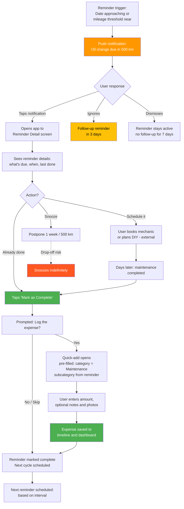

# Journey 7: Maintenance Reminder Flow

**File:** `/03-product/user-journeys/journey-maintenance-reminder.md`
**Produced by:** @product-architect
**Date:** 2026-03-07
**Version:** 1.0 — Pre-validation

---

journey: maintenance-reminder
priority: Medium
frequency: Monthly (reminder triggers), ongoing (setup and management)
phase: MVP
user-role: driver (MVP) — system will support multiple roles in future phases
related-features: M7 (Maintenance reminders), M3 (Expense tracking), M6 (Vehicle timeline), M4 (Fuel entry)
related-specs: maintenance-reminders.md, expense-tracking.md, vehicle-timeline.md

---

## References

- PRD: `/03-product/product-requirements-document.md` (Section 6.1, Feature M7; Section 6.2, Flow 4)
- Functional Spec: `/03-product/functional-specs/maintenance-reminders.md`
- Value Proposition: `/02-strategy/value-proposition.md` (Pain P5: forget maintenance; Gain G4: never forget)
- Concept Document: `/00-project/concept-document.md` (Section 5, maintenance reminders)

---

## Journey: Maintenance Reminder Flow

### Goal

The user receives a timely maintenance reminder, acts on it (schedules and completes the maintenance), logs the resulting expense, and the reminder resets for the next cycle. The maintenance reminder closes the loop between planning and tracking.

### User Context

**When:** The user set up a reminder days or weeks ago (e.g., "Oil change every 10,000 km" or "Insurance renewal March 15"). Now the reminder triggers — either because the date is approaching or they've updated their odometer and the mileage threshold is near.

**Why:** They set the reminder specifically because they forget maintenance deadlines. The notification is expected and welcome — it's the app doing what they asked it to do.

**State of mind:** Grateful (if the reminder is timely and useful) or annoyed (if it's poorly timed, too frequent, or for something they already handled). The difference between these two outcomes determines whether reminders build trust or erode it.

### Prerequisites

- User has at least one vehicle
- User has set up at least one maintenance reminder
- Reminder trigger condition is met (date approaching or mileage threshold near)
- Push notifications are enabled on the device

### Flow Diagram (Mermaid)

### Step-by-Step Flow

| Step | User Action | System Response | Screen | Emotional State |
|------|------------|----------------|--------|-----------------|
| 1 | — (passive) | Push notification: "Oil change due in 500 km. Your last oil change was 9,500 km ago." | Lock Screen / Notification | Grateful — "oh right, thanks for the reminder" |
| 2 | Taps notification | App opens to Reminder Detail screen. Shows: reminder name, vehicle, trigger condition (date or mileage), last completed date, current status (due soon / overdue). | Reminder Detail | Attentive — reviewing what's needed |
| 3 | Reviews details: "Oil Change — BMW E46 — Every 10,000 km — Last done: 2025-12-15 at 145,000 km — Current: 154,500 km" | Additional context: "Average cost for oil change: 120-180 лв" (if historical data exists from past entries). | Reminder Detail | Informed — "I know what to expect" |
| 4a | Takes action externally (calls mechanic, plans weekend DIY) | — (app doesn't know about external actions) | — | Proactive — "I'll handle this" |
| 4b | Taps "Snooze" (1 week or 500 km) | Reminder postponed. Snooze count tracked. If snoozed 3+ times, gentle nudge: "This has been snoozed 3 times. Want to mark it as not applicable?" | Reminder Detail | Procrastinating — but at least aware |
| 5 | Completes maintenance (days later) | — | — | Accomplished — "that's done" |
| 6 | Opens app, navigates to reminder, taps "Mark as Complete" | Completion dialog: "When was this done?" (date picker, default today). "Log the expense?" (Yes/No). | Completion Dialog | Methodical — closing the loop |
| 7a | Taps "Yes — Log expense" | Quick-add opens pre-filled: category = Maintenance, subcategory = Oil Change, date = completion date, vehicle = reminder vehicle. User just needs to enter amount. | Quick-Add (pre-filled) | Efficient — "most of this is already filled in" |
| 7b | Taps "No — just complete the reminder" | Reminder marked complete. Next cycle scheduled (e.g., next oil change at 164,500 km). | Reminders List | Done — but missed a logging opportunity |
| 8 | Enters amount and saves expense | Expense logged. Timeline entry created. Dashboard updated. Reminder resets with next cycle. | Dashboard | Satisfaction — everything is up to date |
| 9 | — (passive) | Next reminder will trigger at 164,500 km (or in 10,000 km from now). | — | Peace of mind — "the app will remind me" |

### Key Moments

**Moment 1: The notification (Step 1)**
The push notification must be timely and informative — not generic. "Oil change due in 500 km" is useful. "You have a reminder" is useless. Include the specific maintenance item, the vehicle, and the urgency indicator (how close to due).

**Moment 2: Completion + expense logging (Steps 6-7)**
This is where the maintenance reminder closes the loop with expense tracking. By offering to log the expense when the reminder is completed, the app creates a seamless connection between "what I need to do" and "what I spent." The pre-filled expense form removes friction — the user just enters the amount.

**Moment 3: Next cycle scheduled (Step 9)**
The reminder silently resets after completion. The user doesn't have to reconfigure it. This "set it and forget it" behavior builds trust and stickiness — the app is reliably managing their maintenance schedule.

### Reminder Types

| Type | Trigger | Example | Notification Timing |
|------|---------|---------|---------------------|
| **Date-based** | Calendar date approaches | Insurance renewal March 15 | 30 days, 7 days, 1 day before |
| **Mileage-based** | Odometer reaches threshold | Oil change every 10,000 km | At 500 km before, at threshold, 500 km past (overdue) |
| **Combined** | Whichever comes first | Oil change every 10,000 km OR 12 months | First trigger wins |

**Mileage tracking challenge:** Mileage-based reminders require the user to periodically update their odometer. The best opportunity: fuel entries (which include odometer reading). If the user hasn't logged fuel recently, prompt: "Update your odometer to check maintenance reminders."

### Common Reminder Templates

Suggested during setup to reduce friction:

| Reminder | Default Interval | Category |
|----------|-----------------|----------|
| Oil change | Every 10,000 km or 12 months | Maintenance |
| Tire rotation | Every 15,000 km or 12 months | Tires |
| Insurance renewal | Annual (specific date) | Insurance |
| Annual tax | Annual (specific date) | Tax |
| Technical inspection | Annual or biennial (specific date) | Administrative |
| Brake pads | Every 30,000-50,000 km | Maintenance |
| Timing belt | Every 80,000-100,000 km | Maintenance |
| Air filter | Every 20,000 km or 12 months | Maintenance |

### Empty States

| State | What the User Sees |
|-------|-------------------|
| No reminders set | "Never forget an oil change or insurance renewal. Set up your first reminder." + suggestion cards for common reminders (oil change, insurance, tires). |
| Reminders set but none due | "All caught up! Your next reminder: Oil change in 3,500 km." Green checkmark, peaceful state. |
| Reminder overdue | "Overdue: Oil change was due 1,200 km ago." Red/orange indicator. "Mark as complete" button prominent. |
| Free tier limit reached (3 reminders) | "You've used all 3 free reminders. Upgrade to Premium for unlimited reminders." Existing reminders still work — just can't add more. |

### Drop-Off Risks

| Risk Point | Why They Might Leave | Severity | Mitigation |
|-----------|---------------------|----------|------------|
| **Notification fatigue** | Too many reminders feel spammy | Medium | Smart timing: don't send more than 1 reminder notification per day. Group multiple due reminders into one notification. Respect notification quiet hours. |
| **Odometer not updated** | Mileage-based reminders can't fire without recent odometer data | High | Prompt odometer update during fuel entries. Weekly gentle nudge: "Update your odometer to keep reminders accurate." |
| **Snooze loop** | User snoozes indefinitely, reminder loses credibility | Medium | After 3 snoozes, offer: "Do you still need this reminder? Reschedule or remove." Don't keep nagging. |
| **Notifications disabled** | User denied notification permission | High | In-app badge on Reminders tab showing overdue count. Periodic in-app prompt: "Enable notifications to get reminded on time." |
| **Reminder limit (3) too restrictive** | User needs 4+ reminders but won't pay for premium | Medium | 3 is enough for the most critical items (oil change, insurance, inspection). More is a genuine premium value. |

### Design Implications

1. **Notification content is critical.** Push notifications must be informative, not generic. Include: what's due, which car, and how urgent. "BMW E46: Oil change due in 500 km" — not "You have a maintenance reminder."

2. **Pre-filled expense on completion.** When a reminder is marked complete, the transition to expense logging should feel seamless. Pre-fill everything possible: category, subcategory, vehicle, date. The user only types the amount.

3. **Reminders list as a peace-of-mind screen.** The reminders screen should feel calming when everything is green (nothing due). And urgent when something is overdue (red/orange indicators). Visual status at a glance.

4. **Template suggestions on first use.** When a user first visits reminders, suggest common maintenance items with pre-filled intervals. One-tap setup: "Oil change every 10,000 km? Set it up." Reduces setup friction significantly.

5. **Overdue handling matters.** An overdue reminder should escalate gently: first notification, then in-app badge, but never aggressive. The app should help, not nag.

### Success Criteria

| Metric | Target | How Measured |
|--------|--------|-------------|
| Reminder setup rate (within 30 days of signup) | 40%+ of users set at least 1 reminder | Feature usage analytics |
| Average reminders per user | 2+ | Feature usage analytics |
| Reminder completion rate (acted on within 14 days of trigger) | 60%+ | Reminder lifecycle analytics |
| Completion-to-expense-logging rate | 50%+ complete reminders via "Log expense" flow | Flow analytics |
| Notification tap-through rate | 20%+ | Push notification analytics |
| Reminder-driven premium conversion | 10%+ of conversions from 3-reminder limit | Paywall trigger attribution |

### Connections to Other Journeys

- **Feeds Journey 2 (Daily Expense Logging):** Completing a reminder naturally flows into logging the expense. This is an alternative entry point to the logging habit.
- **Reinforces Journey 3 (Aha Moment):** Maintenance expenses logged through reminders make the monthly total more accurate and the aha moment more impactful.
- **Feeds Journey 4 (Vehicle Timeline):** Each completed maintenance reminder creates a timeline entry — building the car's documented history.
- **Can trigger Journey 5 (Premium Upgrade):** The 3-reminder limit is a premium conversion trigger for users who want more.
- **Independent of Journey 6 (Challenge Participation):** Reminders and challenges serve different needs (planning vs. competition).

### Future Role Considerations

- **Garage integration (Phase 2):** When a garage is connected, maintenance reminders could be two-way: the garage can see what's due for a customer's car and proactively reach out. When the garage completes service, the reminder auto-completes and the expense auto-logs. The driver receives: "Your oil change at [Garage Name] is complete. 150 лв logged to your account."
- **Predictive reminders (Phase 3-4):** With enough data, the system could predict maintenance needs based on driving patterns: "Based on your driving, your brake pads will need replacement in approximately 5,000 km (about 2 months)."
- **Fleet reminders (Phase 3):** Fleet managers see a dashboard of all reminders across all fleet vehicles. Overdue items flagged at the fleet level.
- **Architecture implication:** Reminders should support a `source` field (user_created, system_suggested, garage_created, fleet_policy) from day one. Completion should support `completed_by` (owner, garage, fleet_manager) for future multi-role scenarios.

---

## Document History

| Version | Date | Changes |
|---|---|---|
| 1.0 | 2026-03-07 | Initial journey map. Pre-validation — customer interviews not yet conducted. |
