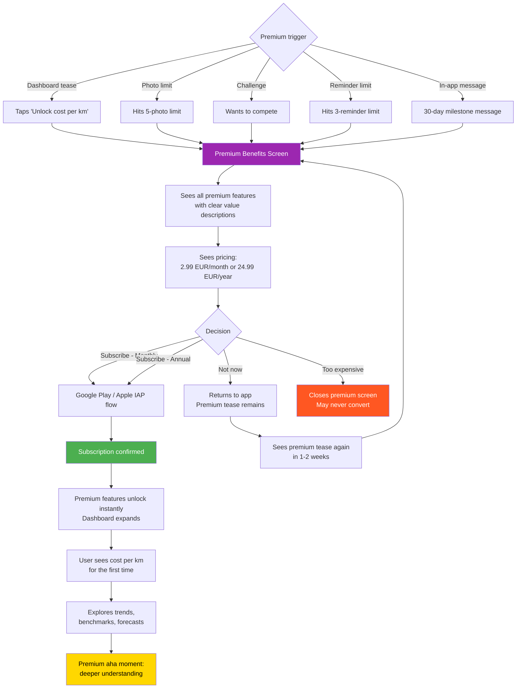

# Journey 5: Premium Upgrade

**File:** `/03-product/user-journeys/journey-premium-upgrade.md`
**Produced by:** @product-architect
**Date:** 2026-03-07
**Version:** 1.0 — Pre-validation

---

journey: premium-upgrade
priority: High
frequency: Once (conversion), then monthly (renewal/retention)
phase: MVP
user-role: driver (MVP) — system will support multiple roles in future phases
related-features: M5 (Cost dashboard), S2 (Spending trends), C1 (Model benchmarks), M6 (Vehicle timeline), M7 (Reminders), S4 (Challenges)
related-specs: cost-dashboard.md, challenges-gamification.md, vehicle-timeline.md, maintenance-reminders.md

---

## References

- PRD: `/03-product/product-requirements-document.md` (Section 6.2, Flow 5)
- Monetization Plan: `/02-strategy/monetization-plan.md` (Sections 2, 3, 6)
- Value Proposition: `/02-strategy/value-proposition.md` (Section 5: Value delivery by tier)
- Positioning: `/02-strategy/positioning-strategy.md` (Emotional positioning: uncertainty to clarity to control)

---

## Journey: Premium Upgrade

### Goal

The user encounters a premium feature tease in a natural context, feels genuine curiosity about what premium offers, evaluates the price against the value, and decides to subscribe. The conversion must feel like a natural escalation of value, never like a gate or punishment.

### User Context

**When:** 2-6 weeks after first use. The user has established a logging habit (Journey 2), experienced the aha moment (Journey 3), and encountered premium-only features 2-3 times. Something specific triggered this session — they want to know their cost per km, or they hit the photo limit, or they want to compete in a challenge.

**Why:** Curiosity has accumulated. They've seen the locked "Cost per km" section on the dashboard multiple times. Today, something pushed them over the edge: a Facebook group discussion about cost per km, a car meet where someone mentioned their number, or simply accumulated desire to see the full picture.

**State of mind:** Evaluating. Not impulse-buying — considering whether the value justifies the price. They already love the free app. Premium is an expansion, not a fix for something broken.

### Prerequisites

- User has been active for 2+ weeks
- User has logged 10+ expenses
- User has seen premium tease at least 2-3 times (dashboard, photo limit, challenge)
- User has NOT been shown aggressive paywalls (soft tease only)

### Flow Diagram (Mermaid)

### Step-by-Step Flow

| Step | User Action | System Response | Screen | Emotional State |
|------|------------|----------------|--------|-----------------|
| 1 | Taps a premium tease (e.g., "Unlock cost per km" on dashboard) | Smooth transition to Premium Benefits screen. No jarring popup — a full, well-designed screen. | Premium Benefits | Curious — "let me see what I get" |
| 2 | Reads premium benefits | Clear list with icons: Cost per km, spending trends, model benchmarks, unlimited photos, unlimited vehicles, unlimited reminders, challenge participation, PDF export. Each benefit has a one-line description of WHY it matters. | Premium Benefits | Evaluating — "some of these I want" |
| 3 | Scrolls to pricing | Two options prominently displayed: Monthly (€2.99/month = ~5.85 лв) and Annual (€24.99/year = ~48.85 лв, 30% savings). Annual is visually recommended (badge: "Best value"). | Premium Benefits (pricing) | Calculating — "is this worth it?" |
| 4a | Taps "Subscribe Monthly" or "Subscribe Annual" | Native iOS/Android payment sheet appears (Apple IAP / Google Play Billing). Familiar, trusted flow. | OS Payment Sheet | Committed — "let's do it" |
| 4b | Taps "Not now" or back button | Returns to previous screen. No guilt trip, no "Are you sure?" modal. A subtle "You can upgrade anytime from Settings." | Previous Screen | Relief — no pressure |
| 5 | Confirms payment (Face ID / fingerprint / password) | Subscription processed. Brief success animation: "Welcome to Premium!" (1-2 seconds). | Confirmation Screen | Excitement — "what do I get?" |
| 6 | App transitions to dashboard | Dashboard expands: cost per km section unlocks and animates into view. Trends section appears. Locked icons disappear. Everything feels like it opens up. | Dashboard (Premium) | Delight — "this is more than I expected" |
| 7 | Sees cost per km for the first time | "Your [car model] costs you 0.42 лв per kilometer." Prominent number with trend indicator. | Dashboard (Premium) | THE PREMIUM AHA — "now I really understand my costs" |
| 8 | Explores other premium features | Spending trends (line charts over time), model benchmarks (if available), forecast section, unlimited photos unlocked. | Various Premium Screens | Discovery — exploring new capabilities |
| 9 | Returns to regular app usage | Premium features are seamlessly integrated. No separate "premium" section — features appear where they naturally belong. | All Screens | Satisfied — the upgrade was worth it |

### Premium Trigger Points (Soft Paywall Strategy)

| Trigger | Context | Tease Message | Expected Conversion Contribution |
|---------|---------|---------------|----------------------------------|
| **Dashboard cost per km** | User is already looking at their monthly total | "Your cost per km: [lock] Unlock with Premium" | 35% of conversions (primary trigger) |
| **Photo limit (5 photos)** | User tries to add 6th photo to timeline | "You've used all 5 free photos. Unlock unlimited photos with Premium." | 20% of conversions |
| **Reminder limit (3 reminders)** | User tries to add 4th reminder | "Unlock unlimited reminders with Premium." | 10% of conversions |
| **Challenge participation** | User sees leaderboard but can't compete | "Go Premium to compete and earn badges." | 10% of conversions |
| **30-day milestone** | 30 days after signup, in-app message | "You've tracked X лв in 30 days. Unlock your full intelligence dashboard." | 15% of conversions |
| **Spending trends** | User scrolls past the monthly total on dashboard | "See your spending trends over time. Premium feature." | 10% of conversions |

### Key Moments

**Moment 1: The pricing reveal (Step 3)**
The user sees €2.99/month for the first time. In the Bulgarian context, this is ~5.85 лв — roughly the price of one car wash or half a tank snack. The framing matters: show it in context of what they spend on their car. "You spend 847 лв/month on your car. Spend 5.85 лв to understand it."

**Moment 2: The payment confirmation (Step 5)**
The transition from "payment confirmed" to "features unlocked" must be instant and delightful. No loading screen, no "processing your subscription." The dashboard should visibly transform — locked sections animate open, new data appears. This is the moment the user feels they got value.

**Moment 3: First cost-per-km view (Step 7)**
This is the premium aha moment. The user has seen their monthly total (free aha, Journey 3), and now they see what that translates to per kilometer. "0.42 лв/km" adds a new dimension to their understanding. If the number is higher than expected, the emotional impact doubles.

### Empty States

| Scenario | What Premium Shows |
|----------|-------------------|
| Just upgraded, 10+ expenses | Full premium dashboard: cost per km, basic trends (if 2+ months), category breakdown enhanced. No benchmarks yet (need community data). |
| Just upgraded, <2 months of data | Cost per km visible. Trends show "Track for 2 months to see trends." Benchmarks show "Coming soon — as our community grows." |
| Model benchmarks not yet available | "Benchmarks for your [model] are not yet available. We'll notify you when they are." |
| Spending forecast, <3 months of data | "Forecasts become available after 3 months of tracking." Show a preview with sample data. |

### Drop-Off Risks

| Risk Point | Why They Might Leave | Severity | Mitigation |
|-----------|---------------------|----------|------------|
| **Price shock** | €2.99/month feels expensive for a Bulgarian user | High | Show annual plan prominently (€2.08/month effective). Frame against car spending: "Less than 1% of what you spend on your car." |
| **Benefits unclear** | User doesn't understand what they get | Medium | Each benefit needs a one-line "why this matters" explanation, not just a feature name. "Cost per km — know the real efficiency of your car." |
| **Payment friction** | IAP flow requires credit card they don't have set up | Medium | Can't control this — it's Apple/Google. But: support both card and carrier billing where available. |
| **Post-purchase regret** | Premium doesn't feel different enough | High | The unlock animation must be dramatic. New data must appear immediately. The user must feel the difference within 30 seconds of upgrading. |
| **Benchmarks not available** | User upgraded for benchmarks but model data is thin | Medium | Set expectations: "Benchmarks improve as our community grows. Your data helps!" Show seeded benchmark data for popular models. |
| **Churn after month 1** | Initial curiosity satisfied, user doesn't see ongoing value | High | Monthly value reinforcement: "This month, Premium helped you track X лв across Y categories, see your cost/km trend, and stay on top of Z reminders." |

### Anti-Patterns (What NOT to Do)

| Anti-Pattern | Why It's Wrong |
|-------------|---------------|
| Full-screen paywall on app launch | Aggressive, destroys trust, makes the app feel greedy |
| "Are you sure?" when they tap "Not now" | Manipulative, disrespectful of their decision |
| Locking basic expense logging behind premium | Kills the habit loop that drives conversion |
| Countdown timers or "Limited time offer" | Feels scammy, undermines premium positioning |
| Auto-renewing free trial without clear disclosure | Trust killer in the Bulgarian market |
| Showing premium features prominently during onboarding | Too early — they haven't experienced the free value yet |

### Design Implications

1. **Premium benefits screen must sell value, not features.** Don't list "Cost per kilometer" — instead say "Know what every kilometer costs you." Don't list "Model benchmarks" — say "See how your car compares to other owners." Benefit-first, feature-second.

2. **Annual plan should be the default recommendation.** Use visual hierarchy: annual plan larger, highlighted, with "Best value" badge and crossed-out monthly equivalent. But don't hide the monthly option — some users prefer lower commitment.

3. **Unlock animation is critical.** The moment after purchase, the dashboard should visibly transform. Locked sections animate open. New numbers appear. The user must feel "this changed everything" within seconds.

4. **No premium ghetto.** Premium features don't live in a separate "Premium" tab. They're integrated into existing screens — the dashboard gets richer, the timeline gets unlimited photos, reminders get no cap. Premium ENHANCES; it doesn't redirect.

5. **Price display in лв.** Show the primary price in лв (5.85 лв/month or 48.85 лв/year) with EUR equivalent in smaller text. Bulgarian users think in лв.

### Success Criteria

| Metric | Target | How Measured |
|--------|--------|-------------|
| Premium conversion rate (of MAU) | 5%+ by Month 6, 7.5% by Month 12 | Subscription analytics |
| Average time from signup to conversion | 3-6 weeks | Cohort analysis |
| Annual vs monthly split | 70% annual, 30% monthly | Subscription analytics |
| 30-day premium retention (don't cancel within 30 days) | 85%+ | Subscription analytics |
| Top conversion trigger | Cost per km tease (target: 35% of conversions) | Paywall trigger attribution |
| Premium satisfaction (no cancel within 3 months) | 70%+ | Subscription analytics |

### Connections to Other Journeys

- **Depends on Journey 2 (Daily Expense Logging) and Journey 3 (Aha Moment):** Users who haven't established the habit and experienced the aha are unlikely to convert. Conversion follows engagement.
- **Triggered by Journey 4 (Vehicle Timeline):** Photo limit hit during timeline documentation is a strong conversion trigger.
- **Unlocks Journey 6 (Challenge Participation):** Premium users can compete in challenges, not just view leaderboards.
- **Enhanced by Journey 7 (Maintenance Reminder):** Users who hit the 3-reminder limit and need more are motivated to upgrade.

### Future Role Considerations

- **Garage owners (Phase 2):** Garage subscriptions (€30-50/month) are a separate premium tier with different features (customer database, work orders, service book sync). The premium upgrade journey for garages is completely different — value proposition is operational efficiency, not personal insight.
- **Dealers (Phase 3):** Dealer subscriptions (€50-100/month) focus on profitability tracking. Different pricing, different benefits, different conversion triggers.
- **Fleet managers (Phase 3):** Per-vehicle pricing (€3-5/vehicle/month). Conversion based on fleet size and operational needs.
- **Architecture implication:** The subscription model should support multiple subscription tiers/types from day one (driver_premium, garage_starter, garage_pro, dealer, fleet) even though MVP only implements driver_premium. Use Apple/Google subscription groups that allow future tier additions.

---

## Document History

| Version | Date | Changes |
|---|---|---|
| 1.0 | 2026-03-07 | Initial journey map. Pre-validation — customer interviews not yet conducted. |
