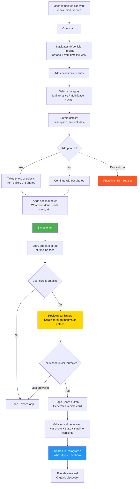

# Journey 4: Vehicle Timeline

**File:** `/03-product/user-journeys/journey-vehicle-timeline.md`
**Produced by:** @product-architect
**Date:** 2026-03-07
**Version:** 1.0 — Pre-validation

---

journey: vehicle-timeline
priority: High
frequency: Weekly (passive viewing), monthly (active entries with photos/notes)
phase: MVP
user-role: driver (MVP) — system will support multiple roles in future phases
related-features: M6 (Vehicle timeline), S1 (Photo attachments), S5 (Shareable vehicle card), M3 (Expense tracking)
related-specs: vehicle-timeline.md, share-export.md, expense-tracking.md

---

## References

- PRD: `/03-product/product-requirements-document.md` (Section 6.1, Feature M6; Section 6.3, UX Direction)
- Functional Spec: `/03-product/functional-specs/vehicle-timeline.md`
- Value Proposition: `/02-strategy/value-proposition.md` (Pain P3: no organized history; Gain G5: beautiful car record; Gain G10: prove history)
- Positioning: `/02-strategy/positioning-strategy.md` (Differentiator 2: car culture, not accounting)

---

## Journey: Vehicle Timeline

### Goal

The user adds a meaningful entry to their vehicle timeline (a repair, modification, or notable event with photos and notes), then scrolls through their car's history and feels pride in the documented journey. Optionally, they share a vehicle card on social media.

### User Context

**When:** The user has just completed a modification, repair, or notable car event. They installed new wheels, got the car detailed, completed a DIY oil change, or returned from a long road trip. They want to document it.

**Why:** Pride and documentation. Car enthusiasts want a visual record of their build, their maintenance history, and their car's story. It's both practical (proof of maintenance for resale) and emotional (a journal of their car).

**State of mind:** Proud, satisfied, or accomplished. They've done something to their car and want to capture it. This is a moment of positive energy — the app should channel it, not block it.

### Prerequisites

- User has at least one vehicle in their account
- User has a recent car event worth documenting (repair, modification, service)
- For sharing: at least a few timeline entries exist

### Flow Diagram (Mermaid)

### Step-by-Step Flow

| Step | User Action | System Response | Screen | Emotional State |
|------|------------|----------------|--------|-----------------|
| 1 | Opens app, navigates to timeline tab | Timeline loads showing chronological feed of all entries for the selected vehicle. Newest first. | Timeline Screen | Purposeful — "I want to document what I just did" |
| 2 | Taps + button (or "Add entry") | Entry creation screen opens. Category picker: Maintenance, Modification, Fuel, Insurance, Other. Date pre-filled to today. | New Entry Screen | Motivated — ready to record |
| 3 | Selects category (e.g., "Modification") | Subcategory suggestions appear (e.g., Wheels, Exhaust, Suspension, Body, Interior, Electronics, Other). | New Entry Screen | Engaged — finding the right label |
| 4 | Enters description ("Installed BBS RS wheels 17-inch") and amount (1,200 лв) | Text field + amount field. Optional odometer. | New Entry Screen | Detail-oriented — wants a good record |
| 5 | Taps "Add Photos" | Camera/gallery picker opens. Can select 1-3 photos. | Photo Selection | Excited — showing off the work |
| 6 | Takes/selects photos (before and after, close-up of new wheels) | Photos thumbnail in the entry. Compression happens automatically. | New Entry Screen | Proud — "this looks great" |
| 7 | Adds notes ("Purchased from BBS Bulgaria. Took 2 hours to install at my mechanic's. Paid 80 лв for mounting and balancing.") | Free-text field below photos. | New Entry Screen | Thorough — building a complete record |
| 8 | Taps "Save" | Entry saved. Timeline refreshes with new entry at top. Photos display prominently. | Timeline Screen | Satisfaction — "my car's story is growing" |
| 9 | Scrolls down through timeline | Sees chronological history: last month's oil change, the tire swap from fall, the insurance renewal, fuel entries interspersed. Each with date, category icon, amount, and photos if any. | Timeline Screen | Pride — "look at everything I've done for this car" |
| 10 | Taps on an older entry to see details | Full entry view: photos (full-size), all details, notes. | Entry Detail Screen | Nostalgia — reliving past car moments |
| 11 | Taps "Share" button (available from timeline header) | Vehicle card generator: auto-creates a visual card with car photo, model name, key stats (total invested, months tracked, top categories), and 2-3 timeline highlights. | Share Card Preview | Ready to show off |
| 12 | Customizes card (optional) and shares to Instagram/WhatsApp/Facebook | Share sheet opens with the generated card image. App branding subtly included. | OS Share Sheet | Social fulfillment — "everyone can see my build" |

### Key Moments

**Moment 1: Photo attachment (Steps 5-6)**
Photos transform the timeline from a ledger into a journal. An entry with "Installed new wheels — 1,200 лв" is data. An entry with before/after photos of the wheels is a story. Encourage photos by making the photo button prominent and the photo display beautiful.

**Moment 2: Scrolling through history (Step 9)**
The first time a user scrolls through 2-3 months of timeline entries and sees their car's complete journey, they experience a different kind of aha moment — not about cost, but about the story of their car. This emotional connection is what separates the app from competitors and creates long-term retention.

**Moment 3: Sharing (Steps 11-12)**
The vehicle card is the organic growth engine. A well-designed card shared to a car enthusiast Facebook group or Instagram generates curiosity: "What app is that?" The card must be visually striking — designed for car culture, not for spreadsheets.

### Empty States

| State | What the User Sees | Design Goal |
|-------|-------------------|-------------|
| 0 entries | "Your car's story starts here. Log your first expense or add a timeline entry." Illustration of an empty road stretching ahead. | Inspire action. Make the empty state feel like a beginning, not emptiness. |
| 1-4 entries | Entries shown, but timeline feels sparse. "Keep documenting your car's journey." | Encourage more entries without making the few existing ones look lonely. |
| 5-9 entries, no photos | Timeline is growing but text-only. Subtle prompt: "Add photos to bring your timeline to life." | Nudge toward photo-rich entries. |
| 10+ entries | Rich timeline with variety. Filter options become more useful. | The timeline is now genuinely useful for reviewing history. |
| Photo limit reached (free tier: 5 total) | "You've used all 5 free photos. Upgrade to Premium for unlimited photos." | Premium conversion trigger — natural, not aggressive. |

### Drop-Off Risks

| Risk Point | Why They Might Leave | Severity | Mitigation |
|-----------|---------------------|----------|------------|
| **No photos, text-only timeline** | Timeline feels like a boring list without visual richness | Medium | Make photo attachment effortless (camera button prominent). Show how much better entries look with photos. |
| **Photo limit hit at 5 (free tier)** | User wants to add more photos but hits the paywall | High | This is an intentional conversion trigger, but it must not feel punishing. Show a clear, friendly upgrade prompt. Let them choose which 5 photos to keep. |
| **Timeline feels like duplicate of expense log** | User doesn't see the difference between logging an expense and adding a timeline entry | Medium | Differentiate visually: timeline emphasizes the story (photos, notes, narrative), while expense log emphasizes the cost (amount, category, totals). Timeline entries CAN include cost but don't have to. |
| **Sharing card looks bad** | Generated card is ugly or generic, not worth sharing | High | Invest in card design. Use the car's actual photo. Clean typography. Stats that feel impressive. App branding subtle (small logo + "Track your car's journey" tagline). |
| **No one to share with** | User doesn't have an active social media presence | Low | Sharing is optional. The timeline's primary value is personal documentation. Sharing is a bonus, not the purpose. |

### Design Implications

1. **Timeline = car journal, not ledger.** The visual design should emphasize photos, dates, and narrative — not amounts and categories. Amounts are there but secondary. The feel should be Instagram-meets-car-diary, not accounting-software.

2. **Photos are first-class citizens.** Timeline entries with photos should display them prominently — at least half the entry's visual space. Entries without photos should still look good but entries WITH photos should look significantly better (incentivizing photo uploads).

3. **Filter and search.** As the timeline grows, users need to find things: "When did I last change the oil?" Filters by category and free-text search become essential at 20+ entries.

4. **Shareable card quality.** The vehicle card must be designed to a social-media-sharing standard. Think: automotive magazine quality layout, not an app screenshot. This card represents the app's brand to the outside world.

5. **Modification tracking is the differentiator.** No competitor does this well. Timeline entries for modifications (wheels, exhaust, suspension, bodywork) with before/after photos create content that enthusiasts genuinely care about and want to share.

### Success Criteria

| Metric | Target | How Measured |
|--------|--------|-------------|
| Timeline entries with photos | 30%+ of entries include at least 1 photo | Entry analytics |
| Timeline views per user per week | 1+ (passive browsing) | Screen view analytics |
| Average timeline entries per vehicle per month | 5+ (including auto-created from expenses) | Entry analytics |
| Vehicle card shares | 5%+ of users share at least once per month | Share event analytics |
| Photo limit premium conversion rate | 15%+ of users who hit the 5-photo limit upgrade | Funnel analytics |
| Share card to app install conversion | Track via app branding link on card | Attribution analytics |

### Connections to Other Journeys

- **Fed by Journey 2 (Daily Expense Logging):** Every expense logged in Journey 2 automatically creates a timeline entry. The timeline is enriched passively.
- **Complements Journey 3 (Aha Moment):** The aha moment is about cost shock. The timeline provides emotional balance — "yes, my car costs a lot, but look at everything I've done and how it's evolved."
- **Feeds Journey 5 (Premium Upgrade):** The photo limit (free: 5 photos) is a conversion trigger. Users who are invested in documenting their car are willing to pay for unlimited photos.
- **Independent of Journey 6 (Challenges):** Timeline and challenges serve different needs — documentation vs. competition.
- **Connected to Journey 7 (Maintenance Reminder):** When maintenance is completed and logged, the timeline entry provides proof. This is valuable for resale (Journey 4 feeds the future PDF export feature).

### Future Role Considerations

- **Garage integration (Phase 2):** When a garage completes service, a timeline entry is auto-created with the garage's service record: work performed, parts used, photos from the garage (if provided). The driver sees "Service completed at [Garage Name]: Brake pad replacement" appear in their timeline without lifting a finger.
- **Dealer use case (Phase 3):** A vehicle's timeline becomes part of its resale documentation. Dealers can access the timeline (with owner permission) as proof of maintenance history. This creates real resale value for users who maintain their timeline.
- **Data intelligence (Phase 4):** Aggregated timeline data reveals real-world maintenance patterns: "Average BMW E46 owners replace brake pads at 45,000 km." This data becomes part of the intelligence platform.
- **Architecture implication:** Timeline entries should support a `created_by` field (owner, garage, dealer, system) from day one. Photo storage should scale (plan for unlimited premium users with 50+ photos per vehicle).

---

## Document History

| Version | Date | Changes |
|---|---|---|
| 1.0 | 2026-03-07 | Initial journey map. Pre-validation — customer interviews not yet conducted. |
